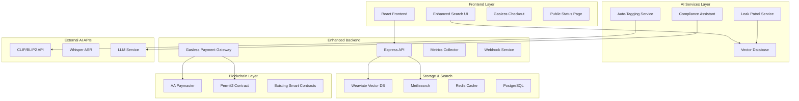

# AI-Native Features Design Document

## Overview

This design document outlines the implementation of five critical AI-native features that will differentiate the platform and attract agencies. These features build on the existing decentralized adult platform infrastructure (tasks 1-42) and add intelligent automation for content discovery, leak protection, compliance, payments, and operational transparency.

## Architecture

### High-Level System Architecture



## Components and Interfaces

### 1. AI Auto-Tagging and Semantic Search

#### Auto-Tagging Service
```typescript
interface AutoTaggingService {
  generateTags(contentId: string, mediaUrl: string): Promise<TagResult[]>
  processEmbeddings(mediaUrl: string): Promise<number[]>
  storeVectorEmbedding(contentId: string, embedding: number[]): Promise<void>
}

interface TagResult {
  tag: string
  confidence: number
  category: 'visual' | 'audio' | 'scene' | 'performer'
}
```

#### Vector Search Service
```typescript
interface VectorSearchService {
  semanticSearch(query: string, filters?: SearchFilters): Promise<SearchResult[]>
  hybridSearch(query: string, filters?: SearchFilters): Promise<SearchResult[]>
  indexContent(contentId: string, embedding: number[], metadata: ContentMetadata): Promise<void>
}

interface SearchResult {
  contentId: string
  relevanceScore: number
  matchedTags: string[]
  snippet?: string
}
```

### 2. AI Leak Patrol System

#### Video Fingerprinting Service
```typescript
interface VideoFingerprintService {
  generateFingerprint(videoUrl: string): Promise<VideoFingerprint>
  compareFingerprints(fp1: VideoFingerprint, fp2: VideoFingerprint): Promise<MatchResult>
  storeFingerprint(contentId: string, fingerprint: VideoFingerprint): Promise<void>
}

interface VideoFingerprint {
  frameHashes: string[]
  audioChroma: number[]
  duration: number
  resolution: string
}
```

#### Leak Detection Service
```typescript
interface LeakDetectionService {
  crawlPlatforms(platforms: string[]): Promise<CrawlResult[]>
  detectLeaks(fingerprints: VideoFingerprint[]): Promise<LeakMatch[]>
  generateDMCANotice(leak: LeakMatch): Promise<DMCANotice>
  submitTakedown(notice: DMCANotice): Promise<TakedownResult>
}
```

### 3. AI Compliance Assistant

#### Compliance Analysis Service
```typescript
interface ComplianceAnalysisService {
  analyzeContent(contentId: string): Promise<ComplianceReport>
  validateConsent(sceneId: string): Promise<ConsentValidation>
  generateEvidencePack(contentId: string): Promise<EvidencePack>
  calculateRiskScore(content: ContentMetadata): Promise<RiskScore>
}

interface ComplianceReport {
  riskScore: number
  violations: ComplianceViolation[]
  recommendations: string[]
  evidenceComplete: boolean
}
```

### 4. Gasless Payment System

#### Account Abstraction Service
```typescript
interface GaslessPaymentService {
  createUserOperation(purchase: PurchaseRequest): Promise<UserOperation>
  sponsorTransaction(userOp: UserOperation): Promise<SponsoredTransaction>
  executeGaslessPayment(transaction: SponsoredTransaction): Promise<PaymentResult>
}

interface PasskeyWalletService {
  createPasskeyWallet(email: string): Promise<WalletCredentials>
  authenticateWithPasskey(challenge: string): Promise<AuthResult>
  signTransaction(transaction: Transaction, passkey: string): Promise<SignedTransaction>
}
```

### 5. Real-time Metrics and SLO Dashboard

#### Metrics Collection Service
```typescript
interface MetricsCollectionService {
  collectPlaybackMetrics(sessionId: string, metrics: PlaybackMetrics): Promise<void>
  collectBusinessMetrics(event: BusinessEvent): Promise<void>
  calculateSLOs(): Promise<SLOMetrics>
  publishMetrics(metrics: SLOMetrics): Promise<void>
}

interface SLOMetrics {
  playbackP95JoinTime: number
  rebufferRatio: number
  payoutP95Latency: number
  uptime: number
  errorRate: number
}
```

## Data Models

### Enhanced Content Model
```typescript
interface EnhancedContent extends ExistingContent {
  aiTags: AITag[]
  vectorEmbedding: number[]
  fingerprint: VideoFingerprint
  complianceScore: number
  leakDetectionStatus: 'pending' | 'monitoring' | 'detected' | 'resolved'
}

interface AITag {
  tag: string
  confidence: number
  category: string
  generatedAt: Date
  model: string
}
```

### Leak Detection Models
```typescript
interface LeakMatch {
  id: string
  contentId: string
  detectedUrl: string
  platform: string
  matchScore: number
  detectedAt: Date
  status: 'detected' | 'dmca_sent' | 'removed' | 'disputed'
  evidence: LeakEvidence
}

interface LeakEvidence {
  screenshots: string[]
  fingerprintMatch: MatchResult
  metadata: PlatformMetadata
}
```

### Compliance Models
```typescript
interface EvidencePack {
  id: string
  contentId: string
  generatedAt: Date
  merkleHash: string
  documents: ComplianceDocument[]
  riskAssessment: RiskScore
  validationResults: ConsentValidation[]
}

interface ComplianceDocument {
  type: '2257' | 'consent' | 'id_verification' | 'geo_compliance'
  documentUrl: string
  hash: string
  verified: boolean
}
```

### Gasless Payment Models
```typescript
interface GaslessTransaction {
  id: string
  userId: string
  contentId: string
  amount: string
  currency: 'USDC'
  userOperation: UserOperation
  sponsorshipId: string
  status: 'pending' | 'sponsored' | 'executed' | 'failed'
}

interface PasskeyCredentials {
  credentialId: string
  publicKey: string
  walletAddress: string
  encryptedPrivateKey: string
}
```

## Error Handling

### AI Service Error Handling
- **Auto-tagging failures**: Fallback to manual tagging workflow, queue for retry
- **Vector search timeouts**: Fallback to traditional keyword search
- **Fingerprint generation errors**: Log for manual review, continue with upload
- **Compliance analysis failures**: Flag for human review, block publication

### Payment Error Handling
- **Paymaster failures**: Fallback to traditional gas payment
- **Passkey authentication errors**: Fallback to wallet connection
- **Transaction failures**: Retry with exponential backoff, refund if necessary

### Monitoring and Alerting
- **SLO breaches**: Immediate webhook alerts to operations team
- **AI service degradation**: Automatic fallback activation
- **Leak detection failures**: Alert security team within 1 hour

## Testing Strategy

### Unit Testing
- AI service integration tests with mocked external APIs
- Vector search accuracy tests with known datasets
- Compliance rule validation tests
- Payment flow unit tests with test networks

### Integration Testing
- End-to-end auto-tagging pipeline tests
- Leak detection workflow tests with seeded content
- Gasless payment integration tests
- Real-time metrics collection and display tests

### Performance Testing
- Vector search performance under load (1000+ concurrent queries)
- Auto-tagging throughput testing (100+ videos/hour)
- Leak detection crawling performance
- Payment processing latency tests

### Security Testing
- Compliance data encryption and access control tests
- Passkey wallet security validation
- DMCA evidence integrity tests
- Metrics data privacy validation

## Implementation Phases

### Phase 1: Foundation (Week 1)
- Set up vector database (Weaviate) and search infrastructure
- Implement basic auto-tagging service with CLIP integration
- Create gasless payment contracts and paymaster setup
- Build metrics collection infrastructure

### Phase 2: Core AI Features (Week 2)
- Complete auto-tagging and semantic search implementation
- Build leak detection and fingerprinting system
- Implement compliance assistant and evidence pack generation
- Deploy real-time metrics dashboard

### Phase 3: Integration and Polish (Week 3)
- Integrate all AI features with existing frontend
- Complete passkey wallet implementation
- Finalize public status page and SLO monitoring
- Comprehensive testing and performance optimization

## Security Considerations

### Data Privacy
- Vector embeddings stored without direct content linkage
- Compliance data encrypted at rest and in transit
- Leak detection evidence stored with access controls
- Metrics data anonymized for public display

### AI Model Security
- Input validation for all AI service calls
- Rate limiting on expensive AI operations
- Fallback mechanisms for AI service failures
- Regular model performance monitoring

### Payment Security
- Paymaster spending limits and monitoring
- Passkey credential encryption and secure storage
- Transaction replay protection
- Multi-signature controls for high-value operations