# Design Document

## Overview

Reelverse18 enhances the existing Reelverse platform architecture with decentralized adult content capabilities while preserving all current UI/UX and functionality. The enhancement leverages the existing React + TypeScript foundation, current wallet integration (WalletConnect, Coinbase Wallet), and established component library to add blockchain-powered features including creator verification, content monetization, and compliance systems.

The enhanced architecture maintains the existing multi-layer approach while adding: blockchain service layers behind existing components, smart contracts for ownership and payments, enhanced content processing pipelines, and Web3 integrations that extend (not replace) current functionality. The system preserves the existing YouTube/TikTok-style interface, studio workflow, and user experience while adding decentralized capabilities.

## Architecture

### Enhanced System Architecture (Building on Existing Foundation)

```mermaid
graph TB
    subgraph "Existing Frontend Layer (Enhanced)"
        HEADER[Header.tsx + Verification Badges]
        WALLET[WalletButton.tsx + SIWE Integration]
        PLAYER[VideoPlayer.tsx + Watermarking]
        CARDS[ContentCard.tsx + Access Control]
        STUDIO[Studio Pages + Web3 Features]
        SIDEBAR[Sidebar.tsx + Web3 Navigation]
    end
    
    subgraph "New Web3 Service Layer"
        SIWE[SIWE Auth Service]
        KYC[Age/KYC Service]
        BLOCKCHAIN[Blockchain Service]
        WATERMARK[Watermark Service]
        ENCRYPT[Encryption Service]
    end
    
    subgraph "Enhanced Backend Services"
        EXISTING_API[Existing API + Web3 Extensions]
        UPLOAD_PIPELINE[Enhanced Upload Pipeline]
        PAYMENT_SERVICE[Enhanced Payment Service]
        CONTENT_SERVICE[Enhanced Content Service]
    end
    
    subgraph "Blockchain Layer (Polygon PoS)"
        CR[Creator Registry]
        CONT[Content Registry]
        NFT[NFT Access ERC-1155]
        SUB[Subscription Manager]
        REV[Revenue Splitter]
        DAO[Liberty DAO]
        GATE[Content Access Gate]
        UPL[Upload Manager]
        SBT[SBT Contracts]
    end
    
    subgraph "Enhanced Storage Layer"
        EXISTING_STORAGE[Existing Video Storage]
        R2[R2/S3 + Encryption]
        AR[Arweave Permanent]
        IPFS[IPFS Metadata]
    end
    
    subgraph "External Services"
        PERSONA[Persona KYC]
        CCBILL[CCBill/Segpay]
        PAXUM[Paxum Payouts]
        LIVEPEER[Livepeer Transcode]
        GRAPH[The Graph Indexing]
    end
    
    HEADER --> SIWE
    WALLET --> BLOCKCHAIN
    PLAYER --> WATERMARK
    CARDS --> BLOCKCHAIN
    STUDIO --> KYC
    
    SIWE --> CR
    KYC --> SBT
    BLOCKCHAIN --> GATE
    UPLOAD_PIPELINE --> UPL
    PAYMENT_SERVICE --> REV
    
    EXISTING_API --> BLOCKCHAIN
    UPLOAD_PIPELINE --> ENCRYPT
    ENCRYPT --> EXISTING_STORAGE
    ENCRYPT --> R2
    ENCRYPT --> AR
    
    KYC --> PERSONA
    PAYMENT_SERVICE --> CCBILL
    PAYMENT_SERVICE --> PAXUM
    UPLOAD_PIPELINE --> LIVEPEER
    
    GRAPH --> CR
    GRAPH --> CONT
    GRAPH --> NFT
```



### Enhanced Technology Stack (Building on Existing)

**Existing Frontend Foundation (Enhanced):**
- **Framework:** React 19.1.1 + TypeScript (existing)
- **Build Tool:** Vite 6.2.0 (existing)
- **Routing:** React Router DOM 6.22.3 (existing)
- **Wallet Integration:** WalletConnect + Coinbase Wallet SDK (existing)
- **UI Components:** Custom component library with Tailwind patterns (existing)
- **New Web3 Additions:** Wagmi + Viem for enhanced blockchain interactions

**Enhanced Backend Services:**
- **Runtime:** Node.js with TypeScript (to be added)
- **Authentication:** SIWE integration with existing WalletContext
- **Database:** PostgreSQL for off-chain data (to be added)
- **Queue System:** Redis for upload pipeline (to be added)
- **API Framework:** Express.js extending existing service patterns

**Blockchain Infrastructure:**
- **Chain:** Polygon PoS (low fees, fast finality)
- **Payment Token:** USDC (stable, widely accepted)
- **Indexing:** The Graph Protocol subgraph
- **Integration:** Extends existing wallet functionality

**Enhanced Storage & Content:**
- **Existing Storage:** Current video storage system (preserved)
- **Enhanced Options:** Cloudflare R2 with KMS encryption
- **Permanent Storage:** Arweave + IPFS for permanent content
- **Transcoding:** Livepeer Studio integration
- **Encryption:** AES-128 CENC with rotating keys

## Components and Interfaces

### Smart Contracts

#### Core Registry Contracts

**CreatorRegistry.sol**
```solidity
interface ICreatorRegistry {
    struct Creator {
        address wallet;
        bool ageVerified;
        bool talentVerified;
        uint256 totalEarnings;
        uint32 contentCount;
    }
    
    function registerCreator(address creator) external;
    function setVerificationStatus(address creator, bool age, bool talent) external;
    function getCreator(address creator) external view returns (Creator memory);
    function isVerified(address creator, uint8 verificationType) external view returns (bool);
}
```

**ContentRegistry.sol**
```solidity
interface IContentRegistry {
    struct Content {
        address creator;
        address splitter;
        string metaURI;
        bytes32 perceptualHash;
        uint32 geoMask;
        uint256 priceUSDC;
        uint8 storageClass; // 0: Shreddable, 1: Permanent
        uint8 moderationStatus; // 0: Pending, 1: Approved, 2: Rejected
        uint256 createdAt;
    }
    
    function registerContent(
        string calldata metaURI,
        bytes32 pHash,
        uint256 priceUSDC,
        uint8 storageClass,
        address splitter,
        uint32 geoMask
    ) external returns (uint256 contentId);
    
    function setModerationStatus(uint256 contentId, uint8 status) external;
    function getContent(uint256 contentId) external view returns (Content memory);
}
```

**NFTAccess.sol (ERC-1155)**
```solidity
interface INFTAccess {
    function mintPPV(address to, uint256 contentId, uint256 quantity) external;
    function mintSubscription(address to, uint256 planId, uint256 duration) external;
    function hasAccess(address user, uint256 contentId) external view returns (bool);
    function getAccessType(address user, uint256 contentId) external view returns (string memory);
}
```

**RevenueSplitter.sol**
```solidity
interface IRevenueSplitter {
    function createSplitter(
        address[] calldata payees,
        uint32[] calldata basisPoints
    ) external returns (address splitterAddress);
    
    function release(address splitter, address token) external;
    function getShares(address splitter) external view returns (address[] memory, uint32[] memory);
}
```

#### New Contracts for Enhanced Functionality

**ContentAccessGate.sol**
```solidity
interface IContentAccessGate {
    function hasAccess(address user, uint256 contentId) external view returns (bool);
    function issuePlaybackToken(
        address viewer,
        uint256 contentId,
        bytes32 sessionId
    ) external view returns (bytes memory payload);
    function setSigner(address signer) external;
}
```

**UploadManager.sol**
```solidity
interface IUploadManager {
    event UploadRequested(
        address indexed creator,
        uint256 indexed provisionalId,
        string tempURI,
        uint8 storageClass
    );
    
    event UploadFinalized(
        uint256 indexed contentId,
        string hlsURI,
        bytes32 perceptualHash
    );
    
    function requestUpload(
        string calldata tempURI,
        uint8 storageClass
    ) external returns (uint256 provisionalId);
    
    function finalizeUpload(
        uint256 provisionalId,
        string calldata hlsURI,
        bytes32 perceptualHash
    ) external returns (uint256 contentId);
}
```

**SoulBoundTokens.sol**
```solidity
interface ISoulBoundTokens {
    // ERC-5192 Non-transferable tokens
    function mintAgeVerified(address to) external;
    function mintVerifiedTalent(address to) external;
    function hasAgeVerification(address user) external view returns (bool);
    function hasTalentVerification(address user) external view returns (bool);
}
```

### Backend API Interfaces

#### Authentication Service
```typescript
interface AuthAPI {
  // SIWE Authentication
  POST /api/auth/siwe/nonce: () => { nonce: string }
  POST /api/auth/siwe/verify: (message: string, signature: string) => { 
    address: string, 
    session: string 
  }
  
  // Session Management
  GET /api/auth/session: () => { address?: string, verified: boolean }
  POST /api/auth/logout: () => { success: boolean }
}
```

#### Age Verification Service
```typescript
interface AgeVerificationAPI {
  GET /api/age/status: () => {
    status: 'none' | 'pending' | 'verified',
    provider: 'persona',
    proofJwt?: string
  }
  
  POST /api/age/start: () => { providerInitUrl: string }
  POST /api/age/webhook: (providerData: any) => { success: boolean }
}
```

#### Content Access Service
```typescript
interface ContentAccessAPI {
  GET /api/access/:contentId: () => {
    ageOk: boolean,
    geoOk: boolean,
    entitlement: 'free' | 'paid' | 'nft' | 'subscription' | null,
    reason?: string
  }
  
  POST /api/playback-token: (contentId: string) => {
    hlsUrl: string,
    token: string,
    overlayId: string,
    expiresAt: number
  }
}
```

#### Payment Service
```typescript
interface PaymentAPI {
  POST /api/checkout/usdc: (contentId: string) => {
    permitTx?: any,
    calldata?: string
  }
  
  POST /api/checkout/fiat: (contentId: string) => {
    hostedUrl: string
  }
  
  POST /api/checkout/confirm: (contentId: string, providerRef: string) => {
    entitlementId: string
  }
}
```

### Frontend Components

#### Core Authentication Components
```typescript
interface WalletConnectButtonProps {
  onConnect: (address: string) => void;
  onDisconnect: () => void;
}

interface BadgeProps {
  verified: boolean;
  type: 'age' | 'talent' | 'geo';
  country?: string;
  blocked?: boolean;
}
```

#### Content Access Components
```typescript
interface PlayerGuardProps {
  contentId: string;
  children: React.ReactNode;
}

interface AccessPaywallProps {
  productId: string;
  priceUSDC: number;
  priceFiat?: number;
  entitlementType: 'ppv' | 'subscription';
  onSuccess: (entitlementId: string) => void;
}

interface WatermarkedPlayerProps {
  src: string;
  token: string;
  overlayId: string;
  poster?: string;
}
```

#### Studio Components
```typescript
interface ConsentStepperProps {
  sceneHash: string;
  participants: string[];
  onComplete: () => void;
}

interface SplitEditorProps {
  recipients: Array<{ wallet: string; basisPoints: number }>;
  onChange: (recipients: any[]) => void;
  minCreatorShare: number; // 9000 = 90%
}

interface UploadWizardProps {
  onComplete: (contentId: string) => void;
  storageClass: 'shreddable' | 'permanent';
}
```

## Data Models

### On-Chain Data Structures

**Content Metadata (IPFS)**
```typescript
interface ContentMetadata {
  title: string;
  description: string;
  tags: string[];
  thumbnail: string;
  duration: number;
  resolution: string;
  participants: Array<{
    wallet: string;
    role: string;
    consentHash: string;
  }>;
  ageRating: '18+' | '21+';
  categories: string[];
  createdAt: number;
  termsVersion: string;
}
```

**Scene Consent Data**
```typescript
interface SceneConsent {
  sceneHash: string;
  participant: string;
  role: 'performer' | 'director' | 'producer';
  consentDate: number;
  termsVersion: string;
  signature: string;
  documentHashes: string[]; // Encrypted off-chain documents
}
```

### Off-Chain Database Schema

**Users Table**
```sql
CREATE TABLE users (
  wallet_address VARCHAR(42) PRIMARY KEY,
  age_verified BOOLEAN DEFAULT FALSE,
  talent_verified BOOLEAN DEFAULT FALSE,
  kyc_provider VARCHAR(50),
  kyc_reference VARCHAR(100),
  geo_country VARCHAR(2),
  created_at TIMESTAMP DEFAULT NOW(),
  last_active TIMESTAMP DEFAULT NOW()
);
```

**Content Sessions Table**
```sql
CREATE TABLE content_sessions (
  id UUID PRIMARY KEY,
  content_id BIGINT NOT NULL,
  user_wallet VARCHAR(42) NOT NULL,
  session_id VARCHAR(64) NOT NULL,
  watermark_id VARCHAR(64) NOT NULL,
  playback_token VARCHAR(500) NOT NULL,
  ip_address INET,
  user_agent TEXT,
  started_at TIMESTAMP DEFAULT NOW(),
  ended_at TIMESTAMP,
  bytes_streamed BIGINT DEFAULT 0
);
```

**Moderation Queue Table**
```sql
CREATE TABLE moderation_queue (
  id UUID PRIMARY KEY,
  content_id BIGINT NOT NULL,
  reporter_wallet VARCHAR(42),
  reason VARCHAR(100) NOT NULL,
  status VARCHAR(20) DEFAULT 'pending',
  moderator_wallet VARCHAR(42),
  decision VARCHAR(20),
  decision_reason TEXT,
  created_at TIMESTAMP DEFAULT NOW(),
  resolved_at TIMESTAMP
);
```

### The Graph Subgraph Schema

```graphql
type Creator @entity {
  id: ID! # wallet address
  wallet: Bytes!
  ageVerified: Boolean!
  talentVerified: Boolean!
  totalEarnings: BigInt!
  contentCount: Int!
  contents: [Content!]! @derivedFrom(field: "creator")
  createdAt: BigInt!
}

type Content @entity {
  id: ID! # content ID
  creator: Creator!
  metaURI: String!
  perceptualHash: Bytes!
  priceUSDC: BigInt!
  storageClass: Int!
  moderationStatus: Int!
  splitter: Bytes!
  geoMask: Int!
  totalSales: BigInt!
  viewCount: BigInt!
  createdAt: BigInt!
  entitlements: [Entitlement!]! @derivedFrom(field: "content")
}

type Entitlement @entity {
  id: ID! # user-content combination
  user: Bytes!
  content: Content!
  accessType: String! # 'ppv', 'subscription', 'free'
  expiresAt: BigInt
  purchasedAt: BigInt!
  priceUSDC: BigInt!
}

type RevenueSplit @entity {
  id: ID! # transaction hash
  splitter: Bytes!
  content: Content!
  totalAmount: BigInt!
  creatorAmount: BigInt!
  platformAmount: BigInt!
  timestamp: BigInt!
}
```

## Error Handling

### Smart Contract Error Handling

**Custom Errors for Gas Efficiency**
```solidity
// ContentRegistry errors
error ContentNotFound(uint256 contentId);
error UnauthorizedCreator(address caller, address expected);
error InvalidModerationStatus(uint8 status);
error InvalidStorageClass(uint8 class);

// RevenueSplitter errors
error InvalidBasisPoints(uint32 total);
error MinimumCreatorShare(uint32 creatorShare, uint32 minimum);
error SplitterNotFound(address splitter);

// NFTAccess errors
error InsufficientBalance(address user, uint256 contentId);
error AccessExpired(address user, uint256 contentId);
error GeographicallyRestricted(address user, uint256 contentId);
```

**Error Recovery Patterns**
```solidity
// Pausable pattern for emergency stops
contract ContentRegistry is Pausable, AccessControl {
    function registerContent(...) external whenNotPaused {
        // Implementation
    }
    
    // Emergency pause (publishing only, never payouts)
    function emergencyPause() external onlyRole(EMERGENCY_ROLE) {
        _pause();
    }
}

// Circuit breaker for payment failures
contract RevenueSplitter {
    uint256 public failureCount;
    uint256 public constant MAX_FAILURES = 5;
    
    modifier circuitBreaker() {
        require(failureCount < MAX_FAILURES, "Circuit breaker active");
        _;
    }
}
```

### Backend Error Handling

**API Error Response Format**
```typescript
interface APIError {
  code: string;
  message: string;
  details?: any;
  timestamp: number;
  requestId: string;
}

// Error codes
enum ErrorCodes {
  // Authentication
  INVALID_SIGNATURE = 'AUTH_001',
  SESSION_EXPIRED = 'AUTH_002',
  WALLET_NOT_CONNECTED = 'AUTH_003',
  
  // Age Verification
  AGE_VERIFICATION_REQUIRED = 'AGE_001',
  AGE_VERIFICATION_FAILED = 'AGE_002',
  KYC_PROVIDER_ERROR = 'AGE_003',
  
  // Content Access
  CONTENT_NOT_FOUND = 'CONTENT_001',
  INSUFFICIENT_ENTITLEMENT = 'CONTENT_002',
  GEO_RESTRICTED = 'CONTENT_003',
  CONTENT_MODERATED = 'CONTENT_004',
  
  // Payments
  PAYMENT_FAILED = 'PAY_001',
  INSUFFICIENT_BALANCE = 'PAY_002',
  PERMIT_EXPIRED = 'PAY_003',
  FIAT_PROVIDER_ERROR = 'PAY_004'
}
```

**Retry Logic and Circuit Breakers**
```typescript
class PaymentService {
  private circuitBreaker = new CircuitBreaker({
    failureThreshold: 5,
    resetTimeout: 30000
  });
  
  async processUSDCPayment(contentId: string, userAddress: string) {
    return this.circuitBreaker.execute(async () => {
      // Payment processing with exponential backoff retry
      return await this.retryWithBackoff(
        () => this.executePayment(contentId, userAddress),
        { maxRetries: 3, baseDelay: 1000 }
      );
    });
  }
}
```

### Frontend Error Handling

**Error Boundary Components**
```typescript
interface ErrorBoundaryState {
  hasError: boolean;
  error?: Error;
  errorInfo?: ErrorInfo;
}

class PaymentErrorBoundary extends Component<Props, ErrorBoundaryState> {
  static getDerivedStateFromError(error: Error): ErrorBoundaryState {
    return { hasError: true, error };
  }
  
  componentDidCatch(error: Error, errorInfo: ErrorInfo) {
    // Log to monitoring service
    this.logError(error, errorInfo);
  }
  
  render() {
    if (this.state.hasError) {
      return <PaymentErrorFallback onRetry={this.handleRetry} />;
    }
    return this.props.children;
  }
}
```

**User-Friendly Error Messages**
```typescript
const ERROR_MESSAGES = {
  [ErrorCodes.AGE_VERIFICATION_REQUIRED]: {
    title: "Age Verification Required",
    message: "This content is for adults only. Verify once, enjoy everywhere.",
    action: "Verify Age"
  },
  [ErrorCodes.INSUFFICIENT_ENTITLEMENT]: {
    title: "Premium Content",
    message: "Support this creator and unlock exclusive content.",
    action: "Purchase Access"
  },
  [ErrorCodes.GEO_RESTRICTED]: {
    title: "Not Available in Your Region",
    message: "This content is not available in your location due to local regulations.",
    action: null
  }
};
```

## Testing Strategy

### Smart Contract Testing

**Unit Tests with Foundry**
```solidity
contract ContentRegistryTest is Test {
    ContentRegistry registry;
    address creator = address(0x1);
    address moderator = address(0x2);
    
    function setUp() public {
        registry = new ContentRegistry();
        registry.grantRole(MODERATOR_ROLE, moderator);
    }
    
    function testRegisterContent() public {
        vm.prank(creator);
        uint256 contentId = registry.registerContent(
            "ipfs://metadata",
            bytes32("hash"),
            1000000, // 1 USDC
            0, // Shreddable
            address(0x3), // Splitter
            0xFFFFFFFF // Global availability
        );
        
        ContentRegistry.Content memory content = registry.getContent(contentId);
        assertEq(content.creator, creator);
        assertEq(content.priceUSDC, 1000000);
    }
    
    function testModerationAccess() public {
        // Test that only moderators can change moderation status
        vm.prank(creator);
        uint256 contentId = registry.registerContent(...);
        
        vm.prank(moderator);
        registry.setModerationStatus(contentId, 1); // Approved
        
        vm.prank(creator);
        vm.expectRevert(); // Should fail - creator can't moderate
        registry.setModerationStatus(contentId, 2);
    }
}
```

**Integration Tests**
```solidity
contract PlatformIntegrationTest is Test {
    // Test full purchase flow
    function testPurchaseFlow() public {
        // 1. Register creator and content
        // 2. User purchases with USDC permit
        // 3. Verify entitlement minted
        // 4. Verify revenue split executed
        // 5. Verify creator received 90%
    }
    
    // Test subscription flow
    function testSubscriptionFlow() public {
        // 1. Creator sets up subscription plan
        // 2. User subscribes
        // 3. Verify access to subscriber content
        // 4. Test expiry and renewal
    }
}
```

### Backend Testing

**API Integration Tests**
```typescript
describe('Content Access API', () => {
  it('should require age verification for adult content', async () => {
    const response = await request(app)
      .get('/api/access/123')
      .set('Authorization', `Bearer ${unverifiedUserToken}`);
    
    expect(response.body.ageOk).toBe(false);
    expect(response.body.entitlement).toBe(null);
    expect(response.body.reason).toBe('age_verification_required');
  });
  
  it('should issue playback token for entitled user', async () => {
    const response = await request(app)
      .post('/api/playback-token')
      .send({ contentId: '123' })
      .set('Authorization', `Bearer ${entitledUserToken}`);
    
    expect(response.body.hlsUrl).toBeDefined();
    expect(response.body.token).toBeDefined();
    expect(response.body.overlayId).toBeDefined();
  });
});
```

**Upload Pipeline Tests**
```typescript
describe('Upload Pipeline', () => {
  it('should process upload through all stages', async () => {
    const mockFile = createMockVideoFile();
    
    // Test encryption
    const encrypted = await encryptionService.encrypt(mockFile);
    expect(encrypted.keyId).toBeDefined();
    
    // Test transcoding
    const transcoded = await transcodingService.process(encrypted);
    expect(transcoded.hlsManifest).toBeDefined();
    
    // Test watermarking
    const watermarked = await watermarkService.apply(transcoded);
    expect(watermarked.overlayTemplate).toBeDefined();
    
    // Test perceptual hashing
    const pHash = await hashingService.computeHash(watermarked);
    expect(pHash).toHaveLength(64);
  });
});
```

### Frontend Testing

**Component Tests with React Testing Library**
```typescript
describe('PlayerGuard', () => {
  it('should show age gate for unverified user', async () => {
    mockUseAccess.mockReturnValue({
      data: { ageOk: false, geoOk: true, entitlement: null },
      isLoading: false
    });
    
    render(<PlayerGuard contentId="123"><div>Content</div></PlayerGuard>);
    
    expect(screen.getByText(/age verification required/i)).toBeInTheDocument();
    expect(screen.queryByText('Content')).not.toBeInTheDocument();
  });
  
  it('should show paywall for non-entitled user', async () => {
    mockUseAccess.mockReturnValue({
      data: { ageOk: true, geoOk: true, entitlement: null },
      isLoading: false
    });
    
    render(<PlayerGuard contentId="123"><div>Content</div></PlayerGuard>);
    
    expect(screen.getByText(/purchase access/i)).toBeInTheDocument();
  });
});
```

**E2E Tests with Playwright**
```typescript
test('complete user journey', async ({ page }) => {
  // Connect wallet
  await page.goto('/');
  await page.click('[data-testid="connect-wallet"]');
  await connectTestWallet(page);
  
  // Verify age
  await page.click('[data-testid="verify-age"]');
  await completeAgeVerification(page);
  
  // Purchase content
  await page.goto('/watch/123');
  await page.click('[data-testid="purchase-usdc"]');
  await confirmTransaction(page);
  
  // Verify playback
  await expect(page.locator('video')).toBeVisible();
  await expect(page.locator('[data-testid="watermark"]')).toBeVisible();
});
```

### Performance Testing

**Load Testing Scenarios**
```typescript
// Concurrent playback token requests
export const playbackLoadTest = scenario('Playback Token Load', {
  executor: 'ramping-vus',
  stages: [
    { duration: '2m', target: 100 },
    { duration: '5m', target: 500 },
    { duration: '2m', target: 0 }
  ]
});

// Payment processing under load
export const paymentLoadTest = scenario('Payment Processing Load', {
  executor: 'constant-vus',
  vus: 50,
  duration: '10m'
});
```

This comprehensive design document provides the technical foundation for implementing Reelverse18 as a decentralized adult content platform. The architecture balances decentralization with performance, security with usability, and compliance with innovation.