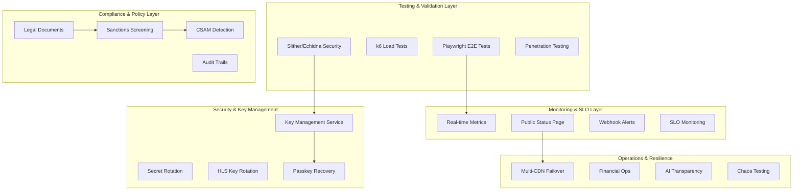

# Go-Live Sprint Design Document

## Overview

This design document outlines the implementation of the final 7-day sprint to achieve 100% agency-ready status. The design focuses on validation, policy, resilience, and operational readiness with a clear execution timeline and go/no-go criteria.

## Architecture

### High-Level System Architecture



## Components and Interfaces

### 1. End-to-End Testing and Security Validation

#### E2E Test Suite
```typescript
interface E2ETestSuite {
  runCriticalJourneys(): Promise<TestResult[]>
  validateFiatPayments(): Promise<TestResult>
  validateGaslessPayments(): Promise<TestResult>
  validatePasskeyOnboarding(): Promise<TestResult>
  validatePlaybackFlow(): Promise<TestResult>
  validateConsentFlow(): Promise<TestResult>
  validateDMCAFlow(): Promise<TestResult>
  validatePayoutFlow(): Promise<TestResult>
}

interface SecurityAudit {
  runSlitherAnalysis(): Promise<SecurityReport>
  runEchidnaFuzzing(): Promise<FuzzingReport>
  conductPenetrationTest(): Promise<PentestReport>
  validateRollbackProcedures(): Promise<RollbackValidation>
}
```

### 2. Real-Time Metrics and SLO Monitoring

#### Metrics Collection Service
```typescript
interface MetricsCollectionService {
  collectPlaybackMetrics(): Promise<PlaybackMetrics>
  collectPaymentMetrics(): Promise<PaymentMetrics>
  collectPayoutMetrics(): Promise<PayoutMetrics>
  calculateSLOs(): Promise<SLOMetrics>
  triggerAlerts(threshold: SLOThreshold): Promise<void>
}

interface StatusPageService {
  updateLiveMetrics(metrics: SLOMetrics): Promise<void>
  createIncident(incident: Incident): Promise<string>
  updateIncident(id: string, update: IncidentUpdate): Promise<void>
  publishStatusUpdate(): Promise<void>
}
```

### 3. Legal and Policy Foundation

#### Policy Management Service
```typescript
interface PolicyManagementService {
  createPolicyDocument(type: PolicyType, content: string): Promise<Policy>
  versionPolicy(policyId: string): Promise<PolicyVersion>
  requireUserAcceptance(userId: string, policyId: string): Promise<void>
  trackPolicyAcceptance(userId: string, policyId: string): Promise<AcceptanceRecord>
}

interface IncidentResponseService {
  createIncident(type: IncidentType, severity: Severity): Promise<Incident>
  escalateToLawEnforcement(incidentId: string): Promise<LEARequest>
  handleTakedownRequest(request: TakedownRequest): Promise<TakedownResponse>
  generateComplianceReport(): Promise<ComplianceReport>
}
```

### 4. Sanctions Screening and Compliance

#### Sanctions Screening Service
```typescript
interface SanctionsScreeningService {
  screenUser(userInfo: UserInfo): Promise<ScreeningResult>
  screenPayout(payoutInfo: PayoutInfo): Promise<ScreeningResult>
  updateSanctionsList(): Promise<void>
  flagSanctionsMatch(userId: string, reason: string): Promise<void>
}

interface ComplianceService {
  enforceCountryBlocklist(country: string): Promise<boolean>
  createAuditTrail(action: ComplianceAction): Promise<AuditRecord>
  generateComplianceReport(): Promise<ComplianceReport>
}
```

### 5. CSAM Detection and Child Safety

#### CSAM Detection Service
```typescript
interface CSAMDetectionService {
  scanContent(contentId: string, contentBuffer: Buffer): Promise<CSAMScanResult>
  reportToNCMEC(csamCase: CSAMCase): Promise<NCMECReport>
  escalateToLawEnforcement(csamCase: CSAMCase): Promise<LEAEscalation>
  restrictEvidenceAccess(caseId: string, authorizedPersonnel: string[]): Promise<void>
}

interface EvidenceManagementService {
  createEvidencePackage(caseId: string): Promise<EvidencePackage>
  restrictAccess(packageId: string, personnel: string[]): Promise<void>
  auditAccess(packageId: string, accessor: string): Promise<void>
  generateLegalReport(caseId: string): Promise<LegalReport>
}
```

### 6. Secrets and Key Management

#### Key Management Service
```typescript
interface KeyManagementService {
  createEnvelopeKey(purpose: KeyPurpose): Promise<EnvelopeKey>
  rotateKey(keyId: string): Promise<KeyRotationResult>
  encryptData(data: Buffer, keyId: string): Promise<EncryptedData>
  decryptData(encryptedData: EncryptedData): Promise<Buffer>
}

interface HLSKeyRotationService {
  rotateHLSKeys(): Promise<HLSKeyRotationResult>
  scheduleRotation(interval: number): Promise<void>
  validateKeyRotation(): Promise<ValidationResult>
  emergencyKeyRevocation(keyId: string): Promise<void>
}
```

## Data Models

### Testing and Validation Models
```typescript
interface TestResult {
  testName: string
  status: 'passed' | 'failed' | 'skipped'
  duration: number
  errors: TestError[]
  screenshots: string[]
}

interface SecurityReport {
  vulnerabilities: Vulnerability[]
  riskScore: number
  recommendations: string[]
  auditDate: Date
}
```

### Metrics and SLO Models
```typescript
interface SLOMetrics {
  p95JoinTime: number // milliseconds
  rebufferRatio: number // percentage
  checkoutSuccessRate: number // percentage
  payoutP95Latency: number // minutes
  uptime: number // percentage
  lastUpdated: Date
}

interface Incident {
  id: string
  title: string
  description: string
  severity: 'minor' | 'major' | 'critical'
  status: 'investigating' | 'identified' | 'monitoring' | 'resolved'
  startedAt: Date
  resolvedAt?: Date
  updates: IncidentUpdate[]
}
```

### Compliance and Policy Models
```typescript
interface Policy {
  id: string
  type: 'terms' | 'privacy' | 'dmca' | '2257' | 'aup' | 'cookie'
  version: string
  content: string
  effectiveDate: Date
  requiresAcceptance: boolean
}

interface ScreeningResult {
  userId: string
  status: 'clear' | 'flagged' | 'blocked'
  matchedLists: string[]
  riskScore: number
  reviewRequired: boolean
}
```

### CSAM and Evidence Models
```typescript
interface CSAMScanResult {
  contentId: string
  status: 'clear' | 'flagged' | 'confirmed'
  confidence: number
  hashMatches: string[]
  requiresHumanReview: boolean
}

interface EvidencePackage {
  id: string
  caseId: string
  contents: EvidenceItem[]
  accessLog: AccessLogEntry[]
  encryptionKey: string
  createdAt: Date
}
```

## Implementation Timeline

### Day 1-2: Testing and Security Foundation
- Implement comprehensive E2E test suite with Playwright
- Set up k6 load testing for concurrent users and payments
- Run Slither/Echidna security analysis on smart contracts
- Conduct penetration testing and document findings
- Create rollback runbooks and emergency procedures

### Day 2-3: Metrics and SLO Implementation
- Wire player beacons to real-time metrics aggregation
- Implement status page tiles with live SLO data
- Set up webhook alerts for SLO threshold breaches
- Test alert thresholds and notification systems
- Publish public status page URL for agencies

### Day 3-4: Legal and Compliance Foundation
- Create and publish legal policy documents
- Implement policy versioning and user acceptance tracking
- Set up sanctions screening integration with KYC and payouts
- Implement country blocklist enforcement
- Create incident response and LEA request procedures

### Day 4-5: CSAM and Security Implementation
- Integrate CSAM detection provider (PhotoDNA/equivalent)
- Set up human review queue and escalation procedures
- Implement evidence access restrictions and audit trails
- Deploy KMS and envelope encryption for sensitive data
- Set up automated HLS key rotation and secret management

### Day 6: Resilience and Chaos Testing
- Implement multi-CDN failover testing
- Simulate CDN failures and key rotation scenarios
- Verify geo-blocking and regional compliance
- Document chaos test results on status page
- Validate emergency procedures and runbooks

### Day 7: Final Polish and Launch Preparation
- Implement passkey recovery flows and device management
- Complete financial operations features (invoicing, audit export)
- Add AI transparency documentation and opt-out controls
- Conduct soft launch with 3 pilot agencies
- Prepare go/no-go decision criteria

## Security Considerations

### Data Protection
- All sensitive data encrypted with KMS-managed keys
- Evidence packages use envelope encryption
- PII never stored on-chain or in logs
- GDPR/CCPA data export and deletion validated

### Access Control
- CSAM evidence restricted to authorized personnel only
- Role-based access for compliance and legal functions
- Audit trails for all sensitive data access
- Emergency access revocation procedures

### Key Management
- Automated key rotation with documented cadence
- Emergency key revocation capabilities
- Key usage monitoring and alerting
- Secure key backup and recovery procedures

## Testing Strategy

### End-to-End Testing
- Critical user journey automation with Playwright
- Payment flow testing (fiat and gasless)
- Passkey onboarding and authentication flows
- Content upload, moderation, and playback testing
- DMCA takedown and payout processing validation

### Load Testing
- Concurrent user simulation with k6
- Payment processing under load
- Video streaming performance testing
- Database and API endpoint stress testing

### Security Testing
- Smart contract fuzzing with Echidna
- Static analysis with Slither
- Penetration testing of backend services
- Vulnerability assessment and remediation

### Chaos Testing
- CDN failover simulation
- Key rotation under load
- Database failover testing
- Network partition simulation

## Go/No-Go Criteria

### Must Be Green
- ✅ E2E test suite passing for all critical journeys
- ✅ Status page showing live SLOs and handling test incidents
- ✅ Evidence pack generation with Merkle anchoring
- ✅ Sanctions and CSAM screening tested with synthetic data
- ✅ KMS deployed with recent key rotation (<30 days)
- ✅ 3DS/SCA and VAT/GST configured for target regions
- ✅ Support runbooks for incident response and LEA requests

### Success Metrics
- P95 join time < 2 seconds
- Rebuffer ratio < 1%
- Checkout success rate > 98%
- Payout P95 latency < 60 minutes
- System uptime > 99.9%
- Zero critical security vulnerabilities
- All compliance checks passing