# Go-to-Market Readiness Design Document

## Overview

This design document outlines the comprehensive system architecture and implementation strategy for achieving 100% go-to-market readiness. The design ensures agencies will actively seek out the platform due to superior automation, compliance, operational transparency, and technical excellence.

## Architecture

### High-Level Go-to-Market Architecture

```mermaid
graph TB
    subgraph "Public Trust Layer"
        StatusPage[Public Status Page]
        MetricsDash[Real-time Metrics Dashboard]
        APIDocs[API Documentation Portal]
        CompliancePortal[Compliance Portal]
    end
    
    subgraph "Agency Integration Layer"
        PublicAPI[Public API Gateway]
        WebhookSys[Webhook System]
        PartnerSDK[Partner SDK]
        AffiliateTrack[Affiliate Tracking]
    end
    
    subgraph "Operational Excellence Layer"
        MonitoringSys[Monitoring System]
        AlertManager[Alert Manager]
        FeatureFlags[Feature Flag System]
        ErrorTracking[Error Tracking]
    end
    
    subgraph "Compliance & Legal Layer"
        EvidencePacks[Evidence Pack Generator]
        ForensicWM[Forensic Watermarking]
        DataCompliance[Data Compliance Engine]
        AuditTrail[Audit Trail System]
    end
    
    subgraph "AI Excellence Layer"
        ModelRegistry[Model Registry]
        DriftDetection[Drift Detection]
        AIGovernance[AI Governance]
        RedTeamTests[Red Team Testing]
    end
    
    subgraph "Growth & Revenue Layer"
        ReferralSys[Referral System]
        AffiliateMgmt[Affiliate Management]
        RevenueOpt[Revenue Optimization]
        ConversionTrack[Conversion Tracking]
    end
    
    StatusPage --> MetricsDash
    PublicAPI --> WebhookSys
    MonitoringSys --> AlertManager
    EvidencePacks --> ForensicWM
    ModelRegistry --> DriftDetection
    ReferralSys --> AffiliateMgmt
```



## Components and Interfaces

### 1. Public Trust and Transparency System

#### Status Page Service
```typescript
interface StatusPageService {
  getRealtimeMetrics(): Promise<RealtimeMetrics>
  getHistoricalTrends(): Promise<HistoricalData>
  getIncidentHistory(): Promise<Incident[]>
  getUptimeStats(): Promise<UptimeStats>
  publishIncident(incident: Incident): Promise<void>
}

interface RealtimeMetrics {
  playbackP95JoinTime: number
  rebufferRatio: number
  payoutP95Latency: number
  checkoutSuccessRate: number
  uptime: number
  activeUsers: number
}
```

#### Metrics Collection Service
```typescript
interface MetricsCollectionService {
  collectPlaybackMetrics(sessionId: string, metrics: PlaybackMetrics): Promise<void>
  collectBusinessMetrics(event: BusinessEvent): Promise<void>
  calculateSLOs(): Promise<SLOMetrics>
  publishToStatusPage(metrics: SLOMetrics): Promise<void>
  triggerAlerts(breaches: SLOBreach[]): Promise<void>
}
```

### 2. Agency Integration and Partnership System

#### Public API Gateway
```typescript
interface PublicAPIGateway {
  authenticateRequest(apiKey: string): Promise<APIKeyScope>
  rateLimit(request: APIRequest): Promise<RateLimitResult>
  routeRequest(request: APIRequest): Promise<APIResponse>
  logRequest(request: APIRequest, response: APIResponse): Promise<void>
  generateCorrelationId(): string
}

interface APIKeyScope {
  permissions: string[]
  rateLimit: number
  organizationId?: string
  expiresAt: Date
}
```

#### Webhook System
```typescript
interface WebhookSystem {
  registerWebhook(config: WebhookConfig): Promise<string>
  sendWebhook(event: WebhookEvent): Promise<WebhookResult>
  retryFailedWebhooks(): Promise<void>
  validateSignature(payload: string, signature: string): boolean
}

interface WebhookConfig {
  url: string
  events: string[]
  secret: string
  retryPolicy: RetryPolicy
}
```

### 3. Operational Excellence System

#### Feature Flag Service
```typescript
interface FeatureFlagService {
  evaluateFlag(flagKey: string, context: EvaluationContext): Promise<boolean>
  createFlag(flag: FeatureFlag): Promise<void>
  updateFlag(flagKey: string, updates: Partial<FeatureFlag>): Promise<void>
  killSwitch(flagKey: string): Promise<void>
  getFlags(organizationId?: string): Promise<FeatureFlag[]>
}

interface FeatureFlag {
  key: string
  enabled: boolean
  rules: FlagRule[]
  killSwitchEnabled: boolean
  organizationScoped: boolean
  geoScoped: boolean
}
```

#### Error Tracking Service
```typescript
interface ErrorTrackingService {
  captureError(error: Error, context: ErrorContext): Promise<string>
  captureException(exception: Exception): Promise<string>
  setUser(user: User): void
  setTag(key: string, value: string): void
  addBreadcrumb(breadcrumb: Breadcrumb): void
}

interface ErrorContext {
  correlationId: string
  userId?: string
  organizationId?: string
  feature: string
  severity: 'low' | 'medium' | 'high' | 'critical'
}
```

### 4. Compliance and Legal Protection System

#### Data Compliance Engine
```typescript
interface DataComplianceEngine {
  exportUserData(userId: string): Promise<DataExportPackage>
  deleteUserData(userId: string, retainAnonymized: boolean): Promise<DeletionResult>
  auditDataAccess(userId: string): Promise<AccessAuditLog[]>
  enforceRetentionPolicy(): Promise<RetentionResult>
  processConsentUpdate(userId: string, consent: ConsentPreferences): Promise<void>
}

interface DataExportPackage {
  userId: string
  exportedAt: Date
  dataCategories: DataCategory[]
  downloadUrl: string
  expiresAt: Date
}
```

#### Forensic Watermarking Service
```typescript
interface ForensicWatermarkingService {
  embedWatermark(videoUrl: string, userSession: UserSession): Promise<string>
  extractWatermark(suspiciousVideo: string): Promise<WatermarkData | null>
  generateForensicReport(watermarkData: WatermarkData): Promise<ForensicReport>
  integrateWithLeakDetection(leakId: string): Promise<void>
}

interface WatermarkData {
  userId: string
  sessionId: string
  timestamp: Date
  deviceFingerprint: string
  confidence: number
}
```

### 5. AI Excellence and Innovation System

#### Model Registry Service
```typescript
interface ModelRegistryService {
  registerModel(model: AIModel): Promise<string>
  deployModel(modelId: string, environment: string): Promise<DeploymentResult>
  rollbackModel(modelId: string, previousVersion: string): Promise<void>
  getModelMetrics(modelId: string): Promise<ModelMetrics>
  compareModels(modelA: string, modelB: string): Promise<ModelComparison>
}

interface AIModel {
  id: string
  name: string
  version: string
  type: 'embedding' | 'classification' | 'generation'
  metrics: ModelMetrics
  tags: string[]
  deployedAt?: Date
}
```

#### AI Governance Service
```typescript
interface AIGovernanceService {
  runRedTeamTests(modelId: string): Promise<RedTeamResults>
  detectModelDrift(modelId: string): Promise<DriftAnalysis>
  reviewFalsePositives(modelId: string): Promise<ReviewQueue>
  generateGovernanceReport(): Promise<GovernanceReport>
  enforceEthicsGuidelines(modelOutput: any): Promise<EthicsResult>
}
```

### 6. Growth and Revenue Optimization System

#### Referral System
```typescript
interface ReferralSystem {
  createReferralCode(userId: string, campaign?: string): Promise<ReferralCode>
  trackReferral(code: string, event: ReferralEvent): Promise<void>
  calculateCommissions(period: DateRange): Promise<Commission[]>
  processPayouts(commissions: Commission[]): Promise<PayoutResult[]>
  getAttributionReport(userId: string): Promise<AttributionReport>
}

interface ReferralCode {
  code: string
  userId: string
  campaign?: string
  commissionRate: number
  expiresAt?: Date
  trackingUrl: string
}
```

#### Revenue Optimization Service
```typescript
interface RevenueOptimizationService {
  runABTest(testConfig: ABTestConfig): Promise<ABTestResult>
  optimizeCheckoutFlow(userId: string): Promise<CheckoutOptimization>
  analyzePricingElasticity(contentId: string): Promise<PricingAnalysis>
  recommendBundles(userId: string): Promise<BundleRecommendation[]>
  trackConversionFunnel(userId: string): Promise<ConversionMetrics>
}
```

## Data Models

### Status Page Models
```typescript
interface RealtimeMetrics {
  timestamp: Date
  playbackP95JoinTime: number
  rebufferRatio: number
  payoutP95Latency: number
  checkoutSuccessRate: number
  uptime: number
  activeUsers: number
  errorRate: number
}

interface Incident {
  id: string
  title: string
  description: string
  status: 'investigating' | 'identified' | 'monitoring' | 'resolved'
  severity: 'minor' | 'major' | 'critical'
  startedAt: Date
  resolvedAt?: Date
  updates: IncidentUpdate[]
}
```

### API Models
```typescript
interface APIRequest {
  method: string
  path: string
  headers: Record<string, string>
  body?: any
  apiKey: string
  correlationId: string
  timestamp: Date
}

interface APIResponse {
  statusCode: number
  body: any
  headers: Record<string, string>
  processingTime: number
  correlationId: string
}
```

### Compliance Models
```typescript
interface DataExportPackage {
  userId: string
  exportedAt: Date
  dataCategories: {
    profile: UserProfile
    content: ContentData[]
    transactions: TransactionData[]
    analytics: AnalyticsData[]
  }
  downloadUrl: string
  expiresAt: Date
}

interface AccessAuditLog {
  userId: string
  accessedBy: string
  accessedAt: Date
  dataType: string
  purpose: string
  ipAddress: string
}
```

## Implementation Strategy

### Phase 1: Critical Infrastructure (Week 1)
- Complete end-to-end testing and security audit
- Implement unified error handling and feature flags
- Set up monitoring and alerting systems
- Deploy kill switches for all new features

### Phase 2: Compliance and Legal (Week 2)
- Build privacy and data compliance operations
- Implement payments edge case handling
- Create forensic watermarking system
- Complete audit trail and evidence systems

### Phase 3: Agency Integration (Week 3)
- Build public API and webhook systems
- Create partner documentation and SDKs
- Implement referral and affiliate systems
- Set up multi-CDN infrastructure

### Phase 4: AI Excellence (Week 4)
- Deploy AI observability and governance
- Complete model registry and drift detection
- Implement red-team testing automation
- Finalize AI governance reporting

## Go-Live Readiness Checklist

### Technical Readiness
- [ ] All E2E tests passing with 99.9% reliability
- [ ] Load testing completed for 1000+ concurrent users
- [ ] Security audit passed with no critical vulnerabilities
- [ ] Feature flags deployed with kill switches active
- [ ] Monitoring and alerting systems operational

### Operational Readiness
- [ ] Status page live with real-time metrics
- [ ] Incident response procedures documented
- [ ] Rollback procedures tested and verified
- [ ] SLA documentation published
- [ ] Support channels established

### Compliance Readiness
- [ ] GDPR/CCPA compliance verified
- [ ] Evidence pack generation tested (<30s)
- [ ] Audit trails comprehensive and tested
- [ ] Legal documentation complete
- [ ] Privacy policies updated

### Agency Readiness
- [ ] Public API documented and tested
- [ ] Webhook system operational
- [ ] Partner onboarding process defined
- [ ] Revenue sharing agreements templated
- [ ] Integration examples published

### Performance Targets
- [ ] P95 join time < 2 seconds
- [ ] Rebuffer ratio < 1%
- [ ] Checkout success rate > 95%
- [ ] Payout P95 latency < 24 hours
- [ ] Uptime > 99.95%

## Success Metrics

### Agency Attraction Metrics
- Number of agency inquiries per week
- Agency onboarding completion rate
- Revenue per agency partner
- Agency retention rate
- Partner satisfaction scores

### Technical Excellence Metrics
- System uptime and reliability
- Performance benchmark comparisons
- Security audit scores
- Compliance audit results
- API adoption rates

### Business Impact Metrics
- Platform revenue growth
- User acquisition through partners
- Conversion rate improvements
- Cost reduction through automation
- Market share growth