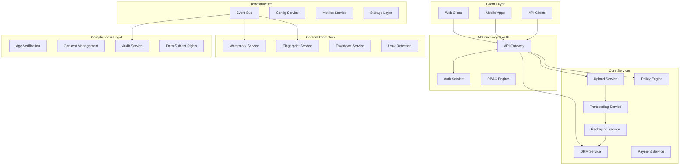

# Production-Grade API Completion Design Document

## Overview

This design document outlines the architecture for completing Reelverse's production-grade API infrastructure. The system addresses critical gaps in secure monetization, content protection, and legal compliance for a decentralized adult content platform.

The architecture follows a microservices pattern with event-driven communication, ensuring scalability, maintainability, and compliance with adult content industry requirements.

## Architecture

### High-Level System Architecture



### Service Communication Patterns

- **Synchronous**: REST APIs for real-time operations (auth, playback authorization)
- **Asynchronous**: Event-driven for content processing pipelines
- **Streaming**: WebSockets for real-time updates (upload progress, transcoding status)

## Components and Interfaces

### 1. Upload and Transcoding Pipeline

#### Upload Service
```typescript
interface UploadService {
  // Multipart upload with resumable sessions
  initiateUpload(request: UploadRequest): Promise<UploadSession>
  uploadChunk(sessionId: string, chunk: ChunkData): Promise<ChunkResponse>
  completeUpload(sessionId: string): Promise<UploadResult>
  
  // Malware and CSAM scanning
  scanContent(contentId: string): Promise<ScanResult>
  
  // On-chain coordination
  requestSlot(uploadRequest: UploadRequest): Promise<SlotReservation>
  commitContent(contentId: string, metadata: ContentMetadata): Promise<TransactionHash>
}

interface UploadRequest {
  fileSize: number
  contentType: string
  organizationId: string
  creatorId: string
  metadata: ContentMetadata
  idempotencyKey: string
}
```

#### Transcoding Service (Livepeer Integration)
```typescript
interface TranscodingService {
  createJob(contentId: string, profiles: TranscodingProfile[]): Promise<JobId>
  handleWebhook(payload: LivepeerWebhook, signature: string): Promise<void>
  getJobStatus(jobId: string): Promise<JobStatus>
  retryJob(jobId: string): Promise<JobId>
}

interface TranscodingProfile {
  name: string
  width: number
  height: number
  bitrate: number
  fps: number
  codec: 'h264' | 'h265' | 'av1'
}
```

### 2. Content Packaging and Encryption

#### Packaging Service
```typescript
interface PackagingService {
  packageContent(contentId: string, renditions: Rendition[]): Promise<PackageResult>
  generateManifests(contentId: string, format: 'hls' | 'dash' | 'cmaf'): Promise<Manifest[]>
  rotateKeys(contentId: string): Promise<KeyRotationResult>
}

interface PackageResult {
  manifestUrls: Record<string, string>
  keyIds: string[]
  segmentCount: number
  totalDuration: number
}
```

#### DRM and Key Management Service
```typescript
interface DRMService {
  // License delivery
  issueLicense(request: LicenseRequest): Promise<License>
  revokeLicense(licenseId: string): Promise<void>
  
  // Key management
  generateContentKeys(contentId: string): Promise<ContentKeys>
  rotateKeys(contentId: string): Promise<KeyRotationResult>
  
  // Device management
  registerDevice(userId: string, deviceInfo: DeviceInfo): Promise<DeviceId>
  revokeDevice(deviceId: string): Promise<void>
}

interface LicenseRequest {
  contentId: string
  userId: string
  deviceId: string
  playbackTicket: string
  drmSystem: 'widevine' | 'fairplay' | 'playready'
}
```

### 3. Authorization and Policy Engine

#### Policy Engine
```typescript
interface PolicyEngine {
  evaluateAccess(request: AccessRequest): Promise<PolicyDecision>
  createPlaybackTicket(contentId: string, userId: string): Promise<PlaybackTicket>
  validateTicket(ticket: string, context: ValidationContext): Promise<TicketValidation>
}

interface AccessRequest {
  contentId: string
  userId: string
  deviceId: string
  ipAddress: string
  geolocation: GeoLocation
  userAgent: string
}

interface PolicyDecision {
  allowed: boolean
  reason?: string
  restrictions: AccessRestriction[]
  watermarkProfile?: WatermarkProfile
}
```

#### CDN Authorization Service
```typescript
interface CDNAuthService {
  authorizeSegment(request: SegmentAuthRequest): Promise<AuthDecision>
  authorizeManifest(request: ManifestAuthRequest): Promise<ManifestResponse>
  issueKeyToken(request: KeyTokenRequest): Promise<KeyToken>
}

interface SegmentAuthRequest {
  ticketId: string
  contentId: string
  segmentRange: string
  clientIP: string
  deviceId: string
}
```

### 4. Payment and Entitlement System

#### Payment Service
```typescript
interface PaymentService {
  // Multi-processor support
  processPayment(request: PaymentRequest): Promise<PaymentResult>
  handleWebhook(processor: PaymentProcessor, payload: any): Promise<void>
  
  // Entitlements
  createEntitlement(payment: PaymentResult): Promise<Entitlement>
  validateEntitlement(userId: string, contentId: string): Promise<EntitlementStatus>
  
  // Payouts
  processPayout(creatorId: string, amount: number): Promise<PayoutResult>
}

interface PaymentRequest {
  userId: string
  contentId: string
  amount: number
  currency: string
  processor: 'ccbill' | 'segpay' | 'epoch' | 'crypto'
  paymentMethod: PaymentMethod
}
```

### 5. Content Protection Services

#### Watermarking Service
```typescript
interface WatermarkingService {
  applyWatermark(contentId: string, profile: WatermarkProfile): Promise<WatermarkResult>
  generateUserWatermark(userId: string, sessionId: string): Promise<WatermarkData>
  detectWatermark(suspiciousContent: Buffer): Promise<WatermarkDetection>
}

interface WatermarkProfile {
  type: 'static_overlay' | 'forensic_embedding' | 'session_based'
  position: WatermarkPosition
  opacity: number
  userData?: UserWatermarkData
}
```

#### Fingerprinting and Leak Detection
```typescript
interface FingerprintingService {
  generateFingerprint(contentId: string): Promise<ContentFingerprint>
  matchFingerprint(suspiciousContent: Buffer): Promise<FingerprintMatch[]>
  
  // Integration with leak detection
  submitToLeakDetection(fingerprint: ContentFingerprint): Promise<void>
}

interface LeakDetectionService {
  ingestLeak(leak: LeakReport): Promise<LeakCase>
  processDMCA(caseId: string): Promise<DMCAResult>
  trackTakedown(caseId: string, platform: string): Promise<TakedownStatus>
}
```

### 6. Compliance and Legal Services

#### Age Verification Service
```typescript
interface AgeVerificationService {
  verifyAge(userId: string, documents: VerificationDocument[]): Promise<VerificationResult>
  checkVerificationStatus(userId: string): Promise<VerificationStatus>
  
  // 2257 compliance
  submitConsentDocuments(performerId: string, documents: ConsentDocument[]): Promise<ConsentSubmission>
  reviewConsent(submissionId: string, decision: ReviewDecision): Promise<ConsentReview>
}
```

#### Data Subject Rights Service
```typescript
interface DSRService {
  submitRequest(request: DSRRequest): Promise<DSRCase>
  processAccess(caseId: string): Promise<DataExport>
  processErasure(caseId: string): Promise<ErasureResult>
  processRestriction(caseId: string): Promise<RestrictionResult>
}
```

### 7. Infrastructure Services

#### Event Bus
```typescript
interface EventBus {
  publish(event: PlatformEvent): Promise<void>
  subscribe(eventType: string, handler: EventHandler): Promise<Subscription>
  
  // Schema management
  registerSchema(eventType: string, schema: JSONSchema): Promise<void>
  validateEvent(event: PlatformEvent): Promise<ValidationResult>
}

interface PlatformEvent {
  id: string
  type: string
  version: string
  timestamp: Date
  correlationId: string
  payload: any
  metadata: EventMetadata
}
```

## Data Models

### Core Content Models

```typescript
interface Content {
  id: string
  creatorId: string
  organizationId: string
  title: string
  description: string
  tags: string[]
  
  // Content metadata
  duration: number
  fileSize: number
  originalFormat: string
  uploadedAt: Date
  
  // Processing status
  status: ContentStatus
  processingStage: ProcessingStage
  
  // Compliance
  ageRating: AgeRating
  jurisdictionalTags: JurisdictionalTag[]
  consentDocumentIds: string[]
  
  // Monetization
  pricingModel: PricingModel
  price: number
  currency: string
  
  // Protection
  watermarkProfile: WatermarkProfile
  fingerprintId: string
  
  // Storage
  storageLocations: StorageLocation[]
  encryptionKeyId: string
}

interface User {
  id: string
  email: string
  role: UserRole
  organizationId?: string
  
  // Verification
  ageVerificationStatus: VerificationStatus
  ageVerificationDate?: Date
  kycStatus: KYCStatus
  
  // Device management
  devices: Device[]
  maxConcurrentDevices: number
  
  // Entitlements
  subscriptions: Subscription[]
  purchases: Purchase[]
  
  // Compliance
  consentRecords: ConsentRecord[]
  dsrRequests: DSRRequest[]
}
```

### Payment and Entitlement Models

```typescript
interface Entitlement {
  id: string
  userId: string
  contentId: string
  type: 'subscription' | 'ppv' | 'free'
  
  // Validity
  grantedAt: Date
  expiresAt?: Date
  usageLimit?: number
  usageCount: number
  
  // Payment reference
  paymentId: string
  processor: PaymentProcessor
  
  // Status
  status: EntitlementStatus
  restrictions: AccessRestriction[]
}

interface PaymentTransaction {
  id: string
  userId: string
  contentId?: string
  amount: number
  currency: string
  
  // Processor details
  processor: PaymentProcessor
  processorTransactionId: string
  processorFees: number
  
  // Revenue split
  creatorShare: number
  platformShare: number
  
  // Status
  status: PaymentStatus
  processedAt: Date
  
  // Compliance
  taxInfo: TaxInformation
  auditTrail: AuditEntry[]
}
```

### Security and Compliance Models

```typescript
interface AuditEntry {
  id: string
  timestamp: Date
  userId?: string
  action: string
  resource: string
  resourceId: string
  
  // Context
  ipAddress: string
  userAgent: string
  correlationId: string
  
  // Result
  success: boolean
  errorCode?: string
  errorMessage?: string
  
  // Integrity
  hash: string
  previousHash?: string
}

interface ConsentRecord {
  id: string
  performerId: string
  contentId: string
  
  // Documents
  documentHashes: string[]
  attestationHash: string
  
  // Review
  reviewerId: string
  reviewedAt: Date
  approved: boolean
  
  // Validity
  expiresAt: Date
  status: ConsentStatus
}
```

## Error Handling

### Error Classification

```typescript
enum ErrorCategory {
  AUTHENTICATION = 'auth',
  AUTHORIZATION = 'authz',
  VALIDATION = 'validation',
  BUSINESS_LOGIC = 'business',
  EXTERNAL_SERVICE = 'external',
  SYSTEM = 'system',
  COMPLIANCE = 'compliance'
}

interface APIError {
  code: string
  category: ErrorCategory
  message: string
  details?: any
  correlationId: string
  timestamp: Date
  retryable: boolean
}
```

### Error Response Patterns

- **4xx Client Errors**: Validation failures, authentication/authorization issues
- **5xx Server Errors**: System failures, external service unavailability
- **Custom Error Codes**: Business logic violations, compliance failures

### Circuit Breaker Pattern

Implement circuit breakers for external services:
- Livepeer API calls
- Payment processor webhooks
- Storage provider operations
- DRM license servers

## Testing Strategy

### Unit Testing
- Service layer business logic
- Data validation and transformation
- Error handling scenarios
- Security policy evaluation

### Integration Testing
- API endpoint functionality
- Database operations
- External service integrations
- Event publishing and consumption

### End-to-End Testing
- Complete content upload and processing pipeline
- Payment and entitlement workflows
- DRM license delivery and playback
- Compliance and audit workflows

### Performance Testing
- Load testing for high-traffic scenarios
- Stress testing for peak upload periods
- Latency testing for real-time operations (license delivery)
- Scalability testing for concurrent users

### Security Testing
- Authentication and authorization flows
- Input validation and sanitization
- Encryption and key management
- Audit trail integrity

### Compliance Testing
- Age verification workflows
- GDPR data subject rights
- 2257 record keeping requirements
- Audit trail completeness

## Performance Requirements

### Service Level Objectives (SLOs)

#### License Delivery Service
- P95 latency ≤ 250ms
- P99 latency ≤ 500ms
- 99.9% availability

#### CDN Authorization
- P95 latency ≤ 50ms (cache hit)
- P95 latency ≤ 80ms (cache miss)
- 99.95% availability

#### Upload Service
- Support files up to 50GB
- Resumable uploads with 99.9% reliability
- Multipart upload completion within 5 minutes for 1GB files

#### Content Processing Pipeline
- Transcoding initiation within 30 seconds
- End-to-end processing (upload to playback ready) within 2x content duration
- 99.5% processing success rate

### Scalability Targets
- Support 10,000 concurrent users
- Handle 1,000 uploads per hour
- Process 100,000 license requests per minute
- Store 1PB of encrypted content across multiple providers

## Security Considerations

### Encryption Standards
- AES-256 for content encryption
- RSA-4096 or ECDSA P-384 for key exchange
- TLS 1.3 for all API communications
- Envelope encryption for key management

### Key Management
- Hardware Security Modules (HSM) for root keys
- Key rotation every 90 days (configurable)
- Emergency key rotation within 5 minutes
- Secure key escrow for disaster recovery

### Access Control
- OAuth 2.0 with PKCE for client authentication
- JWT tokens with short expiration (15 minutes)
- Role-based access control (RBAC)
- Device-bound licenses with hardware attestation

### Audit and Monitoring
- Immutable audit logs with cryptographic integrity
- Real-time security event monitoring
- Anomaly detection for suspicious access patterns
- Compliance reporting and evidence collection

## Deployment Architecture

### Microservices Deployment
- Containerized services with Docker
- Kubernetes orchestration
- Service mesh for inter-service communication
- Auto-scaling based on demand

### Data Storage
- PostgreSQL for transactional data
- Redis for caching and session storage
- S3-compatible storage for content
- Blockchain for immutable records

### Content Delivery
- Multi-CDN setup with failover
- Edge computing for authorization
- Geographic content distribution
- Adaptive bitrate streaming

### Monitoring and Observability
- Distributed tracing with correlation IDs
- Metrics collection and alerting
- Log aggregation and analysis
- Health checks and service discovery