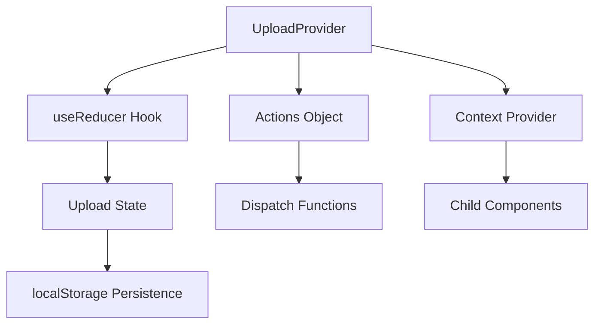

# Fix TSX Provider Error in Upload Store

## Overview
This design addresses the TypeScript/JSX compilation error occurring in the UploadProvider component within `store/uploadStore.ts`. The error indicates malformed JSX syntax in the Provider's value prop assignment.

## Problem Analysis

### Error Details
- **File**: `C:/Users/USER/Documents/GitHub/Reelverse-decentralised-content-platform/store/uploadStore.ts`
- **Line**: 372:28
- **Error**: `Expected ">" but found "value"`
- **Root Cause**: Malformed JSX syntax in UploadContext.Provider value prop

### Current Issue
The error message shows the JSX is malformed:
```tsx
<UploadContext.Provider value= state, actions >
```

### Expected Syntax
The correct JSX should be:
```tsx
<UploadContext.Provider value={{ state, actions }}>
```

## Technical Requirements

### Provider Component Structure
The UploadProvider component must have:
- Proper TypeScript React.FC typing
- Correct JSX object syntax for Provider value prop
- State management using useReducer
- localStorage persistence effects
- Complete action handlers

### State Management Integration


## Implementation Strategy

### 1. JSX Syntax Correction
Fix the Provider component's value prop to use proper object destructuring:

```tsx
// Incorrect (causing error)
<UploadContext.Provider value= state, actions >

// Correct
<UploadContext.Provider value={{ state, actions }}>
```

### 2. TypeScript Interface Validation
Ensure the Provider component properly implements:
- React.FC<UploadProviderProps> interface
- Correct return type annotations
- Proper context value typing

### 3. Import Dependencies Check
Verify all required React imports are present:
- React
- useReducer
- useEffect  
- useContext
- createContext
- ReactNode

### 4. Build Cache Cleanup
Address potential build/cache issues:
- Clear Vite build cache
- Restart development server
- Verify file encoding consistency

## Provider Component Architecture

### Context Structure
```typescript
interface UploadContextValue {
  state: UploadState;
  actions: UploadActions;
}

const UploadContext = createContext<UploadContextValue | null>(null);
```

### Provider Props Interface
```typescript
interface UploadProviderProps {
  children: ReactNode;
}
```

### Component Implementation Pattern
```tsx
export const UploadProvider: React.FC<UploadProviderProps> = ({ children }) => {
  // State management
  const [state, dispatch] = useReducer(uploadReducer, initialState);
  
  // Effects for persistence
  useEffect(() => {
    // localStorage loading logic
  }, []);
  
  useEffect(() => {
    // localStorage saving logic  
  }, [state]);
  
  // Actions object
  const actions: UploadActions = {
    // Action implementations
  };
  
  // Provider render
  return (
    <UploadContext.Provider value={{ state, actions }}>
      {children}
    </UploadContext.Provider>
  );
};
```

## Validation Requirements

### Compilation Checks
- TypeScript compilation without errors
- ESBuild transformation success
- Vite development server startup
- React component rendering

### Runtime Verification
- Context value accessibility in child components
- State persistence across component remounts
- Action dispatching functionality
- Error boundary handling

## Error Prevention Measures

### Syntax Validation
- Use proper JSX object literal syntax for all props
- Ensure consistent TypeScript typing throughout
- Validate React imports and dependencies

### Build System Integration
- Configure proper file watching in Vite
- Ensure TypeScript configuration supports JSX
- Validate build tool compatibility

### Development Workflow
- Clear build cache when encountering syntax errors
- Restart development server after significant changes
- Use proper IDE TypeScript language service

## Testing Strategy

### Component Testing
- Verify Provider renders without errors
- Test context value propagation to children
- Validate state management functionality
- Confirm localStorage persistence behavior

### Integration Testing  
- Test upload workflow with corrected Provider
- Verify upload progress tracking
- Confirm error handling and recovery
- Validate cross-component state sharing