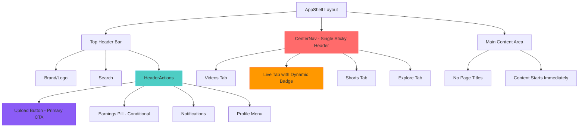

# Header Polish, Sticky Navigation & Enhanced Feeds Design

## Overview

This design document outlines the finalized improvements to the Reelverse platform's user interface, establishing CenterNav as the single sticky header component and eliminating duplicate page titles. The implementation focuses on creating a seamless navigation experience with playable Shorts feed, resilient Live streaming with fallback handling, and hiding wallet connectivity behind feature flags until ready for production.

## Technology Stack & Dependencies

- **Frontend Framework**: React 18.2.0 with TypeScript
- **Build Tool**: Vite 5.2.0
- **Routing**: React Router DOM
- **Styling**: Tailwind CSS with custom design tokens
- **State Management**: React Context API
- **Video Streaming**: HLS.js for adaptive streaming
- **Testing**: Custom integration tests

## Component Architecture

### Finalized Header Architecture

The header system is streamlined into a single sticky navigation pattern:



#### CenterNav - Single Sticky Header Implementation

**Core Requirements:**
- **Single Source of Truth**: Only sticky element in the entire layout
- **No Page-Level Headers**: Eliminates all duplicate "Reelverse" titles
- **Zero Top Gap**: Content starts immediately below CenterNav
- **Live Count Integration**: Shows badge only when `liveCount > 0`

**Technical Implementation:**
```tsx
// Sticky positioning with proper backdrop
className="sticky top-0 z-40 hidden md:flex w-full justify-center bg-slate-950/80 backdrop-blur supports-[backdrop-filter]:bg-slate-950/60"

// Live indicator with conditional rendering
{it.live && liveCount > 0 && (
  <span className="ml-1 inline-flex items-center gap-1 text-[11px] font-semibold text-red-400">
    <span className="relative flex h-2.5 w-2.5">
      <span className="animate-ping absolute inline-flex h-full w-full rounded-full bg-red-500 opacity-70"></span>
      <span className="relative inline-flex h-2.5 w-2.5 rounded-full bg-red-500"></span>
    </span>
    LIVE
  </span>
)}
```

**Accessibility Features:**
- `role="tablist"` and `role="tab"` for screen readers
- Keyboard navigation with Tab/Enter support
- Focus indicators with `focus:ring-2 focus:ring-violet-500`
- Proper `aria-current="page"` for active states

#### HeaderActions - Wallet-Free Experience

**Feature Flag Configuration:**
```tsx
export const FEATURES = {
  WALLET_CONNECT_ENABLED: false,    // Hidden until production ready
  EARNINGS_PILL_ENABLED: true,     // Show creator earnings
  LIVE_ENABLED: true,              // Enable live streaming
  SHORTS_ENABLED: true,            // Enable vertical feeds
} as const;
```

**Action Hierarchy:**
1. **Upload Button** - Primary violet CTA (`bg-violet-600`)
2. **Earnings Pill** - Conditional display based on feature flag
3. **Notifications** - Always visible with badge indicator
4. **Profile Menu** - User access point
5. **Wallet Connect** - Hidden via feature flag

**Implementation Details:**
```tsx
// Conditional wallet rendering
{FEATURES.WALLET_CONNECT_ENABLED ? (
  <button className="rounded-md bg-slate-800 px-3 py-2 text-sm text-slate-100">Connect Wallet</button>
) : null}

// Primary upload action
<Link to="/upload" className="inline-flex items-center gap-2 rounded-md bg-violet-600 px-3 py-2 text-sm font-medium text-white hover:bg-violet-500">
  <span className="text-base">+</span> Upload
</Link>
```

### Layout Structure Improvements

#### AppShell - Single Sticky Header Layout

**Layout Structure:**
```tsx
export function AppShell({ children }: { children: React.ReactNode }) {
  return (
    <div className="flex">
      {/* Sidebar component */}
      <div className="flex-1 min-h-screen bg-slate-950">
        {/* Top header bar with brand/search/HeaderActions */}
        {/* CenterNav goes directly under and becomes the single sticky element */}
        <main className="px-4 md:px-6 lg:px-8 pb-10">
          {children}
        </main>
      </div>
    </div>
  )
}
```

**Key Design Decisions:**
- **No Top Padding**: Content starts immediately after CenterNav
- **Single Sticky Element**: Only CenterNav has sticky positioning
- **Eliminated Page Headers**: No duplicate "Reelverse" titles anywhere
- **Consistent Spacing**: Horizontal padding scales with screen size

**Debug Cleanup:**
- Remove all `border-red-500` debug styles
- Replace with `border-slate-800` for visual separation when needed
- Clean visual hierarchy without debugging artifacts

## Feature Implementation

### Playable Shorts Feed Implementation

#### ReelsFeed - Vertical Scroll Experience

**Container Requirements:**
```tsx
// Full-height container with scroll snap
className="h-full overflow-y-scroll snap-y snap-mandatory overscroll-contain"

// Each video card fills viewport
className="h-full snap-start"
```

**Single Video Autoplay Logic:**
```tsx
// Intersection Observer with 80% threshold
useEffect(() => {
  const observer = new IntersectionObserver(
    ([entry]) => {
      if (entry.isIntersecting && entry.intersectionRatio > 0.8) {
        // Play this video, pause all others
        playVideo(videoId);
        pauseOtherVideos(videoId);
      }
    },
    { threshold: 0.8 }
  );
}, []);
```

**Performance Optimizations:**
- Release media resources when videos move off-screen
- Preload adjacent videos for smooth navigation
- Lazy load video metadata and thumbnails
- Use HLS for adaptive bitrate streaming

#### Shorts Data Generation

```typescript
// pages/ShortsFeedPage.tsx
const SHORTS = Array.from({ length: 12 }).map((_, i) => ({
  id: `short_${i+1}`,
  title: `Pro tip #${i+1}`,
  hlsUrl: 'https://test-streams.mux.dev/x36xhzz/x36xhzz.m3u8', // Test stream for all
  posterUrl: `https://picsum.photos/seed/short${i}/600/1067`, // 9:16 aspect ratio
  durationSec: 25 + (i % 30),
  author: { 
    id: `u_${i}`, 
    name: ['TechGuru','PixelPlays','LensExplorer'][i%3], 
    avatarUrl: `https://i.pravatar.cc/64?img=${i+30}`, 
    isFollowed: i%2===0,
    isVerified: i%5===0 
  },
  counts: { 
    likes: 3000+i*5, 
    comments: 100+i, 
    shares: 40+i, 
    saves: 15+i, 
    views: 20000+i*30 
  },
  tags: ['#shorts','#tips'],
}));

export default function ShortsFeedPage() {
  return <div className="h-[calc(100vh-64px)]"><ReelsFeed videos={SHORTS} /></div>
}
```

#### Performance Considerations

**Video Playback Strategy:**
- Only one video plays at a time
- Preload adjacent videos for smooth navigation
- Pause/resume based on viewport visibility
- Use HLS for adaptive bitrate streaming

**Memory Management:**
- Virtualize off-screen content
- Cleanup video elements when not in view
- Lazy load images and video metadata

### Resilient Live Streaming Experience

#### Live Data Management

**Mock Data Structure:**
```typescript
// lib/liveData.ts
const LIVE = Array.from({length: 12}).map((_,i)=>({
  id: `live_${i+1}`,
  title: `Live ${i+1} — Q&A`,
  posterUrl: `https://picsum.photos/seed/live${i}/800/450`,
  src: 'https://test-streams.mux.dev/x36xhzz/x36xhzz.m3u8' // Consistent test stream
}));

export const getAllLive = () => LIVE;
export const getLiveById = (id: string) => LIVE.find(s => s.id === id);
```

#### LiveWatchPage - Always Playable

**Fallback Strategy:**
```tsx
export default function LiveWatchPage() {
  const { id = '' } = useParams();
  const stream = getLiveById(id);
  const src = stream?.src ?? 'https://test-streams.mux.dev/x36xhzz/x36xhzz.m3u8';
  
  return (
    <div className="mx-auto max-w-[1400px] px-4 py-6 grid grid-cols-1 lg:grid-cols-3 gap-6">
      <div className="lg:col-span-2 space-y-4">
        <LivePlayer id={id} src={src} poster={stream?.posterUrl} />
        <div className="rounded-xl border border-slate-800 p-4">
          <h1 className="text-xl font-semibold text-slate-100">{stream?.title ?? 'Live stream'}</h1>
          <p className="text-slate-400">Tip in USDC — gas covered by the Reelverse Treasury.</p>
        </div>
      </div>
      <div className="h-[70vh]"><LiveChat streamId={id} /></div>
      {!stream && (
        <div className="col-span-full text-center text-slate-400">
          Couldn't find that stream. <Link to="/live" className="text-violet-400">Browse live streams →</Link>
        </div>
      )}
    </div>
  )
}
```

**Key Features:**
- Always provides a playable stream (fallback ensures no broken state)
- Maintains chat functionality regardless of stream existence
- User-friendly error messaging with navigation options
- Consistent player behavior across all scenarios

#### Live Presence Count - Dynamic Badge

**Mock Implementation:**
```typescript
// hooks/useLivePresenceCount.ts
import { useEffect, useState } from 'react';

export function useLivePresenceCount() {
  const [count, setCount] = useState(12);
  
  useEffect(() => {
    const interval = setInterval(() => {
      setCount(c => Math.max(0, c + Math.floor((Math.random()-0.5)*2)));
    }, 5000);
    
    return () => clearInterval(interval);
  }, []);
  
  return count;
}
```

**Badge Behavior:**
- Only shows when `liveCount > 0`
- Pulsing red dot animation for visual attention
- Updates every 5 seconds with realistic fluctuation
- Future: WebSocket integration for real-time updates

### Complete Header Cleanup

#### Eliminated Duplicate Titles

**Pages Affected:**
- `HomePage.tsx` - Remove all "Reelverse" H1 elements
- `LiveFeedPage.tsx` - Remove duplicate page headers
- `ShortsFeedPage.tsx` - Full-screen experience, no titles needed

**Clean Content Structure:**
```typescript
// REMOVED: All page-level H1 "Reelverse" titles
// KEPT: Only section-specific headers
<h2 className="text-xl font-semibold text-slate-100">Trending Now</h2>
<h2 className="text-xl font-semibold text-slate-100">Live Streams</h2>
```

#### Visual Debug Cleanup

**Debug Styles Removed:**
- All `border-red-500` debug borders
- Any red outline or highlight elements
- Development-specific visual aids

**Replacement Strategy:**
- Use `border-slate-800` for subtle visual separation
- Maintain clean, production-ready appearance
- Preserve functionality without debug noise

## Routing Architecture

### Stream Navigation Pattern

**Live Feed Integration:**
```tsx
// LiveFeedPage.tsx - Cards must link to individual streams
{streams.map(stream => (
  <Link to={`/live/${stream.id}`} key={stream.id}>
    <StreamCard stream={stream} />
  </Link>
))}
```

**Route Configuration:**
```typescript
const routes = [
  { path: "/", element: <HomePage /> },                    // No duplicate titles
  { path: "/live", element: <LiveFeedPage /> },           // Clean feed page  
  { path: "/live/:id", element: <LiveWatchPage /> },      // Resilient watch page
  { path: "/shorts", element: <ShortsFeedPage /> },       // Vertical scroll feed
  { path: "/explore", element: <ExplorePage /> },
];
```

### ID Consistency

**Live Stream IDs:**
- Format: `live_1`, `live_2`, etc.
- Consistent between feed cards and watch page URLs
- Fallback handling for invalid/missing IDs

**Shorts Video IDs:**
- Format: `short_1`, `short_2`, etc.
- Used for intersection observer targeting
- Enables keyboard navigation and deep linking

## Styling Strategy

### Clean Design System Implementation

**Color Palette - Production Ready:**
- Primary Background: `slate-950` (consistent across all pages)
- Navigation Container: `slate-900/80` with backdrop blur
- Active Navigation States: `slate-800` with white text
- Live Indicators: `red-500` with pulsing animation
- Primary Actions: `violet-600` for Upload button
- Border Separators: `border-slate-800` (no debug colors)

**Typography Hierarchy:**
```css
/* Navigation items */
.nav-item {
  @apply text-sm font-medium;
}

/* Section headers (only remaining headers) */
.section-header {
  @apply text-xl font-semibold text-slate-100;
}

/* Body content */
.content-text {
  @apply text-slate-300;
}
```

### Responsive Implementation

**Single Breakpoint Strategy:**
```css
/* CenterNav visibility */
.center-nav {
  display: none; /* Hidden on mobile */
}

@media (min-width: 768px) {
  .center-nav {
    display: flex; /* Visible on desktop */
  }
}

/* Content spacing adjustment */
.main-content {
  padding: 0 1rem 2.5rem 1rem; /* Mobile */
}

@media (min-width: 768px) {
  .main-content {
    padding: 0 1.5rem 2.5rem 1.5rem; /* Tablet */
  }
}

@media (min-width: 1024px) {
  .main-content {
    padding: 0 2rem 2.5rem 2rem; /* Desktop */
  }
}
```

## Testing Strategy

### QA Checklist Implementation

**Header & Navigation:**
- ✅ No duplicate "Reelverse" heading anywhere in the app
- ✅ Content starts immediately below sticky CenterNav (zero gap)
- ✅ CenterNav is the only sticky element in the entire layout
- ✅ Live badge only shows when count > 0
- ✅ Connect Wallet button is hidden via feature flag

**Live Streaming:**
- ✅ Clicking any live card opens `/live/:id` with playable stream
- ✅ Invalid stream IDs fall back to test stream (never broken)
- ✅ Chat functionality works regardless of stream status
- ✅ User-friendly error messages with navigation options

**Shorts Experience:**
- ✅ Vertical scroll-snap feed with full viewport cards
- ✅ Only the visible video plays (80% intersection threshold)
- ✅ Smooth navigation with keyboard arrows
- ✅ Performance optimized with resource cleanup

**Visual Cleanup:**
- ✅ All red debug borders removed
- ✅ Consistent `border-slate-800` for visual separation
- ✅ Clean production-ready appearance

### Accessibility Testing

**Keyboard Navigation:**
- Tab through CenterNav pills with visible focus indicators
- Enter key activates navigation items
- Arrow keys navigate Shorts feed
- Screen reader compatibility with proper ARIA labels

**Mobile Responsiveness:**
- CenterNav hidden on mobile (`hidden md:flex`)
- Content remains accessible without sticky header overlap
- Touch navigation works in Shorts feed
- Header actions collapse appropriately

### Performance Benchmarks

**Target Metrics:**
- CenterNav sticky positioning: No layout thrashing
- Shorts autoplay switching: < 200ms
- Live stream fallback: < 1 second
- Memory usage in Shorts feed: Stable with cleanup

## Implementation Priorities

### Phase 1: Core Header Cleanup
1. **Remove Duplicate Titles**
   - Strip all "Reelverse" H1 elements from pages
   - Keep only section-specific H2 headers
   - Ensure clean content hierarchy

2. **Establish Single Sticky Header**
   - Make CenterNav the only sticky element
   - Remove any other sticky positioning
   - Eliminate top gaps and spacing issues

### Phase 2: Enhanced Navigation
3. **Live Count Integration**
   - Implement `useLivePresenceCount` hook
   - Show badge only when count > 0
   - Add pulsing animation for live indicator

4. **Feature Flag Cleanup**
   - Hide Connect Wallet via `WALLET_CONNECT_ENABLED: false`
   - Maintain Upload and Earnings functionality
   - Clean debug styles throughout

### Phase 3: Resilient Experiences
5. **Live Stream Fallback**
   - Ensure consistent stream IDs in feed links
   - Implement robust fallback to test stream
   - Maintain chat functionality in all scenarios

6. **Playable Shorts Feed**
   - Implement scroll-snap vertical navigation
   - Single video autoplay with intersection observer
   - Performance optimization with resource cleanup

### Success Criteria
- **Zero Duplicate Headers**: No "Reelverse" titles anywhere
- **Single Sticky Element**: Only CenterNav has sticky behavior
- **Always Playable**: Live and Shorts never show broken states
- **Clean Visual Design**: No debug borders or development artifacts
- **Accessible Navigation**: Full keyboard and screen reader support

