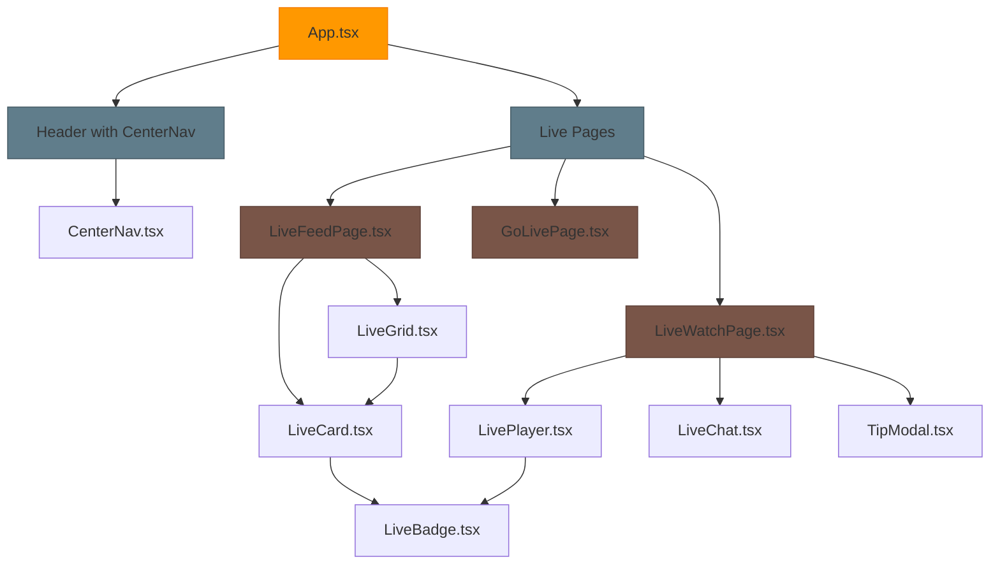

# Live Streaming UI Design Document

## 1. Overview

The Live Streaming UI feature adds comprehensive live streaming capabilities to the Reelverse platform, enabling real-time content creation and consumption with integrated monetization. This feature introduces a center navigation system, live content discovery feed, individual stream watch pages, and creator broadcasting tools.

### Core Objectives
- Provide seamless live streaming discovery and consumption experience
- Enable real-time viewer engagement through chat and tipping
- Support creator monetization with walletless commerce integration
- Maintain responsive design across desktop and mobile platforms
- Integrate with existing Reelverse architecture and design system

### Key Features
- **Center Header Navigation**: Prominent "Live" section with visual indicators
- **Live Discovery Feed**: Categorized live stream browsing with following/trending sections
- **Stream Watch Page**: Full-featured viewing experience with chat and monetization
- **Creator Broadcasting**: Stream management and configuration tools
- **Real-time Features**: Live presence, viewer counts, and chat functionality

## 2. Technology Stack & Dependencies

### Frontend Technologies
- **React 18.2.0** with TypeScript for component development
- **React Router v6** for navigation and routing
- **Tailwind CSS** for styling and responsive design
- **Vite 5.2.0** as build tool and development server

### Live Streaming Technologies
- **WHIP (WebRTC-HTTP Ingestion Protocol)** as primary ingestion for ultra-low latency
- **RTMP** as fallback ingestion protocol for compatibility
- **LL-HLS (Low Latency HLS)** as player protocol for broad device reach
- **WebRTC** for real-time communication (chat, presence)
- **WebSocket** connections for live updates and chat

### Integration Points
- **WalletContext** for walletless commerce and tipping
- **OrganizationContext** for creator permissions and settings
- **Existing Header/Navigation** system for seamless integration
- **Treasury-based Payment System** for gasless USDC transactions

## 3. Component Architecture

### Component Hierarchy



### Core Components

#### components/header/CenterNav.tsx
Central navigation component integrating with existing Header component:

**Props Interface**:
```typescript
interface CenterNavProps {
  className?: string;
}

interface NavItem {
  to: string;
  label: string;
  live?: boolean;
  badge?: boolean;
}
```

**Key Features**:
- Segmented navigation pills with active state indicators
- Responsive behavior (hidden on mobile, pill control below search)
- Live badge with pulsing animation
- Red underline for active Live section
- Backdrop blur glass morphism design

#### components/live/LiveBadge.tsx
Reusable live indicator component:

**Props Interface**:
```typescript
interface LiveBadgeProps {
  text?: string;
  size?: 'sm' | 'md' | 'lg';
  variant?: 'live' | 'upcoming' | 'ended';
}
```

**Design Specifications**:
- Red-500/600 background with white text
- Pulsing white dot animation
- Uppercase 11px bold typography
- Rounded corners with padding

#### components/live/LiveCard.tsx
Individual stream card component for grids and lists:

**Props Interface**:
```typescript
interface LiveCardProps {
  id: string;
  title: string;
  creator: {
    name: string;
    avatarUrl: string;
    verified?: boolean;
  };
  posterUrl: string;
  viewers: number;
  category?: string;
  tags?: string[];
  isLive: boolean;
  scheduledAt?: string;
  onClick?: () => void;
}
```

**Layout Structure**:
- 16:9 aspect ratio thumbnail with gradient overlay
- LiveBadge positioned top-left
- Viewer count chip top-right
- Creator info and title bottom overlay
- Hover animations and focus states

#### components/live/LiveGrid.tsx
Responsive grid layout container:

**Props Interface**:
```typescript
interface LiveGridProps {
  streams: LiveStream[];
  title?: string;
  layout?: 'grid' | 'horizontal-scroll';
  columns?: number;
  showCategories?: boolean;
}
```

**Responsive Behavior**:
- Desktop: 3-4 column grid
- Tablet: 2 column grid  
- Mobile: Single column or horizontal scroll
- Following section: horizontal scrollable cards

## 4. Routing & Navigation

### Route Structure
```
/live                    → LiveFeedPage.tsx
/live/:id               → LiveWatchPage.tsx
/studio/go-live         → GoLivePage.tsx
```

### Navigation Integration
The CenterNav component integrates into the existing Header component between the brand logo and right-side actions. Mobile navigation shows as pill controls below the search bar.

**Desktop Header Layout**:
```
[Logo] [CenterNav: Videos | Live | Shorts | Explore] [Upload | Profile | Wallet]
```

**Mobile Header Layout**:
```
[Logo] [Search] [Menu]
[CenterNav Pills Below]
```

## 5. Live Feed Architecture (/live)

### Page Layout Structure

#### Header Section
- Title: "Live Now" with total live stream count
- Filter tabs: All, Following, Gaming, IRL, Music, Tech
- Sort options: Viewers, Recently Started, Category

#### Content Sections

**Following Live** (Horizontal Scroll):
- Shows streams from followed creators
- Horizontal scrollable cards
- "See All" link to dedicated following page
- Empty state when no followed streams

**Live Now** (Responsive Grid):
- All currently live streams
- Category filtering capability
- Load more pagination or infinite scroll
- Viewer count and category tags

**Upcoming** (Grid with Schedule):
- Scheduled streams with countdown timers
- "Notify Me" buttons for push notifications
- Calendar integration for scheduling

### Data Management
```typescript
interface LiveStream {
  id: string;
  title: string;
  description?: string;
  creator: CreatorInfo;
  thumbnail: string;
  viewers: number;
  category: string;
  tags: string[];
  status: 'live' | 'upcoming' | 'ended';
  startTime: Date;
  scheduledEndTime?: Date;
  isFollowing?: boolean;
}

interface CreatorInfo {
  id: string;
  name: string;
  username: string;
  avatarUrl: string;
  verified: boolean;
  followerCount: number;
}
```

## 6. Live Watch Experience (/live/:id)

### Desktop Layout Structure

**Left Panel (70% width)**:
- 16:9 or 9:16 adaptive video player
- Live badge overlay with viewer count
- Stream health indicator (latency, quality)
- Player controls (play/pause, volume, quality, captions)
- "Start from Live" button for DVR playback

**Right Panel (30% width)**:
- Live chat message stream
- Chat input with emoji picker
- Tip/donate button
- Stream information panel
- Creator follow/subscribe buttons

**Mobile Layout**:
- Full-width video player on top
- Swipe-up chat drawer
- Bottom action sheet for tips and interactions

### Video Player Features

#### Streaming Protocol Support
- **LL-HLS**: Primary player protocol for broad device compatibility and low latency
- **WebRTC**: Real-time communication for chat and presence
- **WHIP Ingestion**: Primary low-latency ingestion protocol
- **RTMP Fallback**: Compatible ingestion for legacy streaming software
- **Adaptive Bitrate**: Automatic quality adjustment based on network conditions
- **DVR Support**: "Start from Live" button and rewind capability for live streams

#### Player Controls
```typescript
interface PlayerControls {
  isPlaying: boolean;
  volume: number;
  quality: string;
  captionsEnabled: boolean;
  isFullscreen: boolean;
  currentTime: number;
  liveHeadTime: number;
}
```

### Chat System Architecture

#### Real-time Messaging
- WebSocket connection for live message delivery
- Message rate limiting and spam protection
- Emoji and emote support
- Moderator actions (timeout, ban, delete)
- Pinned messages and announcements

#### Chat Message Types
```typescript
interface ChatMessage {
  id: string;
  userId: string;
  username: string;
  message: string;
  timestamp: Date;
  type: 'message' | 'tip' | 'subscription' | 'follow';
  badges: Badge[];
  color?: string;
  amount?: number; // for tips
}

interface Badge {
  type: 'subscriber' | 'moderator' | 'verified' | 'vip';
  level?: number;
  color: string;
}
```

### Monetization Integration

#### Tip Modal Component
Walletless USDC tipping with treasury gas coverage:

```typescript
interface TipModalProps {
  streamerId: string;
  streamerName: string;
  isOpen: boolean;
  onClose: () => void;
}

interface TipOption {
  amount: number; // USDC
  label: string;
  emoji?: string;
}
```

**Tip Flow**:
1. User selects tip amount from preset USDC options
2. UI displays "Gas covered by Treasury" badge for transparency
3. Treasury service sponsors transaction fees automatically
4. Smart contract processes USDC transfer (labeled as USDC in UI)
5. Chat message broadcasts tip with animation
6. Creator receives 90% of tip amount

#### Subscription Integration
- Monthly/annual subscription options
- PPV (Pay-Per-View) for premium streams
- Access gating with ContentAccessGate component
- Subscriber-only chat and perks

## 7. Creator Broadcasting (/studio/go-live)

### Stream Configuration Interface

#### Basic Settings
```typescript
interface StreamSettings {
  title: string;
  description: string;
  category: string;
  tags: string[];
  thumbnail?: File;
  privacy: 'public' | 'unlisted' | 'subscribers';
  chatEnabled: boolean;
  donationsEnabled: boolean;
  recordVOD: boolean;
}
```

#### Streaming Setup
- **Stream Key Management**: Secure key generation and rotation
- **Primary Ingest (WHIP)**: `https://live.reelverse.com/whip` for ultra-low latency
- **Fallback Ingest (RTMP)**: `rtmp://live.reelverse.com/app` for legacy compatibility
- **Preview Window**: Pre-broadcast stream preview with health monitoring
- **Audio/Video Settings**: Bitrate, resolution, frame rate optimization
- **Scene Management**: Multiple scene configurations and switching

#### Broadcast Controls
- Start/Stop broadcast buttons
- Stream health monitoring
- Viewer analytics in real-time
- Chat moderation tools
- Stream recording toggle

### Scheduling System
```typescript
interface ScheduledStream {
  id: string;
  title: string;
  scheduledStartTime: Date;
  estimatedDuration: number;
  recurring?: {
    frequency: 'daily' | 'weekly' | 'monthly';
    daysOfWeek?: number[];
  };
  notificationsSent: boolean;
  status: 'scheduled' | 'live' | 'ended' | 'cancelled';
}
```

## 8. State Management & Real-time Features

### Custom Hooks

#### useLivePresence.ts
Real-time presence and viewer tracking:

```typescript
interface LivePresence {
  viewers: number;
  isLive: boolean;
  latencyMs: number;
  quality: StreamQuality;
  lastUpdate: Date;
}

export function useLivePresence(streamId: string) {
  // WebSocket connection management
  // Real-time viewer count updates
  // Stream health monitoring
  // Automatic reconnection logic
}
```

#### useNumberFormat.ts
Consistent number formatting across components:

```typescript
export function useNumberFormat() {
  const formatCount = (count: number): string => {
    return new Intl.NumberFormat('en', {
      notation: 'compact',
      maximumFractionDigits: 1
    }).format(count);
  };
  
  const formatCurrency = (amount: number): string => {
    const formatted = new Intl.NumberFormat('en', {
      style: 'currency',
      currency: 'USD',
      maximumFractionDigits: 0
    }).format(amount);
    return `${formatted} USDC`; // Label as USDC to avoid confusion
  };
  
  return { formatCount, formatCurrency };
}
```

#### useLiveChat.ts
Chat functionality and real-time messaging:

```typescript
interface LiveChatHook {
  messages: ChatMessage[];
  sendMessage: (content: string) => Promise<void>;
  isConnected: boolean;
  isSlowMode: boolean;
  userPermissions: ChatPermissions;
}

export function useLiveChat(streamId: string): LiveChatHook {
  // WebSocket chat connection
  // Message sending and receiving
  // Moderation actions
  // Rate limiting enforcement
}
```

### WebSocket Management
Centralized WebSocket connection management for:
- Live chat messaging
- Viewer presence updates
- Stream health monitoring
- Real-time notifications
- Tip/donation alerts

## 9. Styling Strategy & Design System

### Tailwind Design Tokens

#### Color Palette
```css
/* Dark Theme (Default) */
--bg-primary: theme('colors.slate.950');
--bg-surface: theme('colors.slate.900');
--text-primary: theme('colors.slate.100');
--text-subtle: theme('colors.slate.300');
--text-muted: theme('colors.slate.400');

/* Live Streaming Accent Colors */
--live-primary: theme('colors.red.500');
--live-secondary: theme('colors.red.600');
--accent-primary: theme('colors.violet.500');
```

#### Typography Scale
- Live Badge: `text-[11px] font-bold uppercase`
- Card Titles: `text-sm font-medium`
- Viewer Counts: `text-xs font-semibold`
- Chat Messages: `text-sm leading-relaxed`

#### Spacing System
- Card Padding: `p-4` (16px)
- Grid Gaps: `gap-6` (24px)
- Component Spacing: `space-y-4` (16px vertical)

### Component-Specific Styles

#### Live Badge Animation
```css
.live-badge {
  @apply inline-flex items-center gap-1 px-2 py-1 rounded-md;
  @apply bg-red-600/90 text-white text-[11px] font-bold;
}

.live-dot {
  @apply relative flex h-2.5 w-2.5;
}

.live-dot::before {
  @apply animate-ping absolute inline-flex h-full w-full;
  @apply rounded-full bg-white opacity-60;
  content: '';
}

.live-dot::after {
  @apply relative inline-flex rounded-full h-2.5 w-2.5 bg-white;
  content: '';
}
```

#### Live Card Overlay Gradient
```css
.live-card-overlay {
  background: linear-gradient(
    to top,
    rgba(0, 0, 0, 0.7) 0%,
    rgba(0, 0, 0, 0.1) 50%,
    transparent 100%
  );
}
```

## 10. Testing Strategy

### Component Testing
- **Jest + React Testing Library** for component unit tests
- **Mock WebSocket connections** for real-time feature testing
- **Accessibility testing** with jest-axe
- **Visual regression testing** with Storybook and Chromatic

### Integration Testing
- **E2E testing** with Playwright for critical user flows
- **Live streaming simulation** with mock video sources
- **Payment flow testing** with test USDC tokens
- **Chat functionality testing** with WebSocket mocks

### Performance Testing
- **Stream latency monitoring** with real-time metrics
- **Chat message throughput** testing under load
- **Video player performance** across different devices
- **Bundle size optimization** with Webpack Bundle Analyzer

### Accessibility Requirements
- **WCAG 2.1 AA compliance** for all interactive elements
- **Keyboard navigation** support for all features
- **Screen reader compatibility** with proper ARIA labels
- **Color contrast ratios** meeting accessibility standards
- **Focus management** for modal and chat interfaces

## 11. Data Models & API Integration

### Live Stream Data Structure
```typescript
interface LiveStreamData {
  id: string;
  title: string;
  description: string;
  creator: CreatorProfile;
  status: StreamStatus;
  metrics: StreamMetrics;
  settings: StreamSettings;
  chat: ChatConfiguration;
  monetization: MonetizationSettings;
}

interface StreamMetrics {
  currentViewers: number;
  peakViewers: number;
  totalViews: number;
  chatMessages: number;
  likes: number;
  shares: number;
  tips: {
    count: number;
    totalAmount: number;
  };
  subscriptions: number;
}
```

### API Endpoints Integration
```typescript
// Live stream management
GET /api/streams/live           // Get all live streams
GET /api/streams/:id            // Get specific stream
POST /api/streams               // Create new stream
PUT /api/streams/:id            // Update stream settings
DELETE /api/streams/:id         // End stream

// Chat and interactions
GET /api/streams/:id/chat       // Get chat history
POST /api/streams/:id/chat      // Send chat message
POST /api/streams/:id/tip       // Send tip to streamer
POST /api/streams/:id/follow    // Follow streamer

// Analytics and metrics
GET /api/streams/:id/metrics    // Get stream analytics
GET /api/creators/:id/analytics // Get creator analytics
```

### Error Handling Strategy
- **Network failure recovery** with automatic retry logic
- **Stream interruption handling** with reconnection attempts
- **Payment failure management** with user-friendly error messages
- **Chat connection issues** with graceful fallbacks
- **Video player errors** with alternative stream sources

## 12. Performance Optimization

### Video Streaming Optimization
- **Adaptive bitrate streaming** for variable network conditions
- **Edge caching** with CDN distribution
- **Low-latency protocols** (LL-HLS, WebRTC) for real-time interaction
- **Preloading strategies** for upcoming streams

### React Performance
- **Code splitting** with React.lazy for page-level components
- **Memoization** with React.memo for frequently re-rendered components
- **Virtual scrolling** for long chat message lists
- **Debounced state updates** for real-time features

### Bundle Optimization
- **Tree shaking** for unused code elimination
- **Asset optimization** with image compression and lazy loading
- **Service worker caching** for offline functionality
- **Critical CSS inlining** for faster initial paint

### Mobile Performance
- **Touch gesture optimization** for mobile video controls
- **Battery usage optimization** with efficient rendering
- **Network-aware features** with connection quality detection
- **Progressive enhancement** for varying device capabilities

This design provides a comprehensive foundation for implementing live streaming capabilities in the Reelverse platform, ensuring seamless integration with existing architecture while delivering a premium user experience for both creators and viewers.