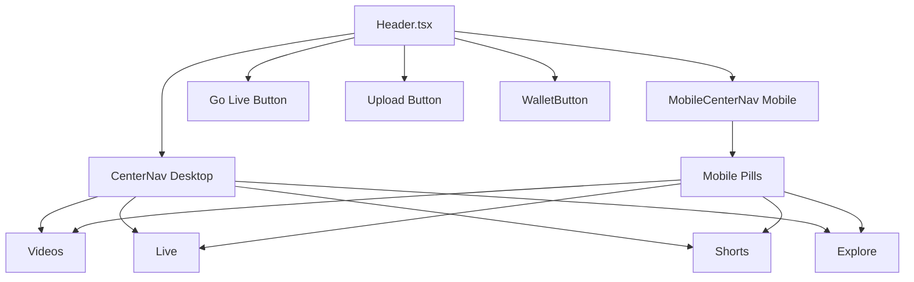

# Live Streaming Header Navigation Fix

## Overview

This document addresses the issue where the live streaming feature, despite being fully implemented, is not visible or accessible through the header navigation in the Reelverse decentralized content platform. The analysis reveals that while the live streaming functionality exists, there may be visibility, routing, or component rendering issues preventing users from accessing it through the header interface.

## Current Implementation Analysis

### Existing Live Streaming Components

The platform has a comprehensive live streaming implementation:

- **LiveFeedPage**: Main live streaming discovery page (`/live`)
- **LivePage**: Stream dashboard and broadcasting interface
- **LiveWatchPage**: Individual stream viewing page (`/live/:id`)
- **GoLivePage**: Creator broadcasting setup (`/studio/go-live`)

### Header Navigation Structure

The header navigation consists of two main components:



### Navigation Configuration

The center navigation is configured in `components/header/CenterNav.tsx` with the following items:

| Route | Label | Special Features |
|-------|-------|------------------|
| `/` | Videos | Default home |
| `/live` | Live | Live indicator with pulsing red dot |
| `/shorts` | Shorts | Short-form content |
| `/explore` | Explore | Discovery features |

## Problem Diagnosis

### Potential Issues Preventing Header Visibility

1. **CSS Display Issues**
   - The `CenterNav` component uses `hidden md:flex` classes
   - Mobile version uses `md:hidden` classes
   - Responsive breakpoints may not be working correctly

2. **React Router Configuration**
   - Routes are properly configured in `App.tsx`
   - `/live` route exists and points to `LiveFeedPage`
   - No apparent routing conflicts

3. **Component Rendering Logic**
   - Navigation items are statically defined
   - No conditional rendering based on user state
   - Should be visible to all users

4. **Z-Index and Layout Issues**
   - Header may be hidden behind other elements
   - Backdrop blur effects might interfere with visibility

## Resolution Strategy

### Step 1: Verify Header Component Integration

**Check if Header is properly imported and rendered in main layout:**

```typescript
// In App.tsx or main layout component
import Header from './components/Header';

// Ensure Header is rendered with proper props
<Header title="Reelverse" />
```

### Step 2: Validate CSS Class Application

**Ensure Tailwind CSS classes are properly compiled:**

- `hidden md:flex` should hide on mobile, show on desktop
- `md:hidden` should show on mobile, hide on desktop
- Verify breakpoint classes are working

### Step 3: Test Navigation Functionality

**Manual testing checklist:**

1. Navigate to `/live` directly via URL
2. Check if LiveFeedPage renders correctly
3. Verify mobile vs desktop navigation display
4. Test responsive breakpoints

### Step 4: Debugging Component Visibility

**Add debugging elements to identify issues:**

```typescript
// Temporary debugging in CenterNav.tsx
export function CenterNav({ className = '', mobile = false }: CenterNavProps) {
  console.log('CenterNav rendering:', { mobile, className });
  
  return (
    <nav 
      className={`${mobile ? 'md:hidden' : 'hidden md:flex'} items-center justify-center mx-auto ${className}`}
      style={{ border: '1px solid red' }} // Temporary visual indicator
    >
      {/* Rest of component */}
    </nav>
  );
}
```

## Recommended Fixes

### Fix 1: Ensure Header Component Usage

**Verify Header is included in the main layout:**

```typescript
// In App.tsx or layout wrapper
function AppLayout({ children }: { children: React.ReactNode }) {
  return (
    <div className="min-h-screen bg-slate-950 text-white">
      <Header title="Reelverse" />
      <main>{children}</main>
    </div>
  );
}
```

### Fix 2: Update CSS Classes for Better Visibility

**Modify CenterNav component for improved visibility:**

```typescript
// Enhanced CenterNav with better responsive handling
export function CenterNav({ className = '', mobile = false }: CenterNavProps) {
  const baseClasses = mobile 
    ? "flex md:hidden items-center justify-center" 
    : "hidden md:flex items-center justify-center mx-auto";
    
  return (
    <nav 
      className={`${baseClasses} ${className}`}
      aria-label="Main navigation"
    >
      <div className="inline-flex items-center rounded-full bg-slate-900/90 backdrop-blur-sm border border-slate-700 p-1 shadow-xl">
        {/* Navigation items */}
      </div>
    </nav>
  );
}
```

### Fix 3: Add Navigation State Debugging

**Create debugging component to verify navigation state:**

```typescript
// Debugging component to add temporarily
function NavigationDebugger() {
  const location = useLocation();
  const { activeItem, isLiveSection } = useNavigationState();
  
  return (
    <div className="fixed top-20 right-4 bg-black/80 text-white p-4 rounded text-sm z-50">
      <div>Current Path: {location.pathname}</div>
      <div>Active Item: {activeItem?.label || 'None'}</div>
      <div>Is Live Section: {isLiveSection ? 'Yes' : 'No'}</div>
    </div>
  );
}
```

### Fix 4: Verify Layout Component Structure

**Ensure proper layout wrapper in main App component:**

```typescript
function App() {
  return (
    <ErrorBoundary>
      <FeatureFlagProvider>
        <WalletProvider>
          <OrganizationProvider>
            <AuthProvider>
              <HashRouter>
                <div className="app-container">
                  <AppContent />
                </div>
              </HashRouter>
            </AuthProvider>
          </OrganizationProvider>
        </WalletProvider>
      </FeatureFlagProvider>
    </ErrorBoundary>
  );
}

function AppContent() {
  return (
    <div className="min-h-screen bg-slate-950">
      <Header title="Reelverse" />
      <main className="pt-16"> {/* Account for fixed header height */}
        <Routes>
          {/* All routes */}
        </Routes>
      </main>
    </div>
  );
}
```

## Implementation Steps

### Immediate Actions

1. **Verify Header Rendering**
   - Check if `<Header />` component is included in main layout
   - Confirm component is receiving proper props

2. **Test Direct Navigation**
   - Navigate to `/live` directly in browser
   - Verify if LiveFeedPage renders correctly

3. **Check CSS Compilation**
   - Ensure Tailwind CSS is properly configured
   - Verify responsive classes are working

4. **Browser Inspector Analysis**
   - Check if navigation elements exist in DOM
   - Verify CSS classes are applied correctly
   - Look for any JavaScript errors

### Secondary Actions

1. **Component Isolation Testing**
   - Test CenterNav component in isolation
   - Verify mobile vs desktop rendering

2. **Route Configuration Review**
   - Confirm all live streaming routes are active
   - Test navigation between different live pages

3. **State Management Verification**
   - Check if any user state affects navigation visibility
   - Verify wallet connection doesn't hide navigation

## Testing Checklist

- [ ] Header component renders on all pages
- [ ] Live navigation pill is visible on desktop
- [ ] Live navigation pill is visible on mobile
- [ ] Clicking Live pill navigates to `/live`
- [ ] LiveFeedPage renders with live streams
- [ ] Go Live button is visible when wallet connected
- [ ] Responsive breakpoints work correctly
- [ ] No JavaScript console errors
- [ ] Navigation state updates correctly

## Expected Outcome

After implementing these fixes, users should be able to:

1. **See the Live navigation pill** in the center header navigation
2. **Click the Live pill** to navigate to the live streaming feed
3. **Access live streaming features** from the main navigation
4. **Use the Go Live button** to start broadcasting (when authenticated)
5. **Experience consistent navigation** across desktop and mobile devices

The live streaming feature will be fully accessible and discoverable through the header navigation, completing the implementation and providing users with clear access to the platform's streaming capabilities.