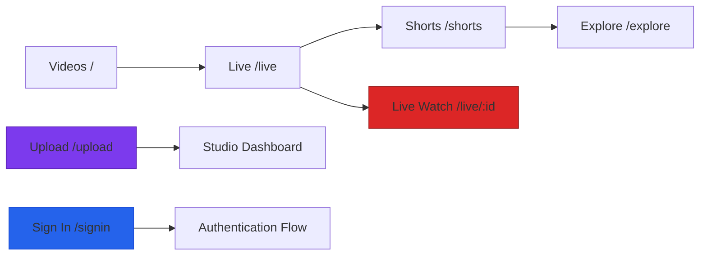
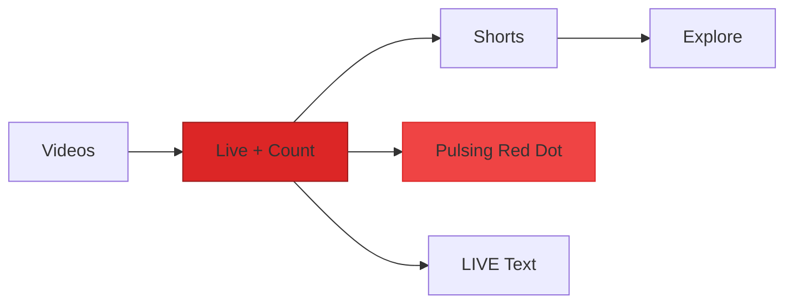
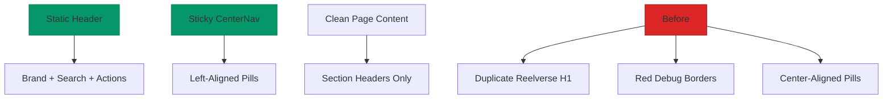

# UI Navigation Improvements Design

## Overview

This design outlines targeted improvements to Reelverse's navigation system, focusing on left-aligning the navigation pills under the brand, eliminating duplicate page titles, implementing immersive live watch experiences, and ensuring visible authentication controls.

The improvements create a cleaner content hierarchy by making the CenterNav the sole sticky navigation element, removing redundant page titles, and providing full-width immersive layouts for live streaming while maintaining consistent slate design tokens throughout.

## Technology Stack & Dependencies

- **Frontend Framework**: React 18.2.0 with TypeScript 5.4.5
- **Routing**: React Router DOM
- **Styling**: Tailwind CSS with custom design tokens
- **State Management**: React Context API (WalletContext, AuthContext)
- **Build Tool**: Vite 5.2.0
- **Design System**: Custom components with slate-950 dark theme

## Component Architecture

### Simplified Layout Hierarchy

```mermaid
graph TD
    A[AppShell] --> B[Header Bar - Static]
    A --> C[CenterNav - Sticky Only]
    A --> D[Main Content]
    A --> E[Sidebar - Conditional]
    
    B --> F[Brand + Search + Actions]
    C --> G[Left-Aligned Pills]
    
    G --> H[Videos | Live | Shorts | Explore]
    G --> I[Live Count Indicator]
    
    F --> J[Upload Button]
    F --> K[Sign In Button]
    F --> L[Profile Menu]
    
    style A fill:#1e293b,stroke:#475569
    style C fill:#7c3aed,stroke:#5b21b6
    style B fill:#374151,stroke:#4b5563
```

### Component Modifications Overview

| Component | Change Type | Key Modifications |
|-----------|------------|-------------------|
| `CenterNav.tsx` | Complete Refactor | Left-aligned pills with `align='left'` default, simplified structure |
| `HeaderActions.tsx` | Authentication Focus | Visible Sign In button, hide wallet connect, keep Upload primary |
| `AppShell.tsx` | Layout Logic | Regex-based sidebar hiding for `/live/:id` routes |
| `HomePage.tsx` | Content Cleanup | Remove "Reelverse" H1, replace red borders with slate-800 |
| `LiveFeedPage.tsx` | Content Cleanup | Remove "Reelverse" H1, replace red borders with slate-800 |
| `LiveWatchPage.tsx` | Immersive Experience | Full-width layout, fallback HLS stream handling |

## Routing & Navigation

### Navigation Structure



### Conditional Layout Logic

The navigation system implements intelligent layout switching based on route patterns:

- **Standard Layout**: Sidebar + Header + CenterNav for most pages
- **Immersive Layout**: Hidden sidebar for `/live/:id` watch pages
- **Mobile Layout**: Responsive navigation with bottom tabs

## CenterNav Component Design

### Left-Aligned Pills Implementation

```typescript
type Props = { align?: 'left' | 'center' }

export function CenterNav({ align = 'left' }: Props) {
  const liveCount = useLivePresenceCount()
  const items = [
    { to: '/', label: 'Videos' },
    { to: '/live', label: 'Live', live: true },
    { to: '/shorts', label: 'Shorts' },
    { to: '/explore', label: 'Explore' },
  ]
```

### Sticky Navigation Structure

The CenterNav becomes the sole sticky navigation element with left-alignment:

```css
.nav-sticky {
  position: sticky;
  top: 0;
  z-index: 40;
  width: 100%;
  background: rgba(2, 6, 23, 0.8);
  backdrop-filter: blur(8px);
  justify-content: flex-start; /* Left-aligned */
}

.nav-pills {
  margin: 8px 16px;
  border: 1px solid #1e293b; /* slate-800 */
  background: rgba(15, 23, 42, 0.8); /* slate-900/80 */
}
```

### Navigation Pills Design



### Live Indicator Implementation

```jsx
{it.live && liveCount > 0 && (
  <span className="ml-1 inline-flex items-center gap-1 text-[11px] font-semibold text-red-400">
    <span className="relative flex h-2.5 w-2.5">
      <span className="animate-ping absolute inline-flex h-full w-full rounded-full bg-red-500 opacity-70"></span>
      <span className="relative inline-flex h-2.5 w-2.5 rounded-full bg-red-500"></span>
    </span>
    LIVE
  </span>
)}
```

## HeaderActions Component Design

### Authentication State Management

The HeaderActions component implements conditional rendering based on user authentication:

```typescript
interface AuthState {
  user: User | null;
  isLoading: boolean;
  isAuthenticated: boolean;
}
```

### Action Button Priority

| Priority | Component | Visibility | Styling |
|----------|-----------|------------|---------|
| 1 | Upload Button | Always visible | Primary violet-600 background |
| 2 | Sign In Button | When not authenticated | Primary blue-600 background |
| 3 | Profile Menu | When authenticated | Secondary slate-800 background |
| 4 | Notifications | Always visible | Icon with notification badge |

### Button Design Specifications

```css
.upload-button {
  background: #7c3aed;
  color: white;
  padding: 8px 12px;
  border-radius: 6px;
  font-weight: 500;
  transition: background-color 0.2s;
}

.signin-button {
  background: #2563eb;
  color: white;
  padding: 8px 12px;
  border-radius: 6px;
  font-weight: 500;
}
```

## AppShell Layout Logic

### Immersive Live Watch Implementation

```typescript
export function AppShell({ children }: { children: React.ReactNode }) {
  const { pathname } = useLocation()
  const immersive = /^\/live\/[^\/]+$/.test(pathname) // Full-width on live watch

  return (
    <div className="flex min-h-screen bg-slate-950">
      {!immersive && (
        <aside className="w-64 shrink-0 border-r border-slate-900">
          <Sidebar />
        </aside>
      )}
      <div className="flex-1">
        {/* Static header with brand + search + actions */}
        {/* Left-aligned CenterNav */}
        <main className={`pb-10 ${immersive ? 'px-0 md:px-0' : 'px-4 md:px-6 lg:px-8'}`}>
          {children}
        </main>
      </div>
    </div>
  )
}
```

### Layout Modes

```mermaid
graph TD
    A[Standard Layout] --> B[Sidebar 256px]
    A --> C[Main Content]
    
    D[Immersive Layout /live/:id] --> E[Full Width Main]
    
    C --> F[Static Header]
    C --> G[Sticky CenterNav]
    C --> H[Page Content]
    
    E --> F
    E --> G  
    E --> I[Immersive Content px-0]
    
    style A fill:#1e293b,stroke:#475569
    style D fill:#dc2626,stroke:#991b1b
```



## Content Cleanup Strategy

### Page Title Elimination

Replace duplicate page titles with section headers only:

```jsx
// Before - Duplicate branding
<h1 className="text-3xl font-bold">Reelverse</h1>
<hr className="border border-red-500" />

// After - Clean section headers
{/* No H1 here; CenterNav is the page header */}
{/* Optional section header only */}
<h2 className="text-xl font-semibold text-slate-100 mb-3">Trending Now</h2>
```

### Debug Styling Cleanup

Systematic replacement of debug styles:

```css
/* Replace all instances */
border-red-500 → border-slate-800
border-red-400 → border-slate-700  
bg-red-100 → bg-slate-900
text-red-600 → text-slate-200
```

### Content Hierarchy After Cleanup



## Live Watch Immersive Experience

### Full-Width Immersive Layout

Live watch pages hide the sidebar and use full-width layouts:

```typescript
// Route detection for immersive mode
const immersive = /^\/live\/[^\/]+$/.test(pathname)

// Layout adaptation
<main className={`pb-10 ${immersive ? 'px-0 md:px-0' : 'px-4 md:px-6 lg:px-8'}`}>
  {children}
</main>
```

### Fallback Stream Handling

```typescript
// Always provide playable stream with fallback
const src = stream?.src ?? 'https://test-streams.mux.dev/x36xhzz/x36xhzz.m3u8'

// User-friendly error handling
{!stream && (
  <div className="col-span-full text-center text-slate-400 mt-8">
    <p className="mb-2">Couldn't find that stream.</p>
    <Link to="/live" className="text-violet-400 hover:text-violet-300 underline">
      Browse live streams →
    </Link>
  </div>
)}
```

### Live Watch Content Layout

```mermaid
graph LR
    A[Video Player Area] --> B[Chat Sidebar]
    
    A --> C[Stream Title & Info]
    A --> D[Creator Profile]
    A --> E[Follow & Tip Actions]
    
    B --> F[Real-time Chat]
    B --> G[Viewer Count]
    B --> H[Chat Moderation]
    
    style A fill:#1e293b,stroke:#475569
    style B fill:#374151,stroke:#4b5563
```



## Responsive Design Patterns

### Mobile Navigation Adaptation

The navigation system maintains responsive behavior with mobile-specific handling:

```typescript
// CenterNav mobile detection
const isMobile = window.innerWidth < 768

// Mobile-specific pill styling
<nav className={`${isMobile ? 'justify-center' : 'justify-start'}`}>
```

### Breakpoint Behavior

| Breakpoint | Sidebar | CenterNav | HeaderActions |
|------------|---------|-----------|---------------|
| Mobile (<768px) | Hidden | Center-aligned pills | Icon upload only |
| Desktop (≥768px) | Conditional | Left-aligned pills | Full actions |

## Implementation Checklist

### Primary Changes (Critical)
- [ ] CenterNav: Left-align pills with `align='left'` default
- [ ] HeaderActions: Show Sign In button when logged out, hide wallet connect
- [ ] AppShell: Hide sidebar on `/live/:id` routes using regex
- [ ] HomePage/LiveFeedPage: Remove "Reelverse" H1 titles

### Styling Fixes (High Priority)
- [ ] Replace all `border-red-500` with `border-slate-800`
- [ ] Remove red horizontal rules and debug borders
- [ ] Ensure consistent slate token usage
- [ ] Maintain AA contrast ratios

### Layout Validation (Medium Priority)
- [ ] Pills positioned left under brand logo
- [ ] Single sticky header (CenterNav only)
- [ ] Live watch pages full-width and immersive
- [ ] Sign In button visible across all pages when logged out

### Quality Assurance (Low Priority)
- [ ] Live cards link to `/live/:id` correctly
- [ ] Fallback HLS stream works in LiveWatchPage
- [ ] Mobile responsiveness maintained
- [ ] Accessibility attributes preserved
