# Video Monetization System

## Overview

The Video Monetization System enables creators to earn revenue through multiple streams: USDC tips, walletless subscriptions, collaborative revenue splits, and referral programs. The system integrates seamlessly with the existing earnings ledger and finance hub, providing a comprehensive monetization solution that requires no wallet connections.

Key features include:
- **USDC Tipping**: Direct creator support with gas costs covered by Reelverse Treasury
- **Walletless Subscriptions**: Monthly/annual subscription plans with 90% creator revenue share
- **Collaborative Splits**: Automated revenue distribution among video collaborators
- **Referral Program**: 10% revenue sharing for 6 months to drive organic growth
- **Unified Finance Hub**: Centralized earnings tracking and payout management

## Technology Stack & Dependencies

**Backend:**
- Node.js/Express API endpoints
- PostgreSQL database with new monetization tables
- Existing earnings ledger and credits system
- Background job processing for renewals and splits
- Rate limiting and authentication middleware

**Frontend:**
- React components for tip/subscribe flows
- SWR for real-time data updates
- Toast notifications for user feedback
- Responsive modal interfaces

**Integration Points:**
- Existing earnings ledger system
- Finance page and balance pill components
- Video watch page and action rail
- Creator studio monetization settings

## Component Architecture

### Backend Data Models

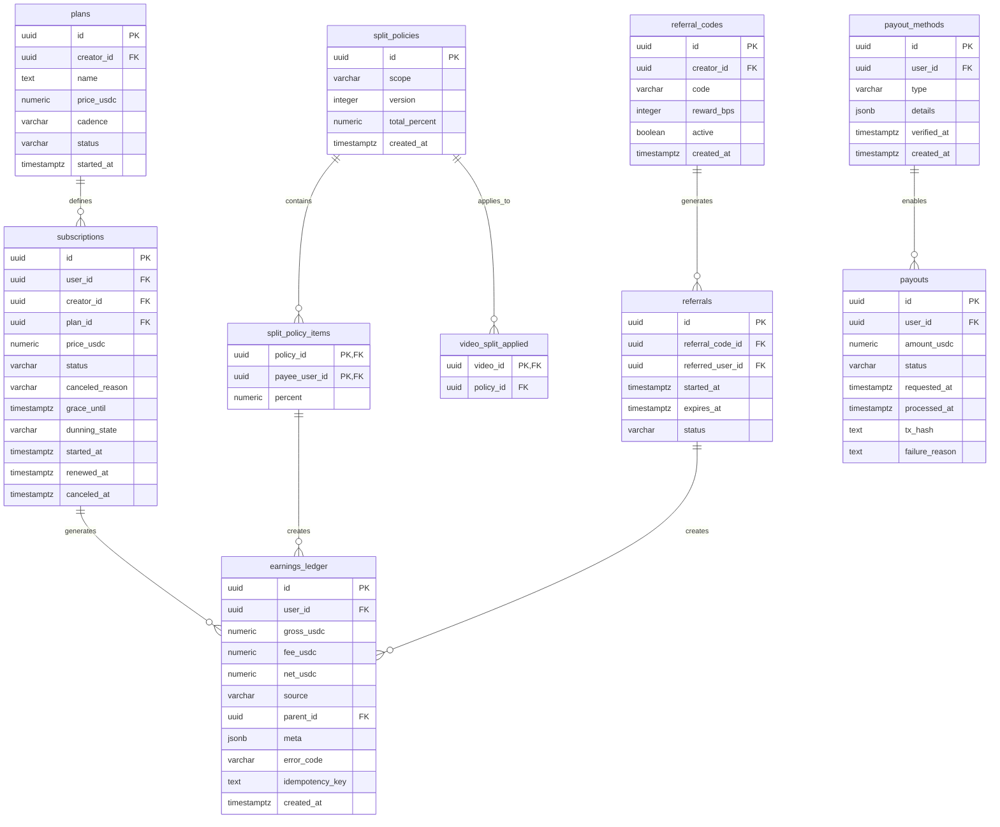
```mermaid
erDiagram
    plans {
        uuid id PK
        uuid creator_id FK
        text name
        numeric price_usdc
        varchar cadence
        varchar status
        timestamptz started_at
    }
    
    subscriptions {
        uuid id PK
        uuid user_id FK
        uuid creator_id FK
        uuid plan_id FK
        numeric price_usdc
        varchar status
        varchar canceled_reason
        timestamptz grace_until
        varchar dunning_state
        timestamptz started_at
        timestamptz renewed_at
        timestamptz canceled_at
    }
    
    split_policies {
        uuid id PK
        varchar scope
        integer version
        numeric total_percent
        timestamptz created_at
    }
    
    split_policy_items {
        uuid policy_id PK,FK
        uuid payee_user_id PK,FK
        numeric percent
    }
    
    video_split_applied {
        uuid video_id PK,FK
        uuid policy_id FK
    }
    
    referral_codes {
        uuid id PK
        uuid creator_id FK
        varchar code
        integer reward_bps
        boolean active
        timestamptz created_at
    }
    
    referrals {
        uuid id PK
        uuid referral_code_id FK
        uuid referred_user_id FK
        timestamptz started_at
        timestamptz expires_at
        varchar status
    }
    
    earnings_ledger {
        uuid id PK
        uuid user_id FK
        numeric gross_usdc
        numeric fee_usdc
        numeric net_usdc
        varchar source
        uuid parent_id FK
        jsonb meta
        varchar error_code
        text idempotency_key
        timestamptz created_at
    }
    
    payout_methods {
        uuid id PK
        uuid user_id FK
        varchar type
        jsonb details
        timestamptz verified_at
        timestamptz created_at
    }
    
    payouts {
        uuid id PK
        uuid user_id FK
        numeric amount_usdc
        varchar status
        timestamptz requested_at
        timestamptz processed_at
        text tx_hash
        text failure_reason
    }
    
    plans ||--o{ subscriptions : defines
    split_policies ||--o{ split_policy_items : contains
    split_policies ||--o{ video_split_applied : applies_to
    referral_codes ||--o{ referrals : generates
    subscriptions ||--o{ earnings_ledger : generates
    split_policy_items ||--o{ earnings_ledger : creates
    referrals ||--o{ earnings_ledger : creates
    payout_methods ||--o{ payouts : enables
```

### Component Hierarchy

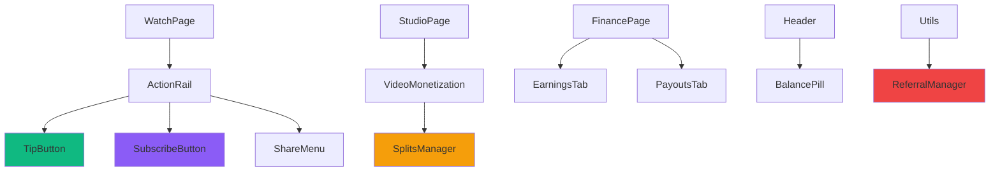
```mermaid
graph TD
    A[WatchPage] --> B[ActionRail]
    B --> C[TipButton]
    B --> D[SubscribeButton]
    B --> E[ShareMenu]
    
    F[StudioPage] --> G[VideoMonetization]
    G --> H[SplitsManager]
    
    I[FinancePage] --> J[EarningsTab]
    I --> K[PayoutsTab]
    
    L[Header] --> M[BalancePill]
    
    N[Utils] --> O[ReferralManager]
    
    style C fill:#10b981
    style D fill:#8b5cf6
    style H fill:#f59e0b
    style O fill:#ef4444
```

### API Endpoints Reference

#### POST /api/tips
**Purpose**: Process USDC tips with automatic splits and referral attribution

**Headers Required:**
- `Idempotency-Key`: Unique key for safe retries
- `Content-Type`: application/json

**Request Schema:**
```typescript
{
  videoId: string,
  creatorId: string,
  amountUSDC: number  // Min $1, Max $100
}
```

**Response Schema:**
```typescript
{
  ok: boolean,
  transactionId: string,
  todayUSDC: number,
  pendingUSDC: number,
  availableUSDC: number
}
```

**Business Logic:**
1. Validate idempotency key and tip amount ($1-$100 range)
2. Load video split policy (versioned and immutable)
3. Calculate gross_usdc, fee_usdc, net_usdc for each payee
4. Apply referral bonus if active referral exists (reduce platform fee)
5. Create earnings ledger entries with parent_id linking splits
6. Update real-time balance via WebSocket
7. Floor rounding to 0.000001, assign residual to creator

#### POST /api/subscriptions
**Purpose**: Create or manage subscription plans with dunning logic

**Headers Required:**
- `Idempotency-Key`: Unique key for safe retries

**Request Schema:**
```typescript
{
  planId: string,  // References plans table
  creatorId: string
}
```

**Response Schema:**
```typescript
{
  ok: boolean,
  subscriptionId: string,
  nextRenewalDate: string,
  priceUSDC: number,  // Frozen at subscription time
  plan: {
    name: string,
    cadence: 'monthly' | 'annual'
  }
}
```

**Business Logic:**
1. Check for existing active subscription (idempotent)
2. Freeze plan price at subscription time
3. Create subscription record with plan_id reference
4. Schedule first payment and renewal job
5. Create immediate earnings ledger entry with gross/fee/net breakdown
6. Set dunning_state to 'active'

#### GET /api/finance/summary
**Purpose**: Get comprehensive real-time earnings summary

**Response Schema:**
```typescript
{
  availableUSDC: number,      // Eligible for payout
  pendingUSDC: number,        // Processing/hold period
  lifetimeUSDC: number,       // Total ever earned
  todayUSDC: number,          // Today's net earnings
  activeSubscriptions: number,
  totalTips: number,
  payoutThreshold: number,    // Min payout amount ($25)
  nextPayoutDate: string      // Next available payout
}
```

#### POST /api/payouts
**Purpose**: Request payout to verified payment method

**Headers Required:**
- `Idempotency-Key`: Unique key for safe retries

**Request Schema:**
```typescript
{
  amountUSDC: number,
  payoutMethodId: string
}
```

**Response Schema:**
```typescript
{
  ok: boolean,
  payoutId: string,
  status: 'requested' | 'processing' | 'paid' | 'failed',
  estimatedProcessingTime: string,
  remainingAvailableUSDC: number
}
```

**Business Logic:**
1. Validate user KYC and OFAC screening status
2. Check availableUSDC >= requested amount and above threshold
3. Verify payout method is verified and active
4. Create payout record with 'requested' status
5. Reduce availableUSDC immediately
6. Queue for worker processing

#### GET /api/videos/:id/splits
**Purpose**: Retrieve current split policy for video (versioned)

**Response Schema:**
```typescript
{
  policyId: string,
  version: number,
  splits: Array<{
    payeeUserId: string,
    percent: number,
    name: string
  }>,
  totalPercent: number,  // Always 100.00
  appliedAt: string
}
```

#### POST /api/referrals/claim
**Purpose**: Process referral code redemption with fraud protection

**Request Schema:**
```typescript
{
  code: string  // 6-20 character alphanumeric
}
```

**Response Schema:**
```typescript
{
  ok: boolean,
  expiresAt: string,     // 180 days from claim
  rewardBps: number,     // Usually 1000 (10%)
  creatorName: string,
  maxRewardUSDC: number  // Cap at $50 lifetime
}
```

**Business Logic:**
1. Validate code exists and is active
2. Guard against self-referrals (same user)
3. Check single referral per user limit
4. Verify device fingerprint and IP reputation
5. Set 180-day expiry window
6. Store attribution cookie and server record

#### GET /api/finance/ledger.csv
**Purpose**: Streaming CSV export of earnings ledger

**Query Parameters:**
- `startDate`: ISO date string
- `endDate`: ISO date string
- `source`: Filter by earnings source

**Response**: Streaming CSV with columns:
- Date, Source, Gross USDC, Fee USDC, Net USDC, Video ID, Notes, Transaction ID

#### POST /api/payout-methods
**Purpose**: Add and verify payout methods

**Request Schema:**
```typescript
{
  type: 'usdc_address' | 'bank',
  details: {
    address?: string,     // For USDC
    bankToken?: string,   // For bank transfers
    accountName?: string
  }
}
```

## Business Logic Layer

### Tip Processing Workflow with Versioned Splits

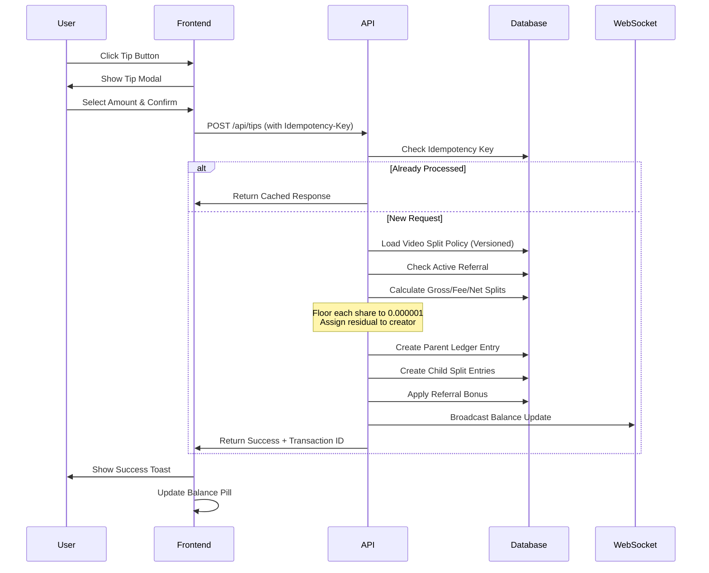
```mermaid
sequenceDiagram
    participant User as User
    participant Frontend as Frontend
    participant API as API
    participant DB as Database
    participant WS as WebSocket
    
    User->>Frontend: Click Tip Button
    Frontend->>User: Show Tip Modal
    User->>Frontend: Select Amount & Confirm
    Frontend->>API: POST /api/tips (with Idempotency-Key)
    API->>DB: Check Idempotency Key
    alt Already Processed
        API->>Frontend: Return Cached Response
    else New Request
        API->>DB: Load Video Split Policy (Versioned)
        API->>DB: Check Active Referral
        API->>DB: Calculate Gross/Fee/Net Splits
        Note over API: Floor each share to 0.000001<br/>Assign residual to creator
        API->>DB: Create Parent Ledger Entry
        API->>DB: Create Child Split Entries
        API->>DB: Apply Referral Bonus
        API->>WS: Broadcast Balance Update
        API->>Frontend: Return Success + Transaction ID
    end
    Frontend->>User: Show Success Toast
    Frontend->>Frontend: Update Balance Pill
```

### Subscription Renewal with Dunning Logic

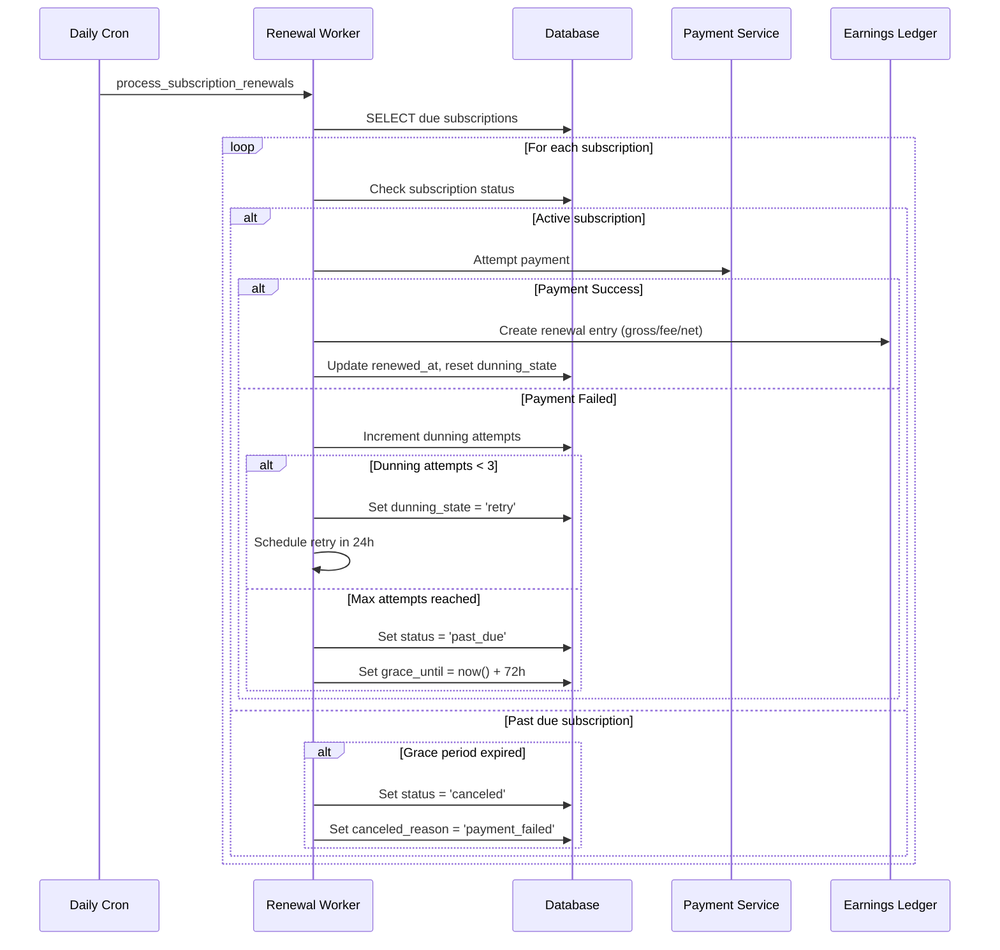
```mermaid
sequenceDiagram
    participant Cron as Daily Cron
    participant Worker as Renewal Worker
    participant DB as Database
    participant Payment as Payment Service
    participant Ledger as Earnings Ledger
    
    Cron->>Worker: process_subscription_renewals
    Worker->>DB: SELECT due subscriptions
    loop For each subscription
        Worker->>DB: Check subscription status
        alt Active subscription
            Worker->>Payment: Attempt payment
            alt Payment Success
                Worker->>Ledger: Create renewal entry (gross/fee/net)
                Worker->>DB: Update renewed_at, reset dunning_state
            else Payment Failed
                Worker->>DB: Increment dunning attempts
                alt Dunning attempts < 3
                    Worker->>DB: Set dunning_state = 'retry'
                    Worker->>Worker: Schedule retry in 24h
                else Max attempts reached
                    Worker->>DB: Set status = 'past_due'
                    Worker->>DB: Set grace_until = now() + 72h
                end
            end
        else Past due subscription
            alt Grace period expired
                Worker->>DB: Set status = 'canceled'
                Worker->>DB: Set canceled_reason = 'payment_failed'
            end
        end
    end
```

### Revenue Split Calculation with Immutable Policies

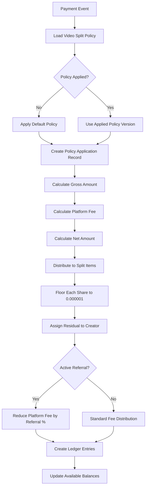
```mermaid
flowchart TD
    A[Payment Event] --> B[Load Video Split Policy]
    B --> C{Policy Applied?}
    C -->|No| D[Apply Default Policy]
    C -->|Yes| E[Use Applied Policy Version]
    D --> F[Create Policy Application Record]
    E --> F
    F --> G[Calculate Gross Amount]
    G --> H[Calculate Platform Fee]
    H --> I[Calculate Net Amount]
    I --> J[Distribute to Split Items]
    J --> K[Floor Each Share to 0.000001]
    K --> L[Assign Residual to Creator]
    L --> M{Active Referral?}
    M -->|Yes| N[Reduce Platform Fee by Referral %]
    M -->|No| O[Standard Fee Distribution]
    N --> P[Create Ledger Entries]
    O --> P
    P --> Q[Update Available Balances]
```

### Payout Request Lifecycle

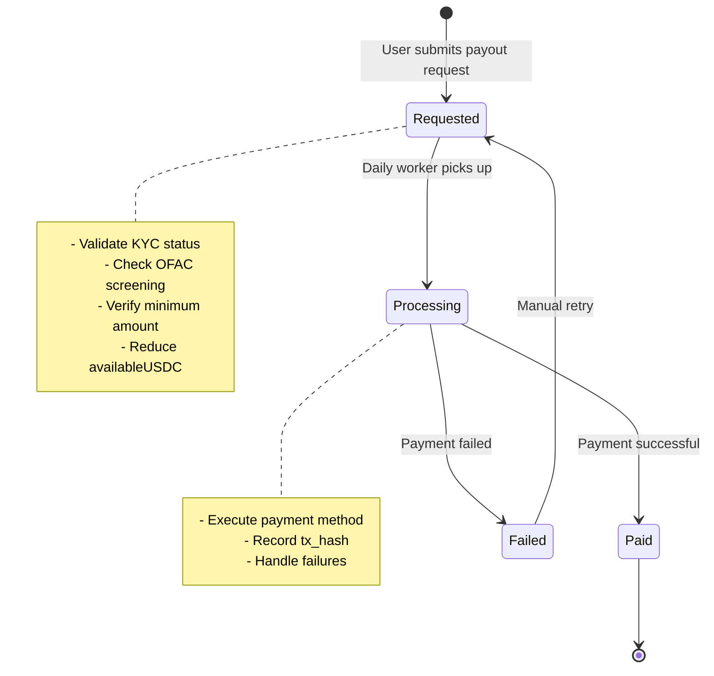
```mermaid
stateDiagram-v2
    [*] --> Requested : User submits payout request
    Requested --> Processing : Daily worker picks up
    Processing --> Paid : Payment successful
    Processing --> Failed : Payment failed
    Failed --> Requested : Manual retry
    Paid --> [*]
    
    note right of Requested
        - Validate KYC status
        - Check OFAC screening
        - Verify minimum amount
        - Reduce availableUSDC
    end note
    
    note right of Processing
        - Execute payment method
        - Record tx_hash
        - Handle failures
    end note
```

### Referral Attribution with Fraud Protection

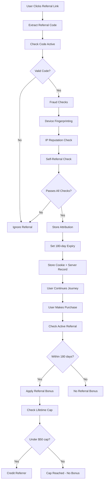
```mermaid
flowchart TD
    A[User Clicks Referral Link] --> B[Extract Referral Code]
    B --> C[Check Code Active]
    C --> D{Valid Code?}
    D -->|No| E[Ignore Referral]
    D -->|Yes| F[Fraud Checks]
    F --> G[Device Fingerprinting]
    G --> H[IP Reputation Check]
    H --> I[Self-Referral Check]
    I --> J{Passes All Checks?}
    J -->|No| E
    J -->|Yes| K[Store Attribution]
    K --> L[Set 180-day Expiry]
    L --> M[Store Cookie + Server Record]
    M --> N[User Continues Journey]
    
    N --> O[User Makes Purchase]
    O --> P[Check Active Referral]
    P --> Q{Within 180 days?}
    Q -->|Yes| R[Apply Referral Bonus]
    Q -->|No| S[No Referral Bonus]
    R --> T[Check Lifetime Cap]
    T --> U{Under $50 cap?}
    U -->|Yes| V[Credit Referrer]
    U -->|No| W[Cap Reached - No Bonus]
```

## Testing Strategy

### Critical Path Testing

**Tip Processing with Splits Test:**
```typescript
describe('Tip Processing with Versioned Splits', () => {
  beforeEach(async () => {
    // Setup test video with 3-way split: Creator 70%, Collaborator 20%, Platform 10%
    await createTestSplitPolicy({
      videoId: 'test-video-123',
      splits: [
        { payeeUserId: 'creator-456', percent: 70.00 },
        { payeeUserId: 'collab-789', percent: 20.00 }
      ]
    })
  })
  
  it('should distribute tip with correct rounding to creator', async () => {
    const tipAmount = 10.33 // Will create rounding residual
    const platformFee = tipAmount * 0.10 // $1.033
    const netAmount = tipAmount - platformFee // $9.297
    
    const response = await request(app)
      .post('/api/tips')
      .set('Idempotency-Key', 'test-tip-123')
      .send({
        videoId: 'test-video-123',
        creatorId: 'creator-456',
        amountUSDC: tipAmount
      })
    
    expect(response.status).toBe(200)
    
    // Verify ledger entries
    const ledgerEntries = await db.earnings_ledger.findAll({
      where: { meta: { tip_id: response.body.transactionId } }
    })
    
    // Should have 3 entries: parent + 2 splits
    expect(ledgerEntries).toHaveLength(3)
    
    // Find creator and collaborator entries
    const creatorEntry = ledgerEntries.find(e => e.user_id === 'creator-456')
    const collabEntry = ledgerEntries.find(e => e.user_id === 'collab-789')
    
    // Verify amounts (floor to 0.000001, residual to creator)
    expect(collabEntry.net_usdc).toBe(1.859400) // 20% of $9.297 floored
    expect(creatorEntry.net_usdc).toBe(7.437600) // Remaining amount including residual
    
    // Verify sum equals original net amount
    const totalDistributed = creatorEntry.net_usdc + collabEntry.net_usdc
    expect(totalDistributed).toBe(9.297)
  })
  
  it('should apply referral bonus correctly', async () => {
    // Setup active referral
    await createActiveReferral({
      code: 'TEST123',
      creatorId: 'referrer-999',
      referredUserId: 'tipper-user',
      rewardBps: 1000 // 10%
    })
    
    const response = await request(app)
      .post('/api/tips')
      .set('Idempotency-Key', 'test-referral-tip')
      .send({
        videoId: 'test-video-123',
        creatorId: 'creator-456', 
        amountUSDC: 10.00
      })
    
    // Verify referrer received bonus
    const referralEntry = await db.earnings_ledger.findOne({
      where: { 
        user_id: 'referrer-999',
        source: 'referral'
      }
    })
    
    expect(referralEntry.net_usdc).toBe(0.90) // 10% of $9 net amount
  })
  
  it('should handle idempotency correctly', async () => {
    const idempotencyKey = 'duplicate-tip-test'
    
    // First request
    const response1 = await request(app)
      .post('/api/tips')
      .set('Idempotency-Key', idempotencyKey)
      .send({
        videoId: 'test-video-123',
        creatorId: 'creator-456',
        amountUSDC: 5.00
      })
    
    // Duplicate request
    const response2 = await request(app)
      .post('/api/tips')
      .set('Idempotency-Key', idempotencyKey)
      .send({
        videoId: 'test-video-123',
        creatorId: 'creator-456',
        amountUSDC: 5.00
      })
    
    expect(response1.status).toBe(200)
    expect(response2.status).toBe(200)
    expect(response1.body.transactionId).toBe(response2.body.transactionId)
    
    // Verify only one set of ledger entries created
    const ledgerCount = await db.earnings_ledger.count({
      where: { idempotency_key: idempotencyKey }
    })
    expect(ledgerCount).toBe(3) // Parent + 2 splits
  })
})
```

**Subscription Renewal with Dunning:**
```typescript
describe('Subscription Renewal Processing', () => {
  it('should handle successful renewal', async () => {
    const subscription = await createTestSubscription({
      userId: 'user-123',
      planId: 'plan-456',
      status: 'active',
      renewed_at: new Date(Date.now() - 31 * 24 * 60 * 60 * 1000) // 31 days ago
    })
    
    // Mock successful payment
    mockPaymentService.processPayment.mockResolvedValue({ success: true })
    
    await subscriptionRenewalWorker.process()
    
    const updatedSub = await db.subscriptions.findByPk(subscription.id)
    expect(updatedSub.status).toBe('active')
    expect(updatedSub.dunning_state).toBe('active')
    expect(updatedSub.renewed_at).toBeAfter(subscription.renewed_at)
    
    // Verify ledger entry created
    const ledgerEntry = await db.earnings_ledger.findOne({
      where: {
        user_id: subscription.creator_id,
        source: 'subscription',
        meta: { subscription_id: subscription.id }
      }
    })
    expect(ledgerEntry).toBeTruthy()
    expect(ledgerEntry.gross_usdc).toBe(subscription.price_usdc)
  })
  
  it('should handle dunning progression', async () => {
    const subscription = await createTestSubscription({
      status: 'active',
      dunning_state: 'active',
      renewed_at: new Date(Date.now() - 31 * 24 * 60 * 60 * 1000)
    })
    
    // Mock payment failure
    mockPaymentService.processPayment.mockRejectedValue(new Error('Payment failed'))
    
    // First failure
    await subscriptionRenewalWorker.process()
    let updatedSub = await db.subscriptions.findByPk(subscription.id)
    expect(updatedSub.dunning_state).toBe('retry')
    expect(updatedSub.dunning_attempts).toBe(1)
    
    // Second failure  
    await subscriptionRenewalWorker.process()
    updatedSub = await db.subscriptions.findByPk(subscription.id)
    expect(updatedSub.dunning_attempts).toBe(2)
    
    // Third failure - should mark past due
    await subscriptionRenewalWorker.process()
    updatedSub = await db.subscriptions.findByPk(subscription.id)
    expect(updatedSub.status).toBe('past_due')
    expect(updatedSub.grace_until).toBeTruthy()
  })
})
```

**Payout Processing:**
```typescript
describe('Payout Processing', () => {
  it('should process valid payout request', async () => {
    // Setup user with verified payout method and sufficient balance
    const user = await createTestUser({ kycStatus: 'verified' })
    const payoutMethod = await createPayoutMethod({
      userId: user.id,
      type: 'usdc_address',
      details: { address: '0x742d35Cc6634C0532925a3b8D5c4c48b18d5c75F' },
      verified_at: new Date()
    })
    
    await updateUserBalance(user.id, { available_usdc: 100.00 })
    
    const response = await request(app)
      .post('/api/payouts')
      .set('Idempotency-Key', 'payout-test-123')
      .send({
        amountUSDC: 50.00,
        payoutMethodId: payoutMethod.id
      })
    
    expect(response.status).toBe(200)
    expect(response.body.payoutId).toBeTruthy()
    
    // Verify balance reduced immediately
    const updatedBalance = await getUserBalance(user.id)
    expect(updatedBalance.available_usdc).toBe(50.00)
    
    // Process payout worker
    await payoutWorker.process()
    
    // Verify payout marked as paid
    const payout = await db.payouts.findByPk(response.body.payoutId)
    expect(payout.status).toBe('paid')
    expect(payout.tx_hash).toBeTruthy()
  })
  
  it('should reject payout for unverified user', async () => {
    const user = await createTestUser({ kycStatus: 'pending' })
    
    const response = await request(app)
      .post('/api/payouts')
      .send({
        amountUSDC: 25.00,
        payoutMethodId: 'any-method-id'
      })
    
    expect(response.status).toBe(400)
    expect(response.body.error).toContain('KYC verification required')
  })
})
```

**Balance Reconciliation:**
```typescript
describe('Balance Reconciliation', () => {
  it('should detect and alert on balance drift', async () => {
    const userId = 'drift-test-user'
    
    // Create ledger entries totaling $100
    await createLedgerEntry({ userId, net_usdc: 50.00, source: 'tip' })
    await createLedgerEntry({ userId, net_usdc: 30.00, source: 'subscription' })
    await createLedgerEntry({ userId, net_usdc: 20.00, source: 'split' })
    
    // Manually set incorrect balance (simulating drift)
    await updateUserBalance(userId, { available_usdc: 99.90 }) // $0.10 drift
    
    const mockAlert = jest.fn()
    reconciliationWorker.setAlertHandler(mockAlert)
    
    await reconciliationWorker.process()
    
    // Should trigger alert for drift > $0.05
    expect(mockAlert).toHaveBeenCalledWith({
      type: 'balance_drift',
      userId,
      storedBalance: 99.90,
      calculatedBalance: 100.00,
      drift: 0.10
    })
    
    // Should update stored balance to match calculated
    const correctedBalance = await getUserBalance(userId)
    expect(correctedBalance.available_usdc).toBe(100.00)
  })
})
```

### Load Testing

**Concurrent Tip Processing:**
```typescript
describe('Load Testing', () => {
  it('should handle 100 concurrent tips without race conditions', async () => {
    const creatorId = 'load-test-creator'
    const promises = []
    
    for (let i = 0; i < 100; i++) {
      promises.push(
        request(app)
          .post('/api/tips')
          .set('Idempotency-Key', `load-test-${i}`)
          .send({
            videoId: 'load-test-video',
            creatorId,
            amountUSDC: 1.00
          })
      )
    }
    
    const responses = await Promise.all(promises)
    
    // All should succeed
    responses.forEach(response => {
      expect(response.status).toBe(200)
    })
    
    // Verify final balance is correct
    const finalBalance = await getUserBalance(creatorId)
    expect(finalBalance.available_usdc).toBe(90.00) // 100 tips * $0.90 net each
  })
})
```

## Frontend Component Implementation

### TipButton Component

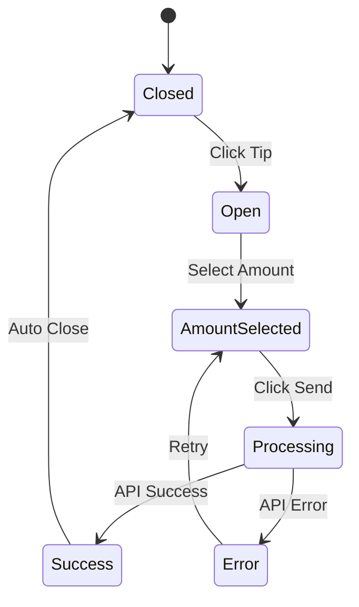
```mermaid
stateDiagram-v2
    [*] --> Closed
    Closed --> Open : Click Tip
    Open --> AmountSelected : Select Amount
    AmountSelected --> Processing : Click Send
    Processing --> Success : API Success
    Processing --> Error : API Error
    Success --> Closed : Auto Close
    Error --> AmountSelected : Retry
```

**Implementation Requirements:**
- Emerald theme colors (bg-emerald-600)
- Amount selection: $2, $5, $10, $20
- Custom amount input support
- Loading states during processing
- Success feedback with balance pill glow
- Error handling with retry option

**UX Copy:**
- Button: "Tip"
- Modal title: "Tip the creator"
- Subtitle: "Tip in USDC — gas covered by the Reelverse Treasury."
- Success message: "Thank you! Your tip has been sent."

### SubscribeButton Component

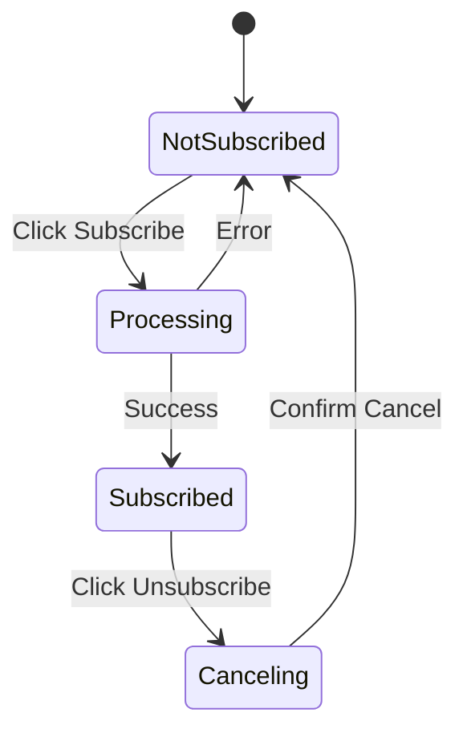
```mermaid
stateDiagram-v2
    [*] --> NotSubscribed
    NotSubscribed --> Processing : Click Subscribe
    Processing --> Subscribed : Success
    Processing --> NotSubscribed : Error
    Subscribed --> Canceling : Click Unsubscribe
    Canceling --> NotSubscribed : Confirm Cancel
```

**State Management:**
- Check existing subscription status on mount
- Handle subscription state transitions
- Display appropriate button text and styling
- Manage cancellation flow

**UX Copy:**
- Not subscribed: "Subscribe $4.99"
- Subscribed: "Subscribed ✓"
- Subtitle: "Cancel anytime. 90% goes to the creator."

### Video Monetization Studio Component

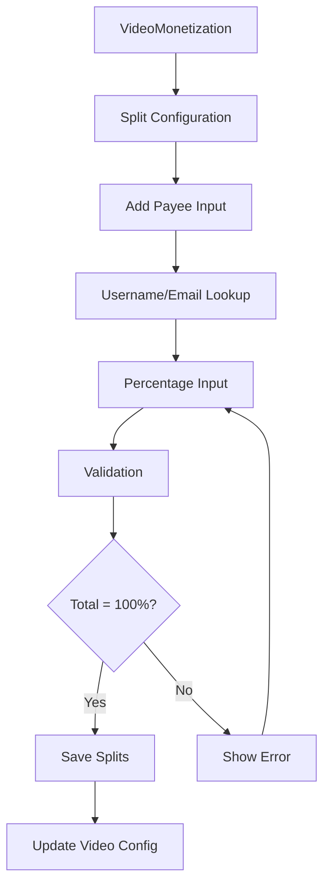
```mermaid
flowchart TD
    A[VideoMonetization] --> B[Split Configuration]
    B --> C[Add Payee Input]
    C --> D[Username/Email Lookup]
    D --> E[Percentage Input]
    E --> F[Validation]
    F --> G{Total = 100%?}
    G -->|Yes| H[Save Splits]
    G -->|No| I[Show Error]
    I --> E
    H --> J[Update Video Config]
```

**Features:**
- Real-time payee search by username/email
- Percentage validation (must sum to 100%)
- Visual split preview
- Drag-and-drop reordering
- Save/cancel functionality

**UX Copy:**
- Section title: "Revenue Splits"
- Subtitle: "Pay collaborators automatically from this video's earnings."
- Add button: "Add Collaborator"
- Save button: "Save Split Configuration"

### Referral System Implementation

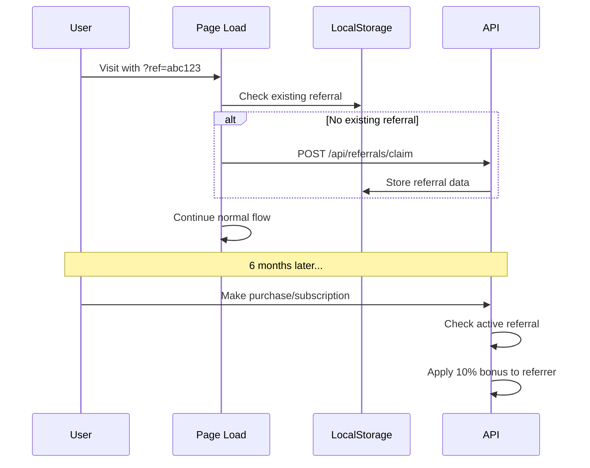
```mermaid
sequenceDiagram
    participant User as User
    participant Page as Page Load
    participant Storage as LocalStorage
    participant API as API
    
    User->>Page: Visit with ?ref=abc123
    Page->>Storage: Check existing referral
    alt No existing referral
        Page->>API: POST /api/referrals/claim
        API->>Storage: Store referral data
    end
    Page->>Page: Continue normal flow
    
    Note over User,API: 6 months later...
    
    User->>API: Make purchase/subscription
    API->>API: Check active referral
    API->>API: Apply 10% bonus to referrer
```

**Referral Code Generation:**
- 6-character alphanumeric codes
- Case-insensitive matching
- Collision detection and regeneration
- Creator-specific codes in format: `@username-abc123`

**Share Menu Integration:**
- Auto-append referral code to share URLs
- Copy link functionality
- Social media sharing buttons
- QR code generation for mobile sharing

## Data Flow Architecture

### Earnings Ledger Integration

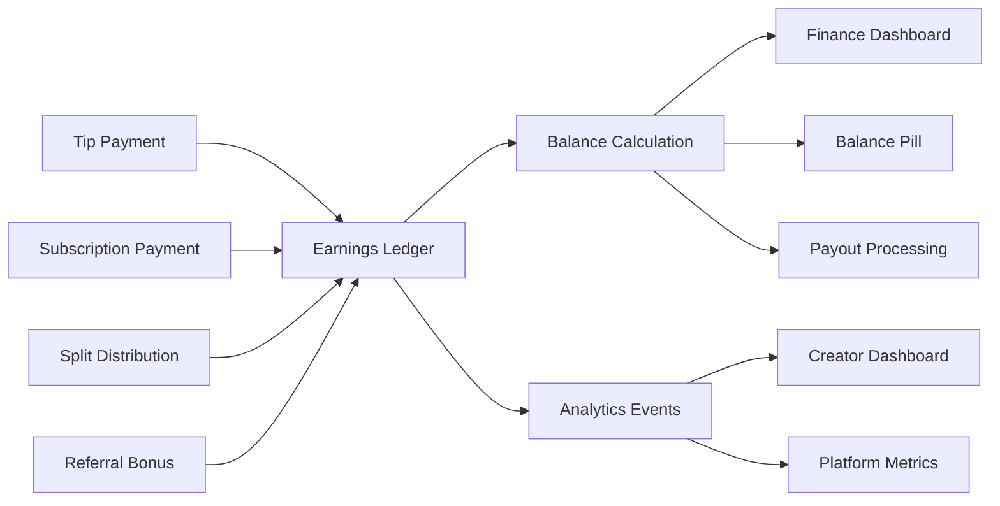
```mermaid
flowchart LR
    A[Tip Payment] --> E[Earnings Ledger]
    B[Subscription Payment] --> E
    C[Split Distribution] --> E
    D[Referral Bonus] --> E
    
    E --> F[Balance Calculation]
    F --> G[Finance Dashboard]
    F --> H[Balance Pill]
    F --> I[Payout Processing]
    
    E --> J[Analytics Events]
    J --> K[Creator Dashboard]
    J --> L[Platform Metrics]
```

**Ledger Entry Structure:**
```typescript
interface EarningsEntry {
  id: string
  user_id: string
  amount_usdc: number
  source: 'tip' | 'subscription' | 'split' | 'referral' | 'adshare'
  parent_id?: string  // Links split entries to original transaction
  meta: {
    video_id?: string
    subscription_id?: string
    referral_id?: string
    split_percent?: number
    original_amount?: number
  }
  error_code?: string
  created_at: Date
}
```

### Real-time Balance Updates

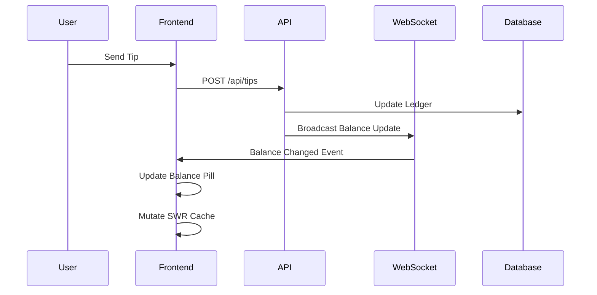
```mermaid
sequenceDiagram
    participant User as User
    participant Frontend as Frontend
    participant API as API
    participant WS as WebSocket
    participant DB as Database
    
    User->>Frontend: Send Tip
    Frontend->>API: POST /api/tips
    API->>DB: Update Ledger
    API->>WS: Broadcast Balance Update
    WS->>Frontend: Balance Changed Event
    Frontend->>Frontend: Update Balance Pill
    Frontend->>Frontend: Mutate SWR Cache
```

**WebSocket Event Schema:**
```typescript
{
  type: 'balance_update',
  userId: string,
  newBalance: number,
  change: number,
  source: 'tip' | 'subscription' | 'split' | 'referral'
}
```

## Backend Service Architecture

### Database Migrations

**Migration: Create Plans Table**
```sql
CREATE TABLE plans (
  id UUID PRIMARY KEY DEFAULT gen_random_uuid(),
  creator_id UUID NOT NULL REFERENCES users(id),
  name TEXT NOT NULL,
  price_usdc NUMERIC(20,6) NOT NULL CHECK (price_usdc > 0),
  cadence VARCHAR(10) NOT NULL CHECK (cadence IN ('monthly','annual')),
  status VARCHAR(10) NOT NULL DEFAULT 'active' 
    CHECK (status IN ('active','archived')),
  started_at TIMESTAMPTZ NOT NULL DEFAULT NOW(),
  created_at TIMESTAMPTZ NOT NULL DEFAULT NOW()
);

CREATE INDEX idx_plans_creator_id ON plans(creator_id);
CREATE INDEX idx_plans_status ON plans(status) WHERE status = 'active';
```

**Migration: Update Subscriptions Table**
```sql
-- Add plan reference and enhanced dunning fields
ALTER TABLE subscriptions 
  ADD COLUMN plan_id UUID REFERENCES plans(id),
  ADD COLUMN canceled_reason TEXT,
  ADD COLUMN grace_until TIMESTAMPTZ,
  ADD COLUMN dunning_state VARCHAR(20) DEFAULT 'active' 
    CHECK (dunning_state IN ('active','retry','past_due','canceled'));

-- Keep price_usdc to freeze price at subscription time
-- Update status check constraint
ALTER TABLE subscriptions DROP CONSTRAINT IF EXISTS subscriptions_status_check;
ALTER TABLE subscriptions ADD CONSTRAINT subscriptions_status_check 
  CHECK (status IN ('active','canceled','past_due','grace_period'));

CREATE INDEX idx_subscriptions_plan_id ON subscriptions(plan_id);
CREATE INDEX idx_subscriptions_dunning ON subscriptions(dunning_state) 
  WHERE status = 'active';
```

**Migration: Create Versioned Split Policies**
```sql
CREATE TABLE split_policies (
  id UUID PRIMARY KEY DEFAULT gen_random_uuid(),
  scope VARCHAR(20) NOT NULL CHECK (scope IN ('video','creator')),
  version INTEGER NOT NULL,
  total_percent NUMERIC(6,2) NOT NULL CHECK (total_percent = 100.00),
  created_at TIMESTAMPTZ NOT NULL DEFAULT NOW(),
  UNIQUE(scope, version)
);

CREATE TABLE split_policy_items (
  policy_id UUID NOT NULL REFERENCES split_policies(id) ON DELETE CASCADE,
  payee_user_id UUID NOT NULL REFERENCES users(id),
  percent NUMERIC(5,2) NOT NULL CHECK (percent >= 0 AND percent <= 100),
  PRIMARY KEY (policy_id, payee_user_id)
);

CREATE TABLE video_split_applied (
  video_id UUID PRIMARY KEY REFERENCES videos(id),
  policy_id UUID NOT NULL REFERENCES split_policies(id),
  applied_at TIMESTAMPTZ NOT NULL DEFAULT NOW()
);

CREATE INDEX idx_split_policies_scope ON split_policies(scope, version);
CREATE INDEX idx_split_policy_items_payee ON split_policy_items(payee_user_id);
```

**Migration: Create Referral Codes System**
```sql
CREATE TABLE referral_codes (
  id UUID PRIMARY KEY DEFAULT gen_random_uuid(),
  creator_id UUID NOT NULL REFERENCES users(id),
  code VARCHAR(20) NOT NULL UNIQUE,
  reward_bps INTEGER NOT NULL DEFAULT 1000 
    CHECK (reward_bps BETWEEN 0 AND 1000),
  active BOOLEAN NOT NULL DEFAULT true,
  created_at TIMESTAMPTZ NOT NULL DEFAULT NOW()
);

-- Update referrals table to reference codes
ALTER TABLE referrals 
  ADD COLUMN referral_code_id UUID REFERENCES referral_codes(id),
  ADD COLUMN total_rewards_usdc NUMERIC(20,6) DEFAULT 0 
    CHECK (total_rewards_usdc <= 50), -- $50 lifetime cap
  DROP COLUMN referrer_user_id; -- Now via referral_codes.creator_id

CREATE INDEX idx_referral_codes_creator ON referral_codes(creator_id);
CREATE INDEX idx_referral_codes_active ON referral_codes(code) WHERE active = true;
CREATE INDEX idx_referrals_code_id ON referrals(referral_code_id);
```

**Migration: Normalize Earnings Ledger**
```sql
-- Add normalized financial fields
ALTER TABLE earnings_ledger 
  ADD COLUMN gross_usdc NUMERIC(20,6) CHECK (gross_usdc >= 0),
  ADD COLUMN fee_usdc NUMERIC(20,6) CHECK (fee_usdc >= 0),
  ADD COLUMN net_usdc NUMERIC(20,6) CHECK (net_usdc >= 0),
  ADD COLUMN idempotency_key TEXT;

-- Update source constraint
ALTER TABLE earnings_ledger DROP CONSTRAINT IF EXISTS earnings_ledger_source_check;
ALTER TABLE earnings_ledger ADD CONSTRAINT earnings_ledger_source_check
  CHECK (source IN ('tip','subscription','split','referral','payout','refund','adshare'));

-- Add idempotency constraint
CREATE UNIQUE INDEX idx_earnings_ledger_idempotency 
  ON earnings_ledger(user_id, idempotency_key) 
  WHERE idempotency_key IS NOT NULL;

-- Add indexes for performance
CREATE INDEX idx_earnings_ledger_source ON earnings_ledger(source);
CREATE INDEX idx_earnings_ledger_parent_id ON earnings_ledger(parent_id) 
  WHERE parent_id IS NOT NULL;
CREATE INDEX idx_earnings_ledger_user_created ON earnings_ledger(user_id, created_at);

-- Add constraint to ensure gross = fee + net
ALTER TABLE earnings_ledger ADD CONSTRAINT earnings_ledger_amount_consistency
  CHECK (gross_usdc = fee_usdc + net_usdc OR gross_usdc IS NULL);
```

**Migration: Create Payout System**
```sql
CREATE TABLE payout_methods (
  id UUID PRIMARY KEY DEFAULT gen_random_uuid(),
  user_id UUID NOT NULL REFERENCES users(id),
  type VARCHAR(20) NOT NULL CHECK (type IN ('usdc_address','bank')),
  details JSONB NOT NULL, -- {address:'0x..'} or bank details
  verified_at TIMESTAMPTZ,
  active BOOLEAN NOT NULL DEFAULT true,
  created_at TIMESTAMPTZ NOT NULL DEFAULT NOW()
);

CREATE TABLE payouts (
  id UUID PRIMARY KEY DEFAULT gen_random_uuid(),
  user_id UUID NOT NULL REFERENCES users(id),
  payout_method_id UUID NOT NULL REFERENCES payout_methods(id),
  amount_usdc NUMERIC(20,6) NOT NULL CHECK (amount_usdc > 0),
  status VARCHAR(20) NOT NULL DEFAULT 'requested'
    CHECK (status IN ('requested','processing','paid','failed','canceled')),
  requested_at TIMESTAMPTZ NOT NULL DEFAULT NOW(),
  processed_at TIMESTAMPTZ,
  tx_hash TEXT,
  failure_reason TEXT,
  idempotency_key TEXT,
  worker_attempts INTEGER DEFAULT 0,
  next_retry_at TIMESTAMPTZ
);

CREATE INDEX idx_payout_methods_user ON payout_methods(user_id);
CREATE INDEX idx_payout_methods_verified ON payout_methods(user_id, verified_at) 
  WHERE verified_at IS NOT NULL AND active = true;
CREATE INDEX idx_payouts_user ON payouts(user_id);
CREATE INDEX idx_payouts_status ON payouts(status);
CREATE INDEX idx_payouts_processing ON payouts(status, next_retry_at) 
  WHERE status IN ('requested', 'failed');
CREATE UNIQUE INDEX idx_payouts_idempotency 
  ON payouts(user_id, idempotency_key) 
  WHERE idempotency_key IS NOT NULL;
```

**Migration: Create Configuration Table**
```sql
CREATE TABLE monetization_config (
  key VARCHAR(50) PRIMARY KEY,
  value JSONB NOT NULL,
  updated_at TIMESTAMPTZ NOT NULL DEFAULT NOW()
);

-- Insert default configuration
INSERT INTO monetization_config (key, value) VALUES 
  ('minimum_payout_usdc', '25.000000'),
  ('hold_window_hours', '72'),
  ('daily_cutoff_time', '"00:00"'),
  ('max_tip_usdc', '100.000000'),
  ('min_tip_usdc', '1.000000'),
  ('platform_fee_bps', '1000'), -- 10%
  ('referral_expiry_days', '180'),
  ('max_referral_reward_usdc', '50.000000'),
  ('dunning_max_attempts', '3'),
  ('dunning_retry_hours', '24');
```

**Migration: Add User Balance Tracking**
```sql
CREATE TABLE user_balances (
  user_id UUID PRIMARY KEY REFERENCES users(id),
  available_usdc NUMERIC(20,6) NOT NULL DEFAULT 0 CHECK (available_usdc >= 0),
  pending_usdc NUMERIC(20,6) NOT NULL DEFAULT 0 CHECK (pending_usdc >= 0),
  lifetime_usdc NUMERIC(20,6) NOT NULL DEFAULT 0 CHECK (lifetime_usdc >= 0),
  last_reconciled_at TIMESTAMPTZ NOT NULL DEFAULT NOW(),
  updated_at TIMESTAMPTZ NOT NULL DEFAULT NOW()
);

CREATE INDEX idx_user_balances_available ON user_balances(available_usdc) 
  WHERE available_usdc > 0;
  
-- Add trigger to update balance on ledger changes
CREATE OR REPLACE FUNCTION update_user_balance() RETURNS TRIGGER AS $$
BEGIN
  INSERT INTO user_balances (user_id, available_usdc, lifetime_usdc)
  VALUES (NEW.user_id, NEW.net_usdc, NEW.net_usdc)
  ON CONFLICT (user_id) DO UPDATE SET
    available_usdc = user_balances.available_usdc + NEW.net_usdc,
    lifetime_usdc = user_balances.lifetime_usdc + NEW.net_usdc,
    updated_at = NOW();
  RETURN NEW;
END;
$$ LANGUAGE plpgsql;

CREATE TRIGGER trigger_update_user_balance
  AFTER INSERT ON earnings_ledger
  FOR EACH ROW
  WHEN (NEW.source != 'payout') -- Don't double-count payouts
  EXECUTE FUNCTION update_user_balance();
```

### Background Job Processing

**Subscription Renewal Worker (Daily)**
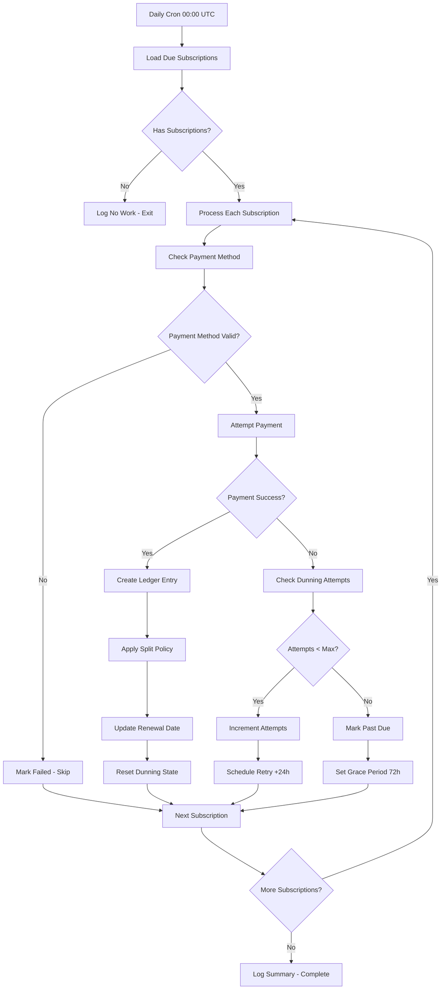
```mermaid
flowchart TD
    A[Daily Cron 00:00 UTC] --> B[Load Due Subscriptions]
    B --> C{Has Subscriptions?}
    C -->|No| D[Log No Work - Exit]
    C -->|Yes| E[Process Each Subscription]
    E --> F[Check Payment Method]
    F --> G{Payment Method Valid?}
    G -->|No| H[Mark Failed - Skip]
    G -->|Yes| I[Attempt Payment]
    I --> J{Payment Success?}
    J -->|Yes| K[Create Ledger Entry]
    K --> L[Apply Split Policy]
    L --> M[Update Renewal Date]
    M --> N[Reset Dunning State]
    J -->|No| O[Check Dunning Attempts]
    O --> P{Attempts < Max?}
    P -->|Yes| Q[Increment Attempts]
    Q --> R[Schedule Retry +24h]
    P -->|No| S[Mark Past Due]
    S --> T[Set Grace Period 72h]
    H --> U[Next Subscription]
    N --> U
    R --> U
    T --> U
    U --> V{More Subscriptions?}
    V -->|Yes| E
    V -->|No| W[Log Summary - Complete]
```

**Payout Processing Worker (Daily)**
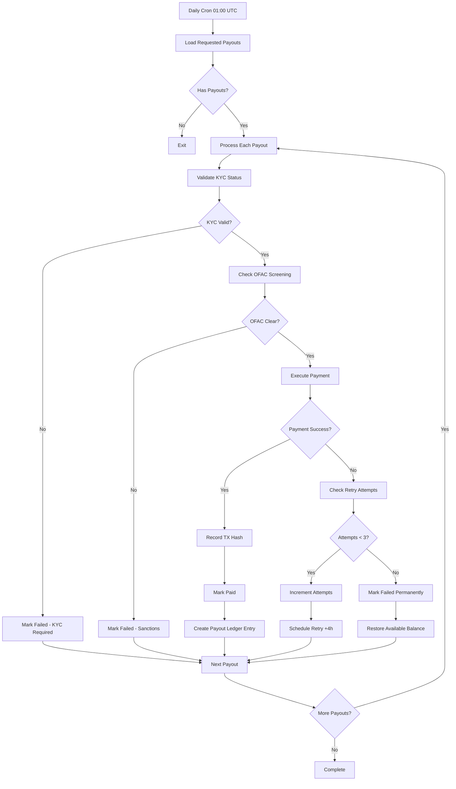
```mermaid
flowchart TD
    A[Daily Cron 01:00 UTC] --> B[Load Requested Payouts]
    B --> C{Has Payouts?}
    C -->|No| D[Exit]
    C -->|Yes| E[Process Each Payout]
    E --> F[Validate KYC Status]
    F --> G{KYC Valid?}
    G -->|No| H[Mark Failed - KYC Required]
    G -->|Yes| I[Check OFAC Screening]
    I --> J{OFAC Clear?}
    J -->|No| K[Mark Failed - Sanctions]
    J -->|Yes| L[Execute Payment]
    L --> M{Payment Success?}
    M -->|Yes| N[Record TX Hash]
    N --> O[Mark Paid]
    O --> P[Create Payout Ledger Entry]
    M -->|No| Q[Check Retry Attempts]
    Q --> R{Attempts < 3?}
    R -->|Yes| S[Increment Attempts]
    S --> T[Schedule Retry +4h]
    R -->|No| U[Mark Failed Permanently]
    U --> V[Restore Available Balance]
    H --> W[Next Payout]
    K --> W
    P --> W
    T --> W
    V --> W
    W --> X{More Payouts?}
    X -->|Yes| E
    X -->|No| Y[Complete]
```

**Balance Reconciliation Worker (Nightly)**
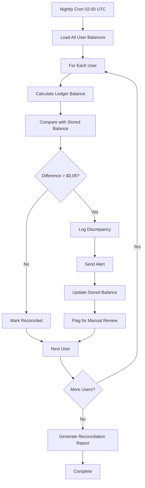
```mermaid
flowchart TD
    A[Nightly Cron 02:00 UTC] --> B[Load All User Balances]
    B --> C[For Each User]
    C --> D[Calculate Ledger Balance]
    D --> E[Compare with Stored Balance]
    E --> F{Difference > $0.05?}
    F -->|No| G[Mark Reconciled]
    F -->|Yes| H[Log Discrepancy]
    H --> I[Send Alert]
    I --> J[Update Stored Balance]
    J --> K[Flag for Manual Review]
    G --> L[Next User]
    K --> L
    L --> M{More Users?}
    M -->|Yes| C
    M -->|No| N[Generate Reconciliation Report]
    N --> O[Complete]
```

**Split Policy Finalization Worker**
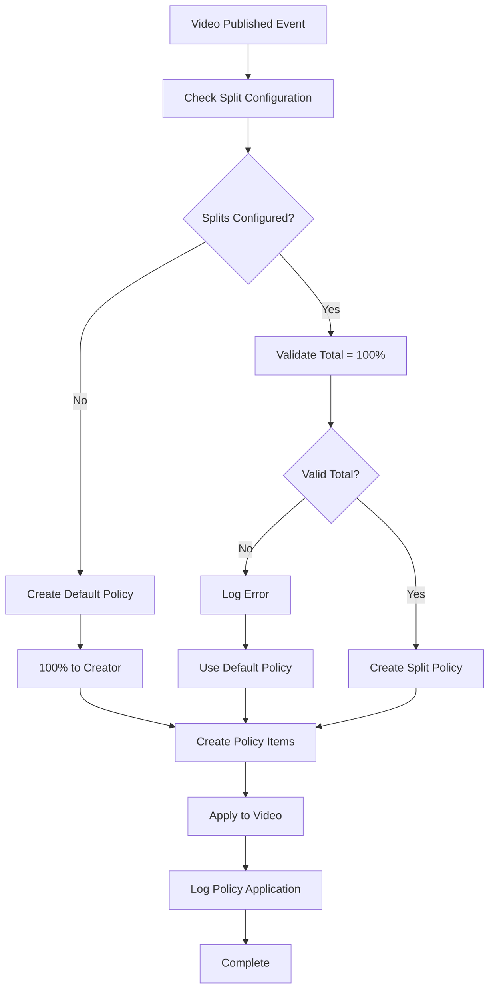
```mermaid
flowchart TD
    A[Video Published Event] --> B[Check Split Configuration]
    B --> C{Splits Configured?}
    C -->|No| D[Create Default Policy]
    D --> E[100% to Creator]
    C -->|Yes| F[Validate Total = 100%]
    F --> G{Valid Total?}
    G -->|No| H[Log Error]
    H --> I[Use Default Policy]
    G -->|Yes| J[Create Split Policy]
    E --> K[Create Policy Items]
    I --> K
    J --> K
    K --> L[Apply to Video]
    L --> M[Log Policy Application]
    M --> N[Complete]
```

**Worker Configuration**
```typescript
// Background job configuration
export const workerConfig = {
  subscriptionRenewals: {
    schedule: '0 0 * * *', // Daily at midnight UTC
    timeout: 1800000, // 30 minutes
    concurrency: 1,
    retry: {
      attempts: 3,
      backoff: 'exponential'
    }
  },
  payoutProcessing: {
    schedule: '0 1 * * *', // Daily at 1 AM UTC
    timeout: 3600000, // 1 hour
    concurrency: 5, // Process 5 payouts concurrently
    retry: {
      attempts: 3,
      backoff: 'exponential'
    }
  },
  balanceReconciliation: {
    schedule: '0 2 * * *', // Daily at 2 AM UTC
    timeout: 7200000, // 2 hours
    concurrency: 10, // Check 10 users concurrently
    alertThreshold: 0.05 // Alert on drift > $0.05
  },
  splitPolicyFinalization: {
    trigger: 'video.published',
    timeout: 300000, // 5 minutes
    concurrency: 1
  }
}
```

**Error Handling and Monitoring**
```typescript
// Worker error handling
interface WorkerError {
  workerId: string
  jobId: string
  error: Error
  context: Record<string, any>
  timestamp: Date
  retryCount: number
}

// Monitoring metrics
interface WorkerMetrics {
  jobsProcessed: number
  jobsSucceeded: number
  jobsFailed: number
  averageProcessingTime: number
  lastRunTime: Date
  nextRunTime: Date
}
```

### Rate Limiting & Security

**API Rate Limits:**
- Tips: 10 per minute per user
- Subscriptions: 5 per minute per user  
- Referral claims: 1 per minute per IP
- Finance queries: 60 per minute per user
- Payout requests: 3 per day per user
- CSV exports: 5 per hour per user

**Security Measures:**
- Input validation with Zod schemas
- SQL injection prevention via parameterized queries
- CSRF token validation on all mutations
- User authentication required for all financial operations
- Amount limits: Tips $1-$100, Subscriptions max $50/month
- Decimal(20,6) arithmetic throughout - no floating point
- Idempotency keys required on all mutation endpoints

**Fraud Detection Pipeline:**
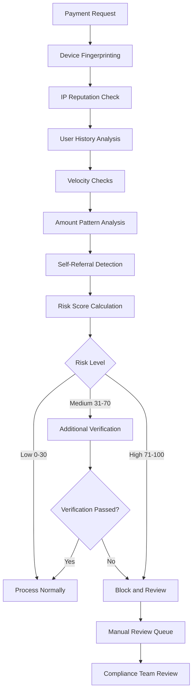
```mermaid
flowchart TD
    A[Payment Request] --> B[Device Fingerprinting]
    B --> C[IP Reputation Check]
    C --> D[User History Analysis]
    D --> E[Velocity Checks]
    E --> F[Amount Pattern Analysis]
    F --> G[Self-Referral Detection]
    G --> H[Risk Score Calculation]
    H --> I{Risk Level}
    I -->|Low 0-30| J[Process Normally]
    I -->|Medium 31-70| K[Additional Verification]
    I -->|High 71-100| L[Block and Review]
    K --> M{Verification Passed?}
    M -->|Yes| J
    M -->|No| L
    L --> N[Manual Review Queue]
    N --> O[Compliance Team Review]
```

**Anti-Abuse Controls:**
- Maximum tip velocity: $500 per creator per day per user
- Self-tipping detection via device fingerprints
- Circular referral loop prevention
- Account age requirements for large tips (>$20)
- Geographic velocity limits to prevent bot farms
- Creator earnings caps until KYC verified

## Compliance & Risk Management

### KYC and Payout Verification

**KYC Requirements:**
- Required only for payouts, not for earning
- Identity verification via Jumio or Persona
- W-9/W-8 tax form collection for US tax reporting
- Enhanced due diligence for high-volume creators (>$10k/month)
- Annual re-verification for active creators

**Payout Method Verification:**
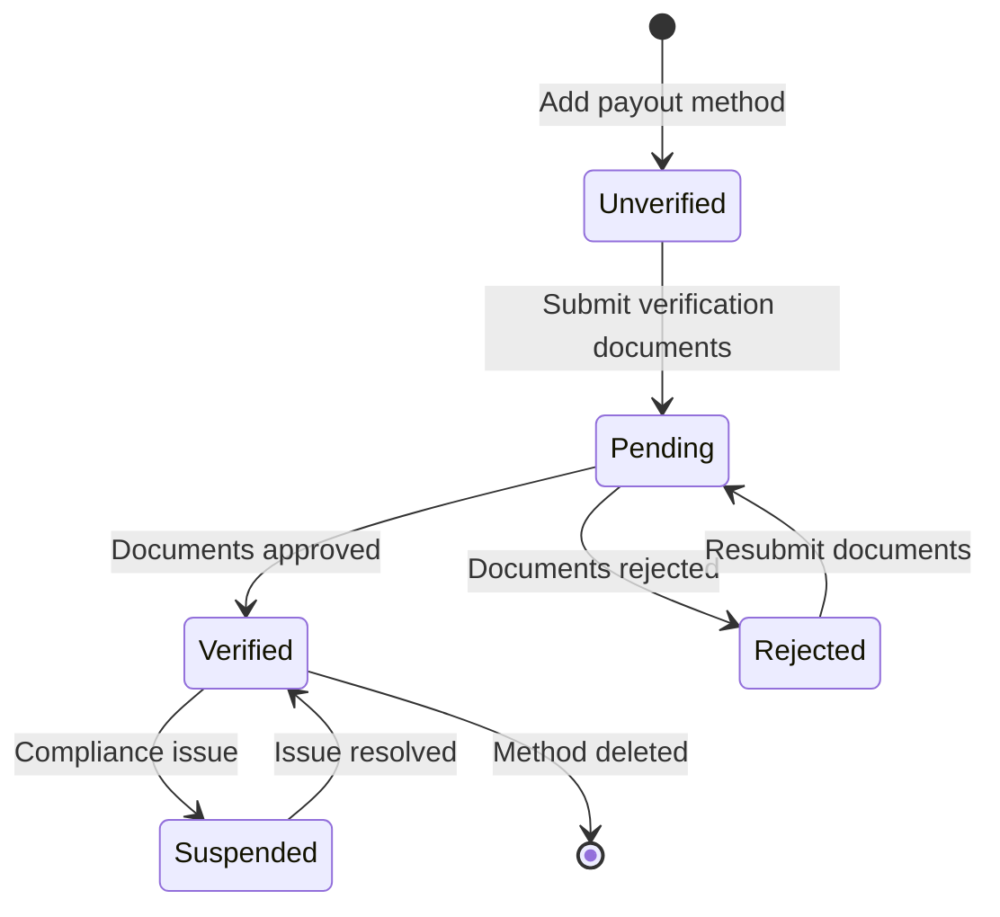
```mermaid
stateDiagram-v2
    [*] --> Unverified : Add payout method
    Unverified --> Pending : Submit verification documents
    Pending --> Verified : Documents approved
    Pending --> Rejected : Documents rejected
    Rejected --> Pending : Resubmit documents
    Verified --> Suspended : Compliance issue
    Suspended --> Verified : Issue resolved
    Verified --> [*] : Method deleted
```

### OFAC and Sanctions Screening

**Screening Requirements:**
- Real-time screening on payout requests
- Daily batch screening of all active creators
- Integration with Chainalysis or TRM Labs
- Automatic blocking of sanctioned addresses
- Manual review queue for potential matches

**Screening Process:**
```sql
-- Example screening check
WITH screening_result AS (
  SELECT 
    user_id,
    payout_method_id,
    ofac_check_status,
    risk_score,
    last_screened_at
  FROM payout_methods pm
  JOIN ofac_screening os ON pm.id = os.payout_method_id
  WHERE pm.user_id = $1
    AND os.status = 'clear'
    AND os.last_screened_at > NOW() - INTERVAL '24 hours'
)
SELECT 
  CASE 
    WHEN screening_result IS NULL THEN 'screening_required'
    WHEN risk_score > 80 THEN 'high_risk_review'
    ELSE 'cleared_for_payout'
  END as payout_eligibility
FROM screening_result;
```

### Tax Compliance and Reporting

**Tax Documentation:**
- W-9 collection for US creators
- W-8 collection for international creators  
- 1099-NEC generation for creators earning >$600/year
- VAT handling for subscription payments in EU
- HST/GST compliance for Canadian creators

**Marketplace vs Merchant of Record:**
```typescript
// Tax configuration per jurisdiction
interface TaxConfig {
  jurisdiction: string
  role: 'marketplace' | 'merchant_of_record'
  taxRates: {
    vat?: number
    salesTax?: number
    withholding?: number
  }
  reportingThresholds: {
    annual1099: number  // $600 for US
    monthlyReporting: number
  }
}

const taxConfigurations: TaxConfig[] = [
  {
    jurisdiction: 'US',
    role: 'marketplace',
    taxRates: { withholding: 0 },
    reportingThresholds: { annual1099: 600, monthlyReporting: 20000 }
  },
  {
    jurisdiction: 'EU',
    role: 'merchant_of_record', // For subscriptions
    taxRates: { vat: 0.20 }, // Varies by country
    reportingThresholds: { annual1099: 0, monthlyReporting: 10000 }
  }
]
```

### Refund and Dispute Management

**Refund Policy:**
- Accidental tips: Full refund within 24 hours
- Duplicate subscriptions: Automatic detection and refund
- Fraudulent transactions: Full investigation and refund
- Creator-initiated refunds: Supported with reason codes

**Refund Processing:**
```sql
-- Create refund ledger entry
INSERT INTO earnings_ledger (
  user_id, 
  gross_usdc, 
  fee_usdc, 
  net_usdc, 
  source, 
  parent_id,
  meta,
  idempotency_key
) VALUES (
  $creator_id,
  -$original_gross,  -- Negative amounts for refunds
  -$original_fee,
  -$original_net,
  'refund',
  $original_transaction_id,
  jsonb_build_object(
    'refund_reason', $reason,
    'refund_initiated_by', $admin_user_id,
    'original_transaction_date', $original_date
  ),
  $idempotency_key
);
```

### NSFW Content and Age Verification

**Content Gating:**
- Age verification required for 18+ content access
- ZK-proof age verification for privacy
- Parental controls and family-safe modes
- Geographic content restrictions
- Creator age verification for monetization

**Age Verification Integration:**
```typescript
interface AgeVerificationCheck {
  userId: string
  method: 'government_id' | 'credit_card' | 'zk_proof'
  verifiedAge: number
  verificationDate: Date
  expiresAt: Date
  jurisdiction: string
}

// Check before allowing access to monetized NSFW content
async function verifyAgeForContent(userId: string, contentId: string): Promise<boolean> {
  const content = await getContentById(contentId)
  const userVerification = await getAgeVerification(userId)
  
  if (content.ageRating === '18+' && !userVerification) {
    throw new Error('Age verification required')
  }
  
  if (content.ageRating === '18+' && userVerification.verifiedAge < 18) {
    throw new Error('Content restricted for user age')
  }
  
  return true
}
```

## Observability & Reconciliation

### Balance Reconciliation System

**Nightly Reconciliation Process:**
```sql
-- Reconciliation query to detect balance drift
WITH ledger_balances AS (
  SELECT 
    user_id,
    SUM(CASE WHEN source != 'payout' THEN net_usdc ELSE 0 END) as calculated_available,
    SUM(net_usdc) as calculated_lifetime
  FROM earnings_ledger 
  WHERE created_at >= '2024-01-01'  -- Platform launch
  GROUP BY user_id
),
balance_comparison AS (
  SELECT 
    ub.user_id,
    ub.available_usdc as stored_available,
    ub.lifetime_usdc as stored_lifetime,
    lb.calculated_available,
    lb.calculated_lifetime,
    ABS(ub.available_usdc - lb.calculated_available) as available_drift,
    ABS(ub.lifetime_usdc - lb.calculated_lifetime) as lifetime_drift
  FROM user_balances ub
  LEFT JOIN ledger_balances lb ON ub.user_id = lb.user_id
)
SELECT 
  user_id,
  stored_available,
  calculated_available,
  available_drift,
  CASE 
    WHEN available_drift > 0.05 THEN 'ALERT'
    WHEN available_drift > 0.01 THEN 'WARNING'
    ELSE 'OK'
  END as reconciliation_status
FROM balance_comparison
WHERE available_drift > 0.01
ORDER BY available_drift DESC;
```

**Audit Trail Implementation:**
```sql
CREATE TABLE audit_logs (
  id UUID PRIMARY KEY DEFAULT gen_random_uuid(),
  table_name VARCHAR(50) NOT NULL,
  record_id UUID NOT NULL,
  action VARCHAR(20) NOT NULL CHECK (action IN ('INSERT','UPDATE','DELETE')),
  old_values JSONB,
  new_values JSONB,
  changed_by UUID REFERENCES users(id),
  changed_at TIMESTAMPTZ NOT NULL DEFAULT NOW(),
  ip_address INET,
  user_agent TEXT,
  reason TEXT
);

CREATE INDEX idx_audit_logs_table_record ON audit_logs(table_name, record_id);
CREATE INDEX idx_audit_logs_changed_by ON audit_logs(changed_by);
CREATE INDEX idx_audit_logs_changed_at ON audit_logs(changed_at);

-- Trigger function for automatic audit logging
CREATE OR REPLACE FUNCTION audit_trigger_function() RETURNS TRIGGER AS $$
BEGIN
  IF TG_OP = 'DELETE' THEN
    INSERT INTO audit_logs (table_name, record_id, action, old_values, changed_by)
    VALUES (TG_TABLE_NAME, OLD.id, 'DELETE', row_to_json(OLD), current_setting('app.current_user_id')::UUID);
    RETURN OLD;
  ELSIF TG_OP = 'UPDATE' THEN
    INSERT INTO audit_logs (table_name, record_id, action, old_values, new_values, changed_by)
    VALUES (TG_TABLE_NAME, NEW.id, 'UPDATE', row_to_json(OLD), row_to_json(NEW), current_setting('app.current_user_id')::UUID);
    RETURN NEW;
  ELSIF TG_OP = 'INSERT' THEN
    INSERT INTO audit_logs (table_name, record_id, action, new_values, changed_by)
    VALUES (TG_TABLE_NAME, NEW.id, 'INSERT', row_to_json(NEW), current_setting('app.current_user_id')::UUID);
    RETURN NEW;
  END IF;
END;
$$ LANGUAGE plpgsql;

-- Apply audit triggers to critical tables
CREATE TRIGGER audit_split_policies 
  AFTER INSERT OR UPDATE OR DELETE ON split_policies
  FOR EACH ROW EXECUTE FUNCTION audit_trigger_function();

CREATE TRIGGER audit_payouts 
  AFTER INSERT OR UPDATE OR DELETE ON payouts
  FOR EACH ROW EXECUTE FUNCTION audit_trigger_function();
```

### Metrics and Monitoring

**Key Performance Indicators:**
```typescript
interface PlatformMetrics {
  // Revenue Metrics
  gmvUSDC: number                    // Gross Merchandise Value
  totalCreatorEarnings: number       // Net creator earnings
  platformRevenue: number            // Platform fees collected
  
  // User Engagement
  activeSubscriptions: number        // Current active subs
  tipCount24h: number               // Tips in last 24h
  newSubscriptions24h: number       // New subs in 24h
  
  // Financial Operations
  payoutsPending: number            // Payouts awaiting processing
  payoutsProcessed24h: number       // Payouts completed today
  averagePayoutTime: number         // Hours from request to completion
  
  // Referral Program
  referralAttributedRevenue: number // Revenue from referrals
  activeReferralCodes: number       // Active referral codes
  referralConversionRate: number    // % of referred users who pay
  
  // Risk and Compliance
  fraudulentTransactions24h: number // Blocked transactions
  kycPendingUsers: number          // Users awaiting KYC
  ofacScreeningFailures: number    // Failed OFAC checks
  
  // Technical Health
  apiResponseTime: number          // Average API response time
  workerJobSuccessRate: number     // % successful background jobs
  balanceReconciliationDrift: number // Max balance drift detected
}
```

**Real-time Alerting:**
```typescript
interface AlertRule {
  metric: string
  condition: 'greater_than' | 'less_than' | 'equals'
  threshold: number
  severity: 'info' | 'warning' | 'critical'
  channels: ('email' | 'slack' | 'pagerduty')[]
}

const alertRules: AlertRule[] = [
  {
    metric: 'balanceReconciliationDrift',
    condition: 'greater_than',
    threshold: 0.05,
    severity: 'critical',
    channels: ['email', 'slack', 'pagerduty']
  },
  {
    metric: 'payoutFailureRate',
    condition: 'greater_than', 
    threshold: 0.05, // 5%
    severity: 'warning',
    channels: ['slack']
  },
  {
    metric: 'fraudulentTransactions24h',
    condition: 'greater_than',
    threshold: 10,
    severity: 'warning',
    channels: ['email', 'slack']
  }
]
```

### Business Intelligence Reports

**Creator Performance Dashboard:**
```sql
-- Top creators by revenue (last 30 days)
WITH creator_revenue AS (
  SELECT 
    el.user_id,
    u.username,
    u.display_name,
    COUNT(DISTINCT CASE WHEN el.source = 'tip' THEN el.id END) as tip_count,
    COUNT(DISTINCT CASE WHEN el.source = 'subscription' THEN el.id END) as sub_count,
    SUM(el.net_usdc) as total_net_earnings,
    SUM(el.gross_usdc) as total_gross_revenue,
    COUNT(DISTINCT DATE(el.created_at)) as active_days,
    MIN(el.created_at) as first_earning,
    MAX(el.created_at) as last_earning
  FROM earnings_ledger el
  JOIN users u ON el.user_id = u.id
  WHERE el.created_at >= NOW() - INTERVAL '30 days'
    AND el.source IN ('tip', 'subscription', 'split')
  GROUP BY el.user_id, u.username, u.display_name
),
referral_impact AS (
  SELECT 
    rc.creator_id,
    COUNT(DISTINCT r.referred_user_id) as referrals_generated,
    SUM(el.net_usdc * 0.1) as referral_bonuses_earned  -- 10% referral bonus
  FROM referral_codes rc
  JOIN referrals r ON rc.id = r.referral_code_id
  JOIN earnings_ledger el ON r.referred_user_id = el.user_id
  WHERE el.created_at >= NOW() - INTERVAL '30 days'
    AND el.source IN ('tip', 'subscription')
  GROUP BY rc.creator_id
)
SELECT 
  cr.username,
  cr.display_name,
  cr.total_net_earnings,
  cr.total_gross_revenue,
  cr.tip_count,
  cr.sub_count,
  cr.active_days,
  cr.total_net_earnings / NULLIF(cr.active_days, 0) as avg_daily_earnings,
  COALESCE(ri.referrals_generated, 0) as referrals_generated,
  COALESCE(ri.referral_bonuses_earned, 0) as referral_bonuses_earned,
  CASE 
    WHEN cr.first_earning >= NOW() - INTERVAL '7 days' THEN 'New Creator'
    WHEN cr.last_earning <= NOW() - INTERVAL '14 days' THEN 'At Risk'
    ELSE 'Active'
  END as creator_status
FROM creator_revenue cr
LEFT JOIN referral_impact ri ON cr.user_id = ri.creator_id
ORDER BY cr.total_net_earnings DESC
LIMIT 100;
```

**Revenue Trend Analysis:**
```sql
-- Daily revenue trends with 7-day moving average
WITH daily_revenue AS (
  SELECT 
    DATE(created_at) as revenue_date,
    source,
    COUNT(*) as transaction_count,
    SUM(gross_usdc) as gross_revenue,
    SUM(fee_usdc) as platform_fees,
    SUM(net_usdc) as creator_earnings
  FROM earnings_ledger
  WHERE created_at >= NOW() - INTERVAL '90 days'
    AND source IN ('tip', 'subscription')
  GROUP BY DATE(created_at), source
),
moving_averages AS (
  SELECT 
    revenue_date,
    source,
    gross_revenue,
    AVG(gross_revenue) OVER (
      PARTITION BY source 
      ORDER BY revenue_date 
      ROWS BETWEEN 6 PRECEDING AND CURRENT ROW
    ) as seven_day_avg
  FROM daily_revenue
)
SELECT 
  revenue_date,
  SUM(CASE WHEN source = 'tip' THEN gross_revenue ELSE 0 END) as tip_revenue,
  SUM(CASE WHEN source = 'subscription' THEN gross_revenue ELSE 0 END) as subscription_revenue,
  SUM(gross_revenue) as total_revenue,
  SUM(CASE WHEN source = 'tip' THEN seven_day_avg ELSE 0 END) as tip_7day_avg,
  SUM(CASE WHEN source = 'subscription' THEN seven_day_avg ELSE 0 END) as sub_7day_avg
FROM moving_averages
GROUP BY revenue_date
ORDER BY revenue_date DESC;
```