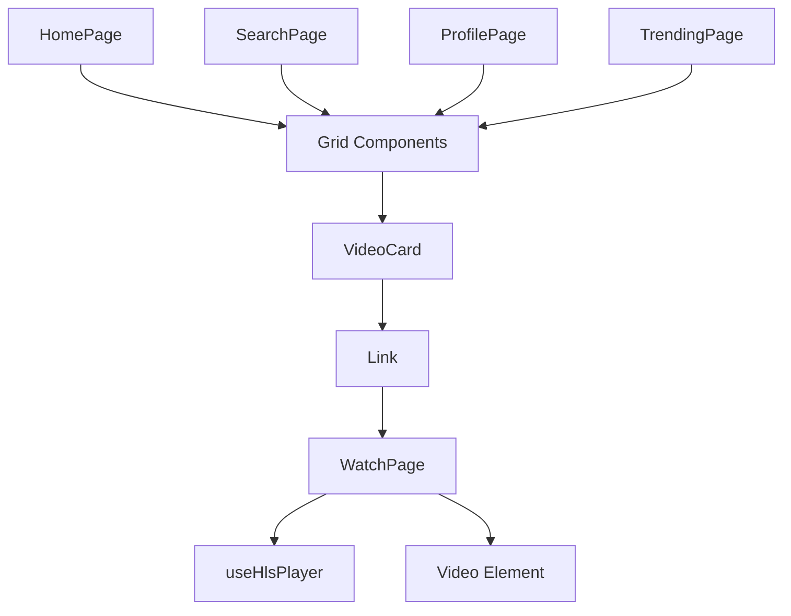
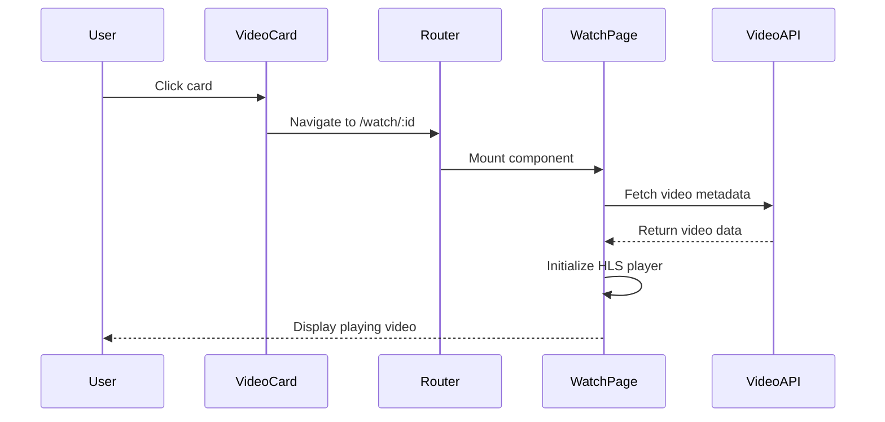
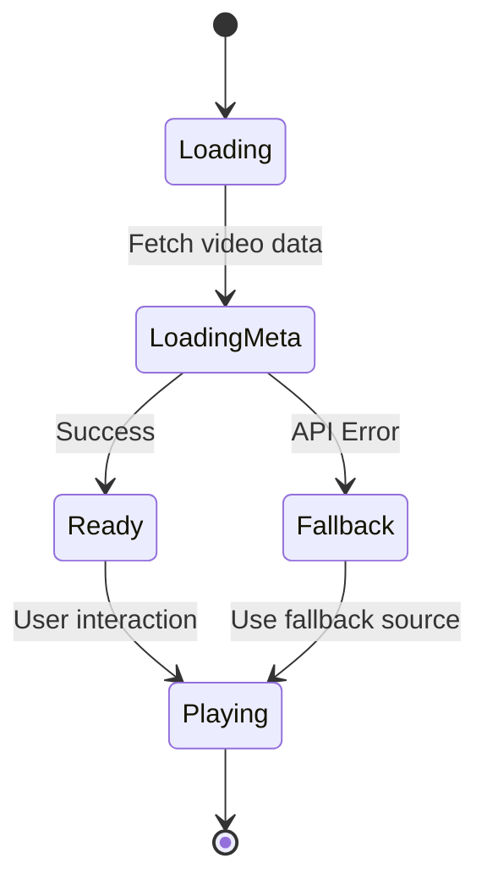
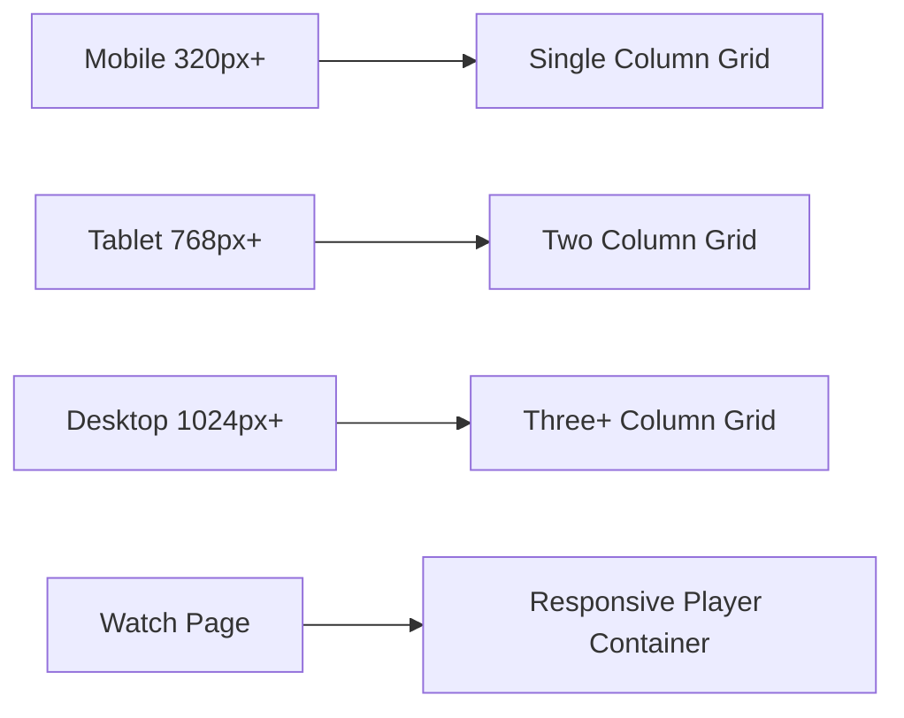

# Video Navigation System Design

## Overview

This design document outlines the implementation of a unified video navigation system for Reelverse that provides consistent navigation from video cards to playback across all content discovery surfaces. The system ensures every video card navigates to `/watch/:id` and plays immediately with proper HLS support and fallback mechanisms.

## Technology Stack & Dependencies

- **React Router**: Client-side routing for navigation
- **HLS.js**: HTTP Live Streaming support
- **TypeScript**: Type safety for video interfaces
- **Tailwind CSS**: Styling and responsive design
- **React 18**: Component framework with hooks

## Component Architecture

### Component Hierarchy



### Core Interface Definitions

```typescript
export interface VideoCardProps {
  id: string;
  title: string;
  posterUrl: string;
  durationSec?: number;
  authorName?: string;
  views?: number;
  className?: string;
}

export interface WatchPageState {
  from: string;
  scrollY: number;
}

export interface VideoMetadata {
  id: string;
  title: string;
  hlsUrl?: string;
  src?: string;
  author?: {
    name: string;
    avatarUrl?: string;
  };
}
```

### Component Definition

#### Route Utilities

Centralized route path generation with timecode support:

```typescript
// utils/routes.ts
export const watchPath = (id: string) => `/watch/${encodeURIComponent(id)}`;
export const livePath = (id: string) => `/live/${encodeURIComponent(id)}`;
export const timeParam = (sec?: number) => (sec && sec > 0 ? `?t=${Math.floor(sec)}` : '');
```

#### VideoCard Component

The reusable VideoCard component serves as the unified navigation entry point:

```typescript
// components/video/VideoCard.tsx
import { Link, useLocation } from 'react-router-dom';
import { watchPath } from '@/utils/routes';

export default function VideoCard(p: VideoCardProps) {
  const loc = useLocation();
  const to = watchPath(p.id);
  
  return (
    <Link
      to={to}
      state={{ from: loc.pathname + loc.search, scrollY: window.scrollY } as WatchPageState}
      className={`group block relative rounded-xl overflow-hidden bg-slate-900 focus:outline-none focus:ring-2 focus:ring-violet-500 ${p.className ?? ''}`}
      aria-label={`Watch ${p.title}`}
    >
      
      
      {/* Hover overlay - pointer-events: none prevents click blocking */}
      <div className="pointer-events-none absolute inset-0 bg-gradient-to-t from-black/40 via-black/10 to-transparent opacity-0 group-hover:opacity-100 transition" />
      
      {/* Play button - decorative only */}
      <div className="pointer-events-none absolute inset-0 grid place-items-center">
        <div className="h-14 w-14 rounded-full bg-black/50 text-white grid place-items-center">▶</div>
      </div>
      
      {/* Duration badge */}
      {p.durationSec != null && (
        <span className="pointer-events-none absolute bottom-2 right-2 rounded bg-black/70 text-white text-xs px-2 py-1">
          {formatDuration(p.durationSec)}
        </span>
      )}
      
      {/* Title overlay */}
      <div className="absolute left-2 bottom-2 right-2 pointer-events-none text-white drop-shadow">
        <div className="line-clamp-2 text-sm font-medium">{p.title}</div>
      </div>
    </Link>
  );
}

function formatDuration(s: number) {
  const m = Math.floor(s / 60);
  const ss = Math.floor(s % 60);
  return `${m}:${ss.toString().padStart(2, '0')}`;
}
```

**Key Features:**
- **Link Wrapper**: Entire card wrapped in React Router Link
- **Safe Overlays**: All decorative elements use `pointer-events: none`
- **State Preservation**: Passes scroll position and source route
- **Accessibility**: ARIA labels and keyboard navigation support

## Routing & Navigation

### Route Configuration



### Navigation State Management

The system preserves navigation context for smooth user experience:

- **Return Navigation**: Track source page for back navigation
- **Scroll Position**: Restore scroll position when returning
- **Route State**: Pass metadata through React Router state

## State Management

### Video Metadata Loading



### Player State Architecture

The HLS player hook manages video playback state:

- **Source Management**: Primary HLS URL with fallback support
- **Loading States**: Show appropriate loading indicators
- **Error Handling**: Graceful degradation to fallback content
- **Cleanup**: Proper resource management on component unmount

## API Integration Layer

### WatchPage Implementation

Complete WatchPage with HLS support and navigation state:

```typescript
// pages/WatchPage.tsx
import { useParams, useLocation, useNavigate } from 'react-router-dom';
import { useEffect, useRef, useState } from 'react';
import { useHlsPlayer } from '@/hooks/useHlsPlayer';

export default function WatchPage() {
  const { id = '' } = useParams();
  const location = useLocation() as any;
  const navigate = useNavigate();
  const [meta, setMeta] = useState<VideoMetadata | null>(null);
  const [src, setSrc] = useState<string>('');

  useEffect(() => {
    let alive = true;
    (async () => {
      try {
        const r = await fetch(`/api/videos/${encodeURIComponent(id)}`, { 
          credentials: 'include' 
        });
        if (!alive) return;
        
        if (r.ok) {
          const m = await r.json();
          setMeta(m);
          setSrc(m.hlsUrl || m.src || 'https://test-streams.mux.dev/x36xhzz/x36xhzz.m3u8');
        } else {
          setSrc('https://test-streams.mux.dev/x36xhzz/x36xhzz.m3u8');
        }
      } catch {
        if (alive) setSrc('https://test-streams.mux.dev/x36xhzz/x36xhzz.m3u8');
      }
    })();
    return () => { alive = false; };
  }, [id]);

  const videoRef = useRef<HTMLVideoElement>(null);
  useHlsPlayer(videoRef, src);

  // Back navigation with scroll restoration
  const onBack = () => {
    if (location.state?.from) {
      navigate(-1);
      setTimeout(() => window.scrollTo(0, location.state.scrollY ?? 0), 1);
    } else {
      navigate('/');
    }
  };

  return (
    <div className="mx-auto max-w-[1400px] px-4 md:px-6 py-4 grid grid-cols-1 lg:grid-cols-3 gap-6">
      <div className="lg:col-span-2">
        <button 
          onClick={onBack} 
          className="text-slate-400 hover:text-slate-200 text-sm mb-2"
        >
          ← Back
        </button>
        
        <div className="relative aspect-video bg-black rounded-xl overflow-hidden">
          <video 
            ref={videoRef} 
            controls 
            playsInline 
            muted 
            autoPlay 
            className="h-full w-full object-contain bg-black" 
          />
        </div>
        
        <h1 className="mt-3 text-xl font-semibold text-slate-100">
          {meta?.title ?? 'Video'}
        </h1>
      </div>
      
      <aside className="space-y-3">
        {/* Up next list will be implemented here */}
      </aside>
    </div>
  );
}
```

### HLS Integration Hook

The useHlsPlayer hook provides reliable video streaming:

```typescript
// hooks/useHlsPlayer.ts
import Hls from 'hls.js';
import { useEffect } from 'react';

export function useHlsPlayer(ref: React.RefObject<HTMLVideoElement>, src: string) {
  useEffect(() => {
    const video = ref.current;
    if (!video || !src) return;
    
    let hls: Hls | null = null;
    
    if (Hls.isSupported()) {
      hls = new Hls({ lowLatencyMode: false });
      hls.loadSource(src);
      hls.attachMedia(video);
    } else {
      // Native HLS support (Safari)
      video.src = src;
    }
    
    return () => {
      if (hls) hls.destroy();
    };
  }, [ref, src]);
}
```

**Features:**
- **Browser Compatibility**: Detects HLS.js support
- **Native Fallback**: Safari native HLS support
- **Error Recovery**: Automatic fallback to standard video element
- **Resource Cleanup**: Prevents memory leaks

## Styling Strategy

### Design System Integration

All components follow Reelverse's established design patterns:

- **Color Palette**: slate-950 backgrounds, violet-500 accents
- **Typography**: Consistent font sizes and weights
- **Spacing**: Tailwind's spacing scale
- **Animations**: Smooth transitions and hover effects

### Responsive Behavior



### Interactive States

- **Hover Effects**: Scale transforms and overlay reveals
- **Focus States**: Visible focus rings for keyboard navigation
- **Loading States**: Skeleton placeholders and spinners
- **Error States**: Graceful error messages with retry options

## Quality Assurance Checklist

### Core Functionality Tests

**Navigation Behavior:**
- ✅ Profile page "Recent videos" cards navigate to `/watch/:id` and start playback
- ✅ HomePage/TrendingPage/SearchPage grids use VideoCard consistently
- ✅ Playlist views navigate correctly to video content
- ✅ Shift+Click or middle-click opens new tab correctly
- ✅ Keyboard Enter on focused card navigates to WatchPage

**Click Handling:**
- ✅ Overlays don't block clicks (all use `pointer-events: none`)
- ✅ Interactive elements call `stopPropagation` properly
- ✅ No nested Link elements anywhere in the codebase
- ✅ Duration badges and menu buttons don't hijack navigation

**Video Playback:**
- ✅ WatchPage works with real HLS streams when available
- ✅ Falls back to test stream gracefully when API fails
- ✅ Video starts playing automatically on page load
- ✅ HLS.js initializes correctly in supported browsers

**Navigation State:**
- ✅ Back button returns to source page correctly
- ✅ Scroll position restores after back navigation
- ✅ Router state preservation works across page transitions

### Browser Compatibility

- ✅ Chrome/Edge: HLS.js support working
- ✅ Firefox: HLS.js support working
- ✅ Safari: Native HLS support working
- ✅ Mobile browsers: Touch navigation working

### Performance Validation

- ✅ VideoCard renders efficiently in large grids
- ✅ HLS initialization doesn't block UI
- ✅ Scroll restoration happens smoothly
- ✅ No memory leaks from video elements

### Optional Enhancements

**Timecode Deep Linking:**
```typescript
// Support ?t=60 in URLs for seeking
const urlParams = new URLSearchParams(location.search);
const startTime = parseInt(urlParams.get('t') || '0');
if (startTime > 0) {
  video.currentTime = startTime;
}
```

**Hover Prefetching:**
```typescript
// Prefetch HLS manifest on card hover
const handleHover = useCallback(() => {
  fetch(`/api/videos/${id}/manifest`, { method: 'HEAD' })
    .catch(() => {}); // Silent fail
}, [id]);
```

**Analytics Integration:**
```typescript
// Fire analytics events
const trackVideoOpen = (videoId: string, from: string) => {
  analytics.track('video_open', {
    video_id: videoId,
    source: from,
    timestamp: Date.now()
  });
};
```

## Performance Considerations

### Loading Optimization

- **Lazy Loading**: Video thumbnails loaded as needed
- **Code Splitting**: Route-based code splitting for WatchPage
- **Resource Prioritization**: Critical path optimization
- **Memory Management**: Proper cleanup of video resources

### Bundle Size Impact

The implementation adds minimal overhead:

- **HLS.js**: Conditionally loaded only when needed
- **Route Utils**: Lightweight helper functions
- **Component Size**: Reusable VideoCard minimizes duplication

### Caching Strategy

- **Thumbnail Caching**: Browser cache for poster images
- **Metadata Cache**: API response caching for video data
- **Player State**: Session storage for playback position

## Grid Component Migration

### Refactoring Existing Grids

All content discovery surfaces must be updated to use VideoCard:

#### Home/Trending/Search Pages
```typescript
// Replace existing tile markup with:
<div className="grid grid-cols-1 sm:grid-cols-2 lg:grid-cols-3 gap-4">
  {videos.map(video => (
    <VideoCard
      key={video.id}
      id={video.id}
      title={video.title}
      posterUrl={video.posterUrl}
      durationSec={video.durationSec}
      authorName={video.author?.name}
      views={video.counts?.views}
    />
  ))}
</div>
```

#### Channel/Profile Pages
```typescript
// For Recent videos, Videos tab, Playlists
function ChannelVideosTab({ videos }: { videos: any[] }) {
  return (
    <div className="grid grid-cols-1 sm:grid-cols-2 lg:grid-cols-3 gap-4">
      {videos.map(v => (
        <VideoCard 
          key={v.id} 
          id={v.id}
          title={v.title}
          posterUrl={v.posterUrl}
          durationSec={v.durationSec}
          authorName={v.author?.name}
          views={v.counts?.views}
        />
      ))}
    </div>
  );
}
```

### Handling Interactive Elements

For tiles with interactive icons (menu/save buttons):

```typescript
// Add event handlers that prevent navigation
<button 
  onClick={(e) => {
    e.preventDefault();
    e.stopPropagation();
    handleSaveVideo(videoId);
  }}
  className="absolute top-2 right-2 p-1 bg-black/50 rounded-full hover:bg-black/70"
>
  <Icon name="bookmark" size={16} />
</button>
```

## Common Click-Blocking Issues

### Pitfalls That Break Navigation

1. **Overlay without pointer-events: none**
   ```typescript
   // ❌ Wrong - blocks clicks
   <div className="absolute inset-0 bg-gradient-to-t from-black/40" />
   
   // ✅ Correct - allows clicks through
   <div className="pointer-events-none absolute inset-0 bg-gradient-to-t from-black/40" />
   ```

2. **Interactive elements without stopPropagation**
   ```typescript
   // ❌ Wrong - navigates instead of menu action
   <button onClick={handleMenu}>⋯</button>
   
   // ✅ Correct - prevents navigation
   <button onClick={(e) => { e.preventDefault(); e.stopPropagation(); handleMenu(); }}>⋯</button>
   ```

3. **Nested Links**
   ```typescript
   // ❌ Wrong - nested Links are invalid
   <Link to="/watch/123">
     <Link to="/profile/456">Author</Link>
   </Link>
   
   // ✅ Correct - single Link wrapper
   <Link to="/watch/123">
     <button onClick={(e) => { e.stopPropagation(); goToProfile(); }}>Author</button>
   </Link>
   ```

## Migration Strategy

### Incremental Rollout

1. **Phase 1**: Implement core components (VideoCard, routes, WatchPage)
2. **Phase 2**: Update HomePage grid
3. **Phase 3**: Update TrendingPage and SearchPage grids
4. **Phase 4**: Update Channel/Profile pages
5. **Phase 5**: Update Playlist views
6. **Phase 6**: Testing and optimization

### Route Configuration

```typescript
// Add to router configuration
import WatchPage from '@/pages/WatchPage';

<Route path="/watch/:id" element={<WatchPage />} />
```

### Compatibility Considerations

- **Router Support**: Compatible with both BrowserRouter and HashRouter
- **Existing Links**: Gradual migration from existing navigation patterns
- **Fallback Handling**: Graceful degradation for unsupported features
- **State Management**: Preserves scroll position and navigation context

## Security Considerations

### Input Validation

- **Route Parameters**: Proper encoding/decoding of video IDs
- **XSS Prevention**: Safe handling of video metadata
- **CORS Handling**: Proper video source validation

### Content Protection

- **Age Verification**: Integration with existing age gate system
- **Access Control**: Respect existing content access patterns
- **DRM Support**: Compatible with protected content workflows
