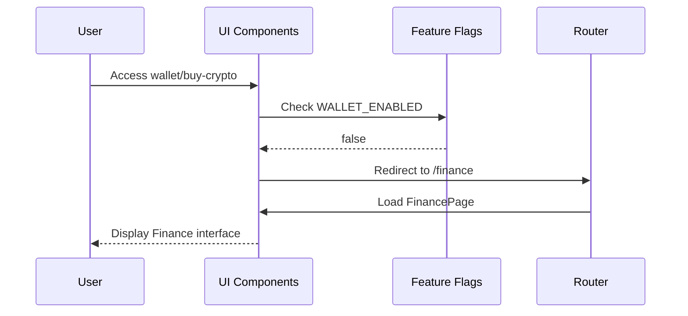
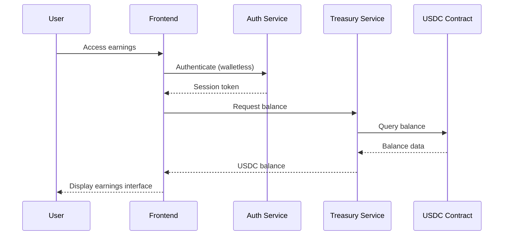
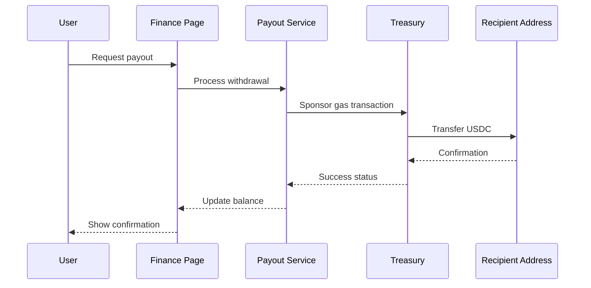
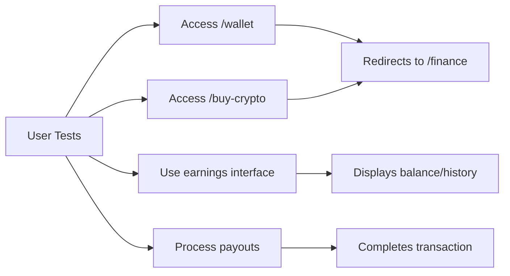

# Walletless Finance-Only System Design

## Overview

This design outlines the implementation of a walletless finance-only system for Reelverse by removing Buy Crypto functionality entirely and hiding/disabling Wallet features while keeping Finance (Earnings & Payouts) as the sole monetary interface. The system emphasizes USDC-only transactions with treasury-sponsored gas fees, providing a seamless user experience without traditional wallet management.

## System Architecture

### Current State Analysis

The current system contains:
- **Wallet integration**: Full wallet connect functionality via WalletContext
- **Buy Crypto page**: Complete onramp integration interface
- **Web3 Routes**: Separate wallet, earnings, and buy-crypto routes
- **Header actions**: Wallet connect buttons and related UI
- **Sidebar navigation**: Web3 group with wallet, earnings, and buy crypto options

### Target Architecture

```mermaid
graph TB
    subgraph "User Interface Layer"
        A[Header Actions] --> B[Upload Button]
        A --> C[Earnings Pill]
        A --> D[Sign In/Profile]
        E[Sidebar] --> F[Finance Group]
        F --> G[Earnings & Payouts Only]
    end
    
    subgraph "Routing Layer"
        H[Route Handler] --> I[/finance → FinancePage]
        H --> J[/wallet → Redirect to /finance]
        H --> K[/buy-crypto → Redirect to /finance]
    end
    
    subgraph "Business Logic"
        L[Walletless Auth] --> M[USDC Transactions]
        L --> N[Treasury Gas Sponsoring]
        O[Earnings Service] --> P[Balance Management]
        O --> Q[Payout Processing]
    end
    
    subgraph "Feature Flags"
        R[WALLET_ENABLED: false]
        S[BUY_CRYPTO_ENABLED: false]
        T[EARNINGS_ENABLED: true]
        U[PAYOUTS_ENABLED: true]
    end
```

## Implementation Strategy

### Feature Flag Configuration

The system will be controlled centrally through enhanced feature flags:

```typescript
// config/featureFlags.ts
export const FEATURES = {
  WALLET_ENABLED: false,      // hide and disable
  BUY_CRYPTO_ENABLED: false, // delete
  EARNINGS_ENABLED: true,
  PAYOUTS_ENABLED: true,
} as const;
```



### Navigation Structure Changes

**Current Web3 Group:**
- Wallet
- Earnings & Payouts  
- Buy Crypto

**New Finance Group:**
- Earnings & Payouts (only)

```typescript
// config/sidebar.ts
import { FEATURES } from '@/config/featureFlags'

export const sidebar = [
  // ... other groups
  {
    label: 'FINANCE',
    items: [
      FEATURES.EARNINGS_ENABLED && { 
        id: 'finance', 
        label: 'Earnings & Payouts', 
        icon: 'CreditCard', 
        route: '/finance' 
      },
      // Hidden via feature flags:
      FEATURES.WALLET_ENABLED && { 
        id: 'wallet', 
        label: 'Wallet', 
        icon: 'Wallet', 
        route: '/wallet' 
      },
      FEATURES.BUY_CRYPTO_ENABLED && { 
        id: 'buycrypto', 
        label: 'Buy Crypto', 
        icon: 'Banknote', 
        route: '/buy-crypto' 
      },
    ].filter(Boolean),
  },
  // ... other groups
];
```

### Route Management

| Current Route | Action | New Behavior |
|---------------|--------|--------------|
| `/wallet` | Hide/Disable | Redirect to `/finance` |
| `/buy-crypto` | Delete | Redirect to `/finance` |
| `/earnings` | Keep | Rename to `/finance` |
| `/finance` | New | Primary earnings interface |

```typescript
// App.tsx Router Configuration
import FinancePage from '@/pages/FinancePage'
import Redirect from '@/pages/Redirect'

// Route definitions:
<Route path="/finance" element={<FinancePage />} />
<Route path="/wallet" element={<Redirect to="/finance" />} />
<Route path="/buy-crypto" element={<Redirect to="/finance" />} />
```

```typescript
// pages/Redirect.tsx
import { useEffect } from 'react'
import { useLocation, useNavigate } from 'react-router-dom'

export default function Redirect({ to }: { to: string }) {
  const nav = useNavigate()
  const loc = useLocation()
  
  useEffect(() => {
    // Handles hash routes like /#/wallet too
    const hash = window.location.hash.replace(/^#/, '')
    const path = loc.pathname && loc.pathname !== '/' ? loc.pathname : hash
    if (path) nav(to, { replace: true })
  }, [nav, loc])
  
  return null
}
```

## Component Modifications

### Header Actions Component

**Current State:**
- Upload button
- Go Live button (conditional)
- Earnings pill (optional)
- Wallet connect functionality
- Sign in/Profile

**Target State:**
- Upload button (primary CTA)
- Earnings pill (optional)
- Sign in/Profile only
- All wallet connect functionality removed

```typescript
// components/earnings/BalancePill.tsx
export function BalancePill({ 
  amount = 128.59, 
  currency = 'USDC' 
}: { 
  amount?: number; 
  currency?: string 
}) {
  return (
    <span className="inline-flex items-center gap-2 rounded-full bg-emerald-800/30 text-emerald-300 border border-emerald-700 px-3 py-1 text-sm">
      <span>$</span> {amount.toFixed(2)} <span className="text-emerald-400">{currency}</span>
    </span>
  )
}
```

```typescript
// components/header/HeaderActions.tsx
import { Link } from 'react-router-dom'
import { useAuth } from '@/contexts/AuthContext'
import { BalancePill } from '@/components/earnings/BalancePill'

export function HeaderActions() {
  const { user } = useAuth()
  
  return (
    <div className="flex items-center gap-3 ml-auto">
      <Link 
        to="/upload" 
        className="inline-flex items-center gap-2 rounded-md bg-violet-600 px-3 py-2 text-sm font-medium text-white hover:bg-violet-500"
      >
        <span className="text-base">+</span> Upload
      </Link>
      
      <BalancePill />
      
      {!user ? (
        <Link 
          to="/signin" 
          className="rounded-md bg-blue-600 px-3 py-2 text-sm font-medium text-white hover:bg-blue-500"
        >
          Sign in to Reelverse
        </Link>
      ) : (
        <Link 
          to="/finance" 
          className="rounded-md bg-slate-800 px-3 py-2 text-sm text-slate-100"
        >
          Finance
        </Link>
      )}
    </div>
  )
}
```

### Finance Page Implementation

The Finance page serves as the unified hub for all monetary operations, replacing separate wallet and buy crypto interfaces:

```typescript
// pages/FinancePage.tsx
import { useState } from 'react'
import EarningsTab from './finance/EarningsTab'
import PayoutsTab from './finance/PayoutsTab'
import { useAuth } from '@/contexts/AuthContext'

export default function FinancePage() {
  const [tab, setTab] = useState<'earnings'|'payouts'>('earnings')
  const { user } = useAuth()
  
  if (!user) {
    return (
      <div className="mx-auto max-w-[1000px] px-4 md:px-6 py-10 text-center">
        <h1 className="text-2xl font-bold text-slate-100 mb-3">Earnings & Payouts</h1>
        <p className="text-slate-400 mb-6">Sign in to view your earnings. No wallet required.</p>
        <a href="/signin" className="inline-flex items-center rounded-md bg-blue-600 px-4 py-2 text-white hover:bg-blue-500">
          Sign in to Reelverse
        </a>
      </div>
    )
  }
  
  return (
    <div className="mx-auto max-w-[1200px] px-4 md:px-6 py-6">
      <h1 className="text-2xl font-bold text-slate-100 mb-4">Earnings & Payouts</h1>
      
      <div className="inline-flex rounded-lg border border-slate-800 bg-slate-900/60 p-1 mb-6">
        <button 
          onClick={() => setTab('earnings')} 
          className={`px-4 py-2 rounded-md text-sm ${
            tab === 'earnings' 
              ? 'bg-slate-800 text-white' 
              : 'text-slate-300 hover:text-white'
          }`}
        >
          Earnings
        </button>
        <button 
          onClick={() => setTab('payouts')} 
          className={`px-4 py-2 rounded-md text-sm ${
            tab === 'payouts' 
              ? 'bg-slate-800 text-white' 
              : 'text-slate-300 hover:text-white'
          }`}
        >
          Payouts
        </button>
      </div>
      
      {tab === 'earnings' ? <EarningsTab /> : <PayoutsTab />}
    </div>
  )
}
```

### Earnings and Payouts Tab Implementation

```typescript
// pages/finance/EarningsTab.tsx
import useSWR from 'swr'

const fetcher = (url: string) => 
  fetch(url, { credentials: 'include' }).then(r => r.json())

export default function EarningsTab() {
  const { data } = useSWR('/api/earnings/today', fetcher, { 
    refreshInterval: 120000 
  })
  
  const formatAmount = (amount: any) => Number(amount ?? 0).toFixed(2)
  
  return (
    <div className="space-y-6">
      <div className="grid grid-cols-1 sm:grid-cols-3 gap-4">
        <Metric label="Today" value={`$${formatAmount(data?.todayUSDC)} USDC`} />
        <Metric label="Pending" value={`$${formatAmount(data?.pendingUSDC)} USDC`} />
        <Metric label="Lifetime" value={`$${formatAmount(data?.lifetimeUSDC)} USDC`} />
      </div>
      
      <div className="rounded-xl border border-slate-800 bg-slate-900/40 p-4">
        <h3 className="text-slate-100 font-semibold mb-3">Recent earnings</h3>
        <p className="text-slate-400 text-sm">
          Walletless by default — we settle USDC to your payout method. 
          We cover gas from the Reelverse Treasury.
        </p>
      </div>
    </div>
  )
}

function Metric({ label, value }: { label: string; value: string }) {
  return (
    <div className="rounded-xl border border-slate-800 bg-slate-900/40 p-4">
      <div className="text-slate-400 text-sm">{label}</div>
      <div className="text-xl font-semibold text-slate-100">{value}</div>
    </div>
  )
}
```

```typescript
// pages/finance/PayoutsTab.tsx
export default function PayoutsTab() {
  return (
    <div className="space-y-6">
      <div className="rounded-xl border border-slate-800 bg-slate-900/40 p-4">
        <h3 className="text-slate-100 font-semibold mb-2">Payout methods</h3>
        
        <ul className="space-y-3">
          <li className="flex items-center justify-between rounded-lg border border-slate-800 bg-slate-900/60 p-3">
            <div>
              <div className="text-slate-200 font-medium">USDC address (optional)</div>
              <div className="text-slate-400 text-sm">
                Add an address if you want on‑chain payouts later. Not required to earn.
              </div>
            </div>
            <button className="rounded-md bg-slate-800 px-3 py-2 text-sm text-slate-100 hover:bg-slate-700">
              Add address
            </button>
          </li>
          
          <li className="flex items-center justify-between rounded-lg border border-slate-800 bg-slate-900/60 p-3">
            <div>
              <div className="text-slate-200 font-medium">Bank transfer</div>
              <div className="text-slate-400 text-sm">
                Cash out via off‑ramp partner (coming soon).
              </div>
            </div>
            <button 
              disabled 
              className="rounded-md bg-slate-800/50 px-3 py-2 text-sm text-slate-400 cursor-not-allowed"
            >
              Soon
            </button>
          </li>
        </ul>
      </div>
    </div>
  )
}
```

## Data Flow Architecture

### Walletless Authentication Flow



### Payout Processing Flow



## User Experience Design

### Finance Page Interface

**Layout Structure:**
- **Balance Cards**: Total earnings, USDC balance, pending payouts
- **Transaction History**: Recent earnings and withdrawals
- **Payout Management**: USDC address configuration
- **Earnings Analytics**: Revenue breakdown and trends

**User Copy Updates:**
- "Walletless by default — we settle in USDC"
- "We cover gas from the Reelverse Treasury"
- "Connect a wallet later only if you want on-chain payouts"
- "Add USDC address (optional)" for payout methods

### Redirect Experience

When users access legacy routes:
- Seamless redirect to `/finance` without error messages
- Preserved user intent through contextual interface
- No breaking changes to bookmarks or external links

## Security Considerations

### Walletless Security Model

**Authentication:**
- Privy-based walletless authentication
- Session key management for temporary access
- Device fingerprinting for security

**Transaction Security:**
- Treasury-sponsored gas payments
- USDC-only transaction validation
- Idempotency controls for payout processing

**Access Control:**
- Role-based earnings access
- Creator verification for payout eligibility
- Audit trails for all financial operations

## Testing Strategy

### Feature Flag Testing

**Unit Tests:**
- Feature flag evaluation logic
- Component conditional rendering
- Route redirect functionality

**Integration Tests:**
- End-to-end navigation flows
- Finance page functionality
- Payout processing workflows

**User Acceptance Tests:**
- Creator earnings workflow
- Payout method configuration
- Legacy route redirect behavior

### Test Scenarios



## Migration Strategy

### Phase 1: Feature Flag Implementation
- Deploy enhanced feature flags with wallet/buy-crypto controls
- Test feature toggle functionality across all components
- Validate no breaking changes to existing flows

### Phase 2: Route Redirects & Finance Page
- Implement Redirect component for hash and browser routes
- Create FinancePage with earnings/payouts tabs
- Update routing configuration for /finance, /wallet, /buy-crypto
- Test legacy URL handling (both hash and normal routes)

### Phase 3: UI Updates
- Update HeaderActions with BalancePill and sign-in flow
- Modify sidebar to show FINANCE group only
- Remove wallet connect gates throughout application
- Replace wallet prompts with sign-in CTAs

### Phase 4: Cleanup & Optimization
- Remove unused wallet dependencies (wagmi, viem, @rainbow-me/rainbowkit, ethers, onramp-sdk)
- Clean up import statements and unused components
- Archive BuyCryptoPage component
- Wire BalancePill to live API with SWR

### Quality Assurance Checklist

- [ ] Sidebar shows only FINANCE → Earnings & Payouts
- [ ] /wallet and /buy-crypto redirect to /finance (works with hash routes)
- [ ] Earnings render for signed-in users without wallet prompts
- [ ] Logged-out users see "Sign in" CTA instead of wallet connect
- [ ] Header shows Upload, Balance pill, and Sign in/Profile only
- [ ] No "Buy Crypto" strings remaining in codebase
- [ ] No "Connect Wallet" prompts anywhere
- [ ] Finance page displays walletless messaging

## Monitoring and Analytics

### Key Metrics

**Usage Metrics:**
- Finance page engagement rates
- Payout completion rates
- Redirect success rates from legacy routes

**Performance Metrics:**
- Page load times for finance interface
- Transaction processing speed
- Error rates for payout operations

**User Experience Metrics:**
- User retention after wallet removal
- Support ticket volume related to finance
- Creator satisfaction with simplified interface

### Error Handling

**Redirect Monitoring:**
- Track 404 errors from legacy routes
- Monitor redirect performance
- Alert on redirect failures

**Transaction Monitoring:**
- Track payout success/failure rates
- Monitor treasury gas sponsoring
- Alert on USDC balance thresholds

## Future Enhancements

### Immediate Next Steps

**Live Balance Updates:**
- Wire BalancePill to `/api/earnings/today` with SWR
- Implement 2-minute refresh intervals
- Add WebSocket push notifications for real-time updates

**Payout Optimization:**
- Add minimum payout threshold configuration
- Implement daily batch processing to reduce fees
- Display next payout schedule to users

**Verification Integration:**
- Gate Payouts by KYC verification when required
- Keep Earnings accessible without verification
- Implement progressive disclosure for compliance requirements

### Optional Wallet Integration

The system maintains flexibility for future wallet integration:
- Feature flags can re-enable wallet functionality
- Wallet infrastructure remains but hidden
- Gradual re-introduction capability for advanced users

### Scalability Planning

**Treasury Management:**
- Automated gas refill mechanisms
- Multi-signature treasury controls
- Treasury balance monitoring and alerts

**USDC Integration:**
- Cross-chain USDC support planning
- Alternative stablecoin integration
- Fiat on/off-ramp considerations

**API Enhancements:**
```typescript
// Future API endpoints
GET /api/earnings/today          // Current day earnings
GET /api/earnings/history        // Historical earnings data
POST /api/payouts/request        // Request payout
GET /api/payouts/methods         // Available payout methods
POST /api/payouts/methods        // Add new payout method
```

This implementation ensures a seamless transition to a walletless finance-only system while maintaining the flexibility to enhance and expand functionality based on user needs and platform evolution.