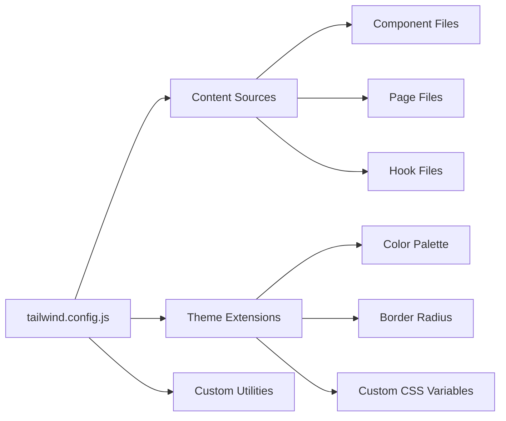
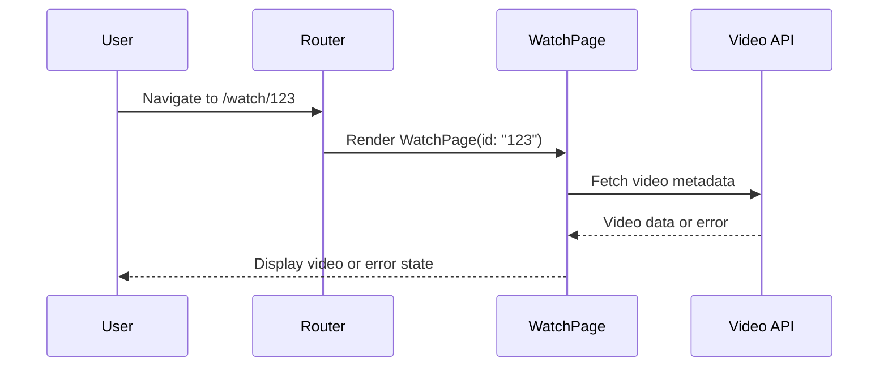

# WatchPage Component Fix Design

## Overview

This design addresses critical runtime errors in the Reelverse application:
1. **Missing WatchPage Import**: `WatchPage is not defined` error in App.tsx
2. **Tailwind CSS Production Warning**: CDN usage causing development-only warning

## Architecture

### Component Import Analysis

```mermaid
graph TD
    A[App.tsx] --> B[Route Configuration]
    B --> C[/watch/:id Route]
    C --> D[WatchPage Component]
    D -.-> E[Missing Import Error]
    
    F[pages/WatchPage.tsx] --> G[Component Exists]
    G -.-> H[Not Imported in App.tsx]
```

### Current State vs Target State

| Component | Current Status | Target Status |
|-----------|---------------|---------------|
| WatchPage | Exists but not imported | Properly imported and accessible |
| Tailwind CSS | CDN-based (development) | PostCSS plugin (production-ready) |
| Route /watch/:id | Configured but broken | Fully functional |

## Component Architecture

### WatchPage Import Fix

The WatchPage component exists in `/pages/WatchPage.tsx` but is missing from the import statements in `App.tsx`.

**Current Import Structure**:
```typescript
// App.tsx imports
import HomePage from './pages/HomePage';
import CreatePage from './pages/CreatePage';
// ... other page imports
// ❌ WatchPage import is missing
```

**Required Import Addition**:
```typescript
import WatchPage from './pages/WatchPage';
```

### Route Configuration Consistency

The application has inconsistent route parameter naming:

**Issue Identified**:
- Age-gated routes use: `/watch/:id`
- Non-age-gated routes use: `/watch/:contentId`

**Solution**: Standardize to `/watch/:id` for consistency with WatchPage implementation.

## Styling Strategy

### Tailwind CSS Production Configuration

**Current Setup (Development)**:
- CDN-based Tailwind CSS via `<script src="https://cdn.tailwindcss.com"></script>`
- Inline configuration in index.html
- Not suitable for production environments

**Target Setup (Production-Ready)**:
- PostCSS plugin integration
- Dedicated tailwind.config.js file
- Optimized CSS output with unused style purging

### Tailwind Configuration Structure



## Testing Strategy

### Component Loading Verification

**Test Cases**:
1. Navigate to `/watch/:id` route
2. Verify WatchPage component renders
3. Confirm no "component not defined" errors
4. Test route parameter extraction

**Integration Points**:
- React Router navigation
- Component state management
- Video playback functionality
- Error boundary handling

### CSS Framework Validation

**PostCSS Integration Tests**:
1. Build process includes Tailwind compilation
2. Unused styles are purged correctly
3. Custom theme variables are preserved
4. Production bundle size optimization

## Business Logic Layer

### Route Parameter Handling

The WatchPage component expects an `id` parameter via `useParams<{ id: string }>()`:

```typescript
// WatchPage.tsx implementation
const { id = '' } = useParams<{ id: string }>();
```

**Routing Architecture**:
- Standard route: `/watch/:id` → extracts `id` parameter
- Consistent with component implementation
- Supports video metadata fetching

### Error Handling Flow



## Configuration Files

### PostCSS Configuration
```javascript
// postcss.config.js
module.exports = {
  plugins: {
    tailwindcss: {},
    autoprefixer: {},
  },
}
```

### Tailwind Configuration
```javascript
// tailwind.config.js
module.exports = {
  content: [
    "./index.html",
    "./src/**/*.{js,ts,jsx,tsx}",
    "./pages/**/*.{js,ts,jsx,tsx}",
    "./components/**/*.{js,ts,jsx,tsx}",
  ],
  theme: {
    extend: {
      colors: {
        // Custom color palette from index.html
        background: 'hsl(var(--background))',
        foreground: 'hsl(var(--foreground))',
        // ... other custom colors
      },
    },
  },
  plugins: [],
}
```

## Implementation Steps

### Phase 1: Component Import Fix
1. Add WatchPage import statement to App.tsx
2. Standardize route parameter naming
3. Test navigation functionality

### Phase 2: Tailwind CSS Production Setup
1. Install Tailwind CSS as PostCSS plugin
2. Create tailwind.config.js with existing theme
3. Remove CDN script from index.html
4. Update build process configuration

### Phase 3: Verification
1. Run application in development mode
2. Test /watch/:id route functionality
3. Verify no console errors or warnings
4. Validate production build process

## Migration Strategy

### Backward Compatibility
- Existing routes continue to function
- Component behavior remains unchanged
- CSS styling preserved during transition

### Development Workflow
- Gradual migration from CDN to PostCSS
- Maintain design system consistency
- Preserve custom CSS variables and utilities