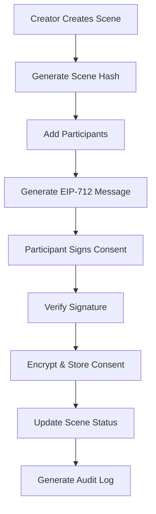

# Scene Consent Management System

## Overview

The Scene Consent Management System provides comprehensive consent tracking for adult content creation, ensuring legal compliance and participant protection. The system uses EIP-712 signatures for cryptographic consent verification and maintains encrypted audit trails for legal evidence.

## Architecture

### Core Components

1. **ConsentService** - Core business logic for consent management
2. **Consent API Routes** - RESTful endpoints for consent operations
3. **Database Schema** - PostgreSQL tables for consent tracking
4. **EIP-712 Signatures** - Cryptographic consent verification
5. **Audit Trail** - Comprehensive logging for legal compliance

### Data Flow



## API Endpoints

### Scene Management

#### Create Scene
```http
POST /api/v1/consent/scene
Authorization: Bearer <jwt-token>
Content-Type: application/json

{
  "title": "Scene Title",
  "description": "Scene description",
  "participants": [
    {
      "wallet": "0x1234...",
      "role": "performer"
    },
    {
      "wallet": "0x5678...",
      "role": "director"
    }
  ],
  "createdAt": 1640995200000
}
```

**Response:**
```json
{
  "sceneHash": "0xabcd1234...",
  "participants": [
    {
      "wallet": "0x1234...",
      "role": "performer",
      "consented": false
    }
  ]
}
```

#### Generate Scene Hash (Legacy)
```http
POST /api/v1/consent/scene-hash
Authorization: Bearer <jwt-token>
Content-Type: application/json

{
  "title": "Scene Title",
  "description": "Scene description",
  "participants": [...],
  "createdAt": 1640995200000
}
```

### Consent Process

#### Generate Consent Message
```http
POST /api/v1/consent/message
Authorization: Bearer <jwt-token>
Content-Type: application/json

{
  "sceneHash": "0xabcd1234...",
  "role": "performer",
  "documentHashes": ["0x1234..."]
}
```

**Response:**
```json
{
  "message": {
    "domain": {
      "name": "Reelverse18 Consent",
      "version": "1",
      "chainId": 137,
      "verifyingContract": "0x0000000000000000000000000000000000000000"
    },
    "types": {
      "SceneConsent": [
        {"name": "sceneHash", "type": "bytes32"},
        {"name": "participant", "type": "address"},
        {"name": "role", "type": "string"},
        {"name": "consentDate", "type": "uint256"},
        {"name": "termsVersion", "type": "string"},
        {"name": "documentHashes", "type": "bytes32[]"}
      ]
    },
    "primaryType": "SceneConsent",
    "message": {
      "sceneHash": "0xabcd1234...",
      "participant": "0x1234...",
      "role": "performer",
      "consentDate": 1640995200,
      "termsVersion": "1.0",
      "documentHashes": ["0x1234..."]
    }
  },
  "consentData": {
    "sceneHash": "0xabcd1234...",
    "participant": "0x1234...",
    "role": "performer",
    "consentDate": 1640995200,
    "termsVersion": "1.0",
    "documentHashes": ["0x1234..."]
  }
}
```

#### Submit Signed Consent
```http
POST /api/v1/consent/submit
Authorization: Bearer <jwt-token>
Content-Type: application/json

{
  "consentData": {
    "sceneHash": "0xabcd1234...",
    "participant": "0x1234...",
    "role": "performer",
    "consentDate": 1640995200,
    "termsVersion": "1.0",
    "documentHashes": ["0x1234..."]
  },
  "signature": "0x1234567890abcdef..."
}
```

**Response:**
```json
{
  "success": true,
  "consentId": "0xabcd1234...:0x1234...",
  "timestamp": 1640995200000
}
```

### Status and Reporting

#### Check Consent Status
```http
GET /api/v1/consent/status/0xabcd1234...?participants=[{"wallet":"0x1234...","role":"performer","consented":false}]
Authorization: Bearer <jwt-token>
```

**Response:**
```json
{
  "sceneHash": "0xabcd1234...",
  "complete": false,
  "totalRequired": 2,
  "totalConsented": 1,
  "missing": ["0x5678..."],
  "completionRate": 0.5
}
```

#### Generate Consent Report
```http
GET /api/v1/consent/report/0xabcd1234...
Authorization: Bearer <jwt-token>
```

**Response:**
```json
{
  "sceneHash": "0xabcd1234...",
  "totalParticipants": 2,
  "consentedParticipants": 2,
  "completionRate": 1.0,
  "consents": [
    {
      "participant": "0x1234...",
      "role": "performer",
      "consentDate": 1640995200,
      "verified": true
    }
  ]
}
```

#### Revoke Consent
```http
POST /api/v1/consent/revoke
Authorization: Bearer <jwt-token>
Content-Type: application/json

{
  "sceneHash": "0xabcd1234...",
  "reason": "Consent withdrawn by participant"
}
```

**Response:**
```json
{
  "success": true,
  "message": "Consent revoked successfully",
  "sceneHash": "0xabcd1234...",
  "participant": "0x1234...",
  "timestamp": 1640995200000
}
```

## Database Schema

### Tables

#### scenes
- `scene_hash` (VARCHAR(66), PRIMARY KEY) - Unique scene identifier
- `content_title` (VARCHAR(500)) - Scene title
- `content_description` (TEXT) - Scene description
- `creator_wallet` (VARCHAR(42)) - Creator's wallet address
- `total_participants` (INTEGER) - Total number of participants
- `consented_participants` (INTEGER) - Number who have consented
- `consent_complete` (BOOLEAN) - Whether all consents are collected
- `terms_version` (VARCHAR(20)) - Terms of service version
- `created_at` (TIMESTAMP) - Creation timestamp
- `updated_at` (TIMESTAMP) - Last update timestamp

#### scene_participants
- `id` (UUID, PRIMARY KEY) - Unique participant record ID
- `scene_hash` (VARCHAR(66)) - Reference to scene
- `participant_wallet` (VARCHAR(42)) - Participant's wallet address
- `participant_role` (VARCHAR(20)) - Role (performer, director, producer)
- `consent_required` (BOOLEAN) - Whether consent is required
- `consent_provided` (BOOLEAN) - Whether consent has been provided
- `consent_timestamp` (TIMESTAMP) - When consent was provided
- `created_at` (TIMESTAMP) - Record creation timestamp

#### consent_signatures
- `id` (UUID, PRIMARY KEY) - Unique signature record ID
- `scene_hash` (VARCHAR(66)) - Reference to scene
- `participant_wallet` (VARCHAR(42)) - Participant's wallet address
- `signature_data` (TEXT) - EIP-712 signature
- `encrypted_consent_data` (TEXT) - Encrypted consent data
- `consent_date` (TIMESTAMP) - Date of consent
- `terms_version` (VARCHAR(20)) - Terms version at time of consent
- `document_hashes` (TEXT[]) - Array of document hashes
- `verification_status` (VARCHAR(20)) - Status (verified, revoked, disputed)
- `created_at` (TIMESTAMP) - Record creation timestamp
- `revoked_at` (TIMESTAMP) - Revocation timestamp
- `revocation_reason` (TEXT) - Reason for revocation

#### consent_audit_log
- `id` (UUID, PRIMARY KEY) - Unique log entry ID
- `scene_hash` (VARCHAR(66)) - Reference to scene
- `participant_wallet` (VARCHAR(42)) - Participant involved
- `action` (VARCHAR(50)) - Action performed
- `actor_wallet` (VARCHAR(42)) - Who performed the action
- `details` (JSONB) - Additional action details
- `ip_address` (INET) - IP address of actor
- `user_agent` (TEXT) - User agent string
- `timestamp` (TIMESTAMP) - Action timestamp

### Views

#### scene_consent_status
Provides easy access to scene consent completion status:
```sql
SELECT 
    s.scene_hash,
    s.content_title,
    s.creator_wallet,
    s.total_participants,
    s.consented_participants,
    s.consent_complete,
    ROUND((s.consented_participants::DECIMAL / s.total_participants) * 100, 2) as completion_percentage
FROM scenes s;
```

#### participant_consent_details
Provides detailed participant consent information:
```sql
SELECT 
    sp.scene_hash,
    sp.participant_wallet,
    sp.participant_role,
    sp.consent_required,
    sp.consent_provided,
    cs.consent_date,
    cs.verification_status
FROM scene_participants sp
LEFT JOIN consent_signatures cs ON sp.scene_hash = cs.scene_hash 
    AND sp.participant_wallet = cs.participant_wallet;
```

## Security Features

### EIP-712 Signature Verification
- Uses typed data signing for cryptographic consent verification
- Prevents signature replay attacks through unique scene hashes
- Ensures participant identity through wallet signature verification

### Data Encryption
- Consent data is encrypted using AES-256-CBC before storage
- Encryption keys are managed securely (environment variables in production)
- Only encrypted data is stored in the database

### Access Control
- All endpoints require JWT authentication
- Participants can only provide consent for themselves
- Creators can view status for their scenes
- Audit trail tracks all actions with actor identification

### Audit Trail
- Comprehensive logging of all consent-related actions
- Immutable audit records for legal compliance
- IP address and user agent tracking
- Automatic triggers maintain data consistency

## Error Handling

### Error Codes

| Code | Description |
|------|-------------|
| CONSENT_001 | Missing required fields |
| CONSENT_002 | Failed to create scene |
| CONSENT_003 | Missing required fields for message |
| CONSENT_004 | Failed to create consent message |
| CONSENT_005 | Missing consent data or signature |
| CONSENT_006 | Participant wallet mismatch |
| CONSENT_007 | Invalid consent signature |
| CONSENT_008 | Failed to store consent |
| CONSENT_009 | Missing participants parameter |
| CONSENT_010 | Failed to check consent status |
| CONSENT_011 | Failed to generate consent report |
| CONSENT_012 | Missing scene hash for revocation |
| CONSENT_013 | Failed to revoke consent |

### Error Response Format
```json
{
  "code": "CONSENT_001",
  "message": "Missing required fields: title, description, participants",
  "timestamp": 1640995200000
}
```

## Testing

### Unit Tests
- ConsentService methods (signature verification, encryption, etc.)
- Scene hash generation consistency
- EIP-712 message creation
- Error handling scenarios

### Integration Tests
- Complete consent workflow (create scene → sign → submit → verify)
- Multi-participant consent coordination
- Consent revocation process
- Status checking and reporting
- Authentication and authorization

### Test Coverage
- All API endpoints
- Database operations
- Cryptographic functions
- Error conditions
- Edge cases (empty participants, long descriptions, special characters)

## Usage Examples

### Frontend Integration

#### Creating a Scene
```typescript
// Create scene with participants
const sceneResponse = await fetch('/api/v1/consent/scene', {
  method: 'POST',
  headers: {
    'Authorization': `Bearer ${authToken}`,
    'Content-Type': 'application/json'
  },
  body: JSON.stringify({
    title: 'My Scene',
    description: 'Scene description',
    participants: [
      { wallet: '0x1234...', role: 'performer' },
      { wallet: '0x5678...', role: 'director' }
    ]
  })
});

const { sceneHash } = await sceneResponse.json();
```

#### Participant Consent Flow
```typescript
// 1. Get consent message
const messageResponse = await fetch('/api/v1/consent/message', {
  method: 'POST',
  headers: {
    'Authorization': `Bearer ${participantToken}`,
    'Content-Type': 'application/json'
  },
  body: JSON.stringify({
    sceneHash,
    role: 'performer'
  })
});

const { message, consentData } = await messageResponse.json();

// 2. Sign with wallet
const signature = await wallet.signTypedData(
  message.domain,
  message.types,
  message.message
);

// 3. Submit signed consent
const submitResponse = await fetch('/api/v1/consent/submit', {
  method: 'POST',
  headers: {
    'Authorization': `Bearer ${participantToken}`,
    'Content-Type': 'application/json'
  },
  body: JSON.stringify({
    consentData,
    signature
  })
});
```

#### Checking Status
```typescript
const participants = [
  { wallet: '0x1234...', role: 'performer', consented: false },
  { wallet: '0x5678...', role: 'director', consented: false }
];

const statusResponse = await fetch(
  `/api/v1/consent/status/${sceneHash}?participants=${encodeURIComponent(JSON.stringify(participants))}`,
  {
    headers: {
      'Authorization': `Bearer ${authToken}`
    }
  }
);

const status = await statusResponse.json();
console.log(`Consent completion: ${status.completionRate * 100}%`);
```

## Compliance Features

### Legal Evidence Package
The system can generate comprehensive evidence packages for legal compliance:

1. **Scene Information** - Title, description, participants, creation date
2. **Consent Records** - All signed consents with cryptographic verification
3. **Audit Trail** - Complete history of all actions and changes
4. **Verification Proofs** - EIP-712 signature verification results
5. **Revocation History** - Any consent revocations with reasons and timestamps

### GDPR Compliance
- Participants can revoke consent at any time
- Personal data is encrypted and can be deleted upon request
- Audit trail maintains compliance history
- Data retention policies can be implemented through database triggers

### Industry Standards
- Follows adult industry best practices for consent documentation
- Cryptographic signatures provide non-repudiation
- Immutable audit trail for regulatory compliance
- Multi-participant coordination ensures all parties are protected

## Performance Considerations

### Database Optimization
- Proper indexing on frequently queried fields
- Efficient queries using views for common operations
- Connection pooling for concurrent requests
- Automatic cleanup of old audit logs (configurable retention)

### Caching Strategy
- Scene status can be cached with short TTL
- Consent completion rates cached for dashboard display
- Database triggers maintain consistency without application logic

### Scalability
- Horizontal scaling through database read replicas
- Stateless service design allows multiple instances
- Async processing for non-critical operations (audit logging)
- Efficient pagination for large participant lists

## Monitoring and Alerting

### Key Metrics
- Consent completion rates by scene
- Average time to complete consent collection
- Revocation rates and reasons
- API response times and error rates

### Alerts
- Failed consent submissions
- Signature verification failures
- Database connection issues
- Unusual revocation patterns

### Logging
- All API requests and responses
- Cryptographic operations (success/failure)
- Database operations and performance
- Security events (authentication failures, etc.)

This comprehensive consent management system ensures legal compliance while providing a smooth user experience for content creators and participants in the adult content ecosystem.