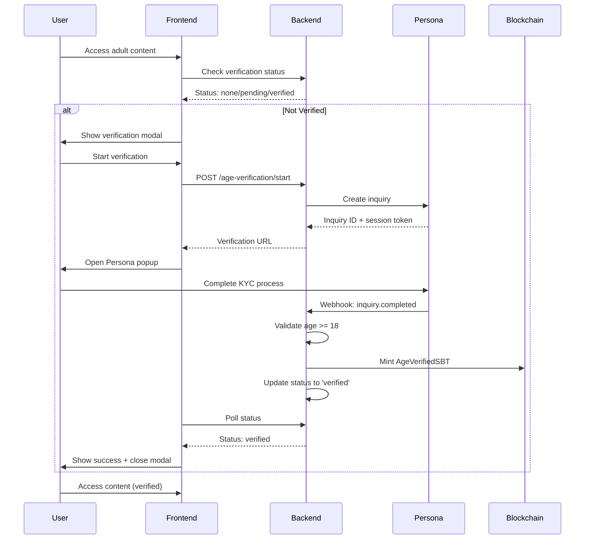

# Age Verification Integration

This document describes the age verification system integration with Persona KYC service.

## Overview

The age verification system ensures that only users 18 years or older can access adult content on the platform. It integrates with Persona's KYC service for secure identity verification and issues Soul Bound Tokens (SBTs) to verified users.

## Architecture

### Backend Components

1. **AgeVerificationService** - Core service handling Persona API integration
2. **Age Verification Routes** - REST API endpoints for frontend integration
3. **Webhook Handler** - Processes Persona verification completion events
4. **Redis Storage** - Caches verification status and inquiry mappings

### Frontend Components

1. **AgeVerificationService** - Frontend service for API communication
2. **AgeVerificationModal** - React component for verification UI
3. **useAgeVerification** - React hook for verification state management

## Verification Flow



## API Endpoints

### Get Verification Status
```http
GET /api/v1/age-verification/status/:address

Response:
{
  "success": true,
  "data": {
    "address": "0x...",
    "status": "verified",
    "provider": "persona",
    "verifiedAt": "2024-01-01T00:00:00Z",
    "expiresAt": "2025-01-01T00:00:00Z",
    "sbTokenId": "123"
  }
}
```

### Start Verification
```http
POST /api/v1/age-verification/start
Content-Type: application/json

{
  "address": "0x...",
  "referenceId": "optional-reference"
}

Response:
{
  "success": true,
  "data": {
    "inquiryId": "inq_123",
    "verificationUrl": "https://withpersona.com/verify?...",
    "provider": "persona"
  }
}
```

### Check SBT Eligibility
```http
GET /api/v1/age-verification/sbt-eligible/:address

Response:
{
  "success": true,
  "data": {
    "eligible": true,
    "address": "0x..."
  }
}
```

### Persona Webhook
```http
POST /api/v1/webhooks/persona
Content-Type: application/json

{
  "type": "inquiry.completed",
  "id": "evt_123",
  "created_at": "2024-01-01T00:00:00Z",
  "data": {
    "object": {
      "id": "inq_123",
      "status": "completed",
      "attributes": {
        "birthdate": "1990-01-01"
      }
    }
  }
}
```

## Frontend Usage

### Basic Integration

```typescript
import { useAgeVerification } from '../hooks/useAgeVerification';
import { AgeVerificationModal } from '../components/AgeVerificationModal';

function MyComponent() {
  const { 
    isVerified, 
    needsVerification, 
    status, 
    startVerification 
  } = useAgeVerification();
  
  const [showModal, setShowModal] = useState(false);

  const handleAccessContent = () => {
    if (needsVerification) {
      setShowModal(true);
    } else {
      // Access content
    }
  };

  return (
    <div>
      <button onClick={handleAccessContent}>
        Access Adult Content
      </button>
      
      <AgeVerificationModal
        isOpen={showModal}
        onClose={() => setShowModal(false)}
        onVerified={() => {
          setShowModal(false);
          // Handle verification success
        }}
      />
    </div>
  );
}
```

### Protected Content Component

```typescript
import { useAgeVerification } from '../hooks/useAgeVerification';

function ProtectedContent({ children }: { children: React.ReactNode }) {
  const { isVerified, loading } = useAgeVerification();

  if (loading) {
    return <div>Checking verification status...</div>;
  }

  if (!isVerified) {
    return (
      <div className="age-gate">
        <h2>Age Verification Required</h2>
        <p>You must be 18+ to view this content.</p>
        {/* Show verification button */}
      </div>
    );
  }

  return <>{children}</>;
}
```

## Configuration

### Environment Variables

#### Backend (.env)
```bash
# Persona Configuration
PERSONA_API_KEY=persona_live_xxx  # or persona_sandbox_xxx for testing
PERSONA_TEMPLATE_ID=itmpl_xxx     # Your Persona inquiry template ID
PERSONA_ENVIRONMENT=production    # or sandbox

# Webhook Configuration
PERSONA_WEBHOOK_SECRET=your_webhook_secret  # For signature verification

# Database
DATABASE_URL=postgresql://...
REDIS_URL=redis://...

# Blockchain
PRIVATE_KEY=0x...  # For SBT minting
CONTRACT_ADDRESS=0x...  # AgeVerifiedSBT contract address
```

#### Frontend (.env)
```bash
VITE_API_URL=https://api.yourapp.com  # Backend API URL
```

### Persona Setup

1. **Create Persona Account**
   - Sign up at https://withpersona.com
   - Complete business verification

2. **Create Inquiry Template**
   - Go to Dashboard > Inquiry Templates
   - Create template with:
     - Government ID verification
     - Selfie verification
     - Age verification (18+)

3. **Configure Webhooks**
   - Go to Dashboard > Webhooks
   - Add webhook URL: `https://yourapi.com/api/v1/webhooks/persona`
   - Subscribe to events:
     - `inquiry.completed`
     - `inquiry.failed`
     - `inquiry.expired`

4. **Get API Keys**
   - Go to Dashboard > API Keys
   - Copy API key and template ID to environment variables

## Verification Status States

| Status | Description | User Action |
|--------|-------------|-------------|
| `none` | No verification attempted | Can start verification |
| `pending` | Verification in progress | Wait for completion |
| `verified` | Successfully verified (18+) | Can access content |
| `failed` | Verification failed | Can retry verification |
| `expired` | Verification expired (1 year) | Must re-verify |

## Security Considerations

1. **Age Validation**
   - Backend validates birthdate shows user is 18+
   - Failed verification if under 18

2. **Webhook Security**
   - Verify webhook signatures in production
   - Use HTTPS for all webhook endpoints

3. **Data Protection**
   - Personal data stored encrypted
   - Minimal data retention (verification status only)
   - GDPR/CCPA compliant data handling

4. **Fraud Prevention**
   - One verification per wallet address
   - Persona's built-in fraud detection
   - Rate limiting on verification attempts

## SBT Integration

### Minting Process
1. User completes Persona verification
2. Backend validates age >= 18
3. Backend calls smart contract to mint AgeVerifiedSBT
4. SBT token ID stored in verification record

### Smart Contract Integration
```typescript
// Example SBT minting call
const contract = new ethers.Contract(contractAddress, abi, signer);
const tx = await contract.mintAgeVerified(userAddress);
const receipt = await tx.wait();
const tokenId = receipt.events[0].args.tokenId;

// Update verification record
await ageVerificationService.markSBTMinted(userAddress, tokenId);
```

## Testing

### Unit Tests
```bash
# Backend tests
cd api && npm test

# Frontend tests
npm test src/testing/ageVerification.test.ts
```

### Integration Testing

1. **Sandbox Environment**
   - Use Persona sandbox for testing
   - Test with fake documents
   - Verify webhook handling

2. **Test Cases**
   - Under 18 verification (should fail)
   - Over 18 verification (should succeed)
   - Invalid documents (should fail)
   - Webhook delivery failures
   - Network timeouts

### Manual Testing Checklist

- [ ] Connect wallet
- [ ] Start verification process
- [ ] Complete Persona flow with test documents
- [ ] Verify webhook received and processed
- [ ] Check verification status updated
- [ ] Verify SBT minted (if applicable)
- [ ] Test content access with verified status
- [ ] Test verification expiry handling

## Monitoring and Analytics

### Key Metrics
- Verification completion rate
- Average verification time
- Failure reasons breakdown
- SBT minting success rate

### Logging
- All verification attempts logged
- Webhook events logged with full payload
- Error conditions logged with context
- Performance metrics tracked

### Alerts
- High verification failure rate
- Webhook delivery failures
- SBT minting failures
- API rate limit approaching

## Troubleshooting

### Common Issues

1. **Verification Stuck in Pending**
   - Check webhook delivery in Persona dashboard
   - Verify webhook endpoint is accessible
   - Check backend logs for processing errors

2. **Under 18 Users Getting Verified**
   - Review age calculation logic
   - Check Persona template configuration
   - Verify webhook payload parsing

3. **SBT Minting Failures**
   - Check smart contract gas limits
   - Verify contract permissions
   - Check blockchain network status

4. **Popup Blocked**
   - Instruct users to allow popups
   - Provide alternative flow (redirect)
   - Add popup blocker detection

### Debug Mode

Enable debug logging:
```javascript
localStorage.setItem('debug', 'age-verification:*');
```

This will log detailed information about:
- API requests and responses
- Verification flow steps
- Error conditions
- Status polling

## Future Enhancements

### Planned Features
- Multi-document verification support
- Biometric verification options
- Automated re-verification before expiry
- Verification status sharing between platforms
- Enhanced fraud detection

### Integration Opportunities
- Creator verification linking
- Content access control automation
- Compliance reporting automation
- Analytics dashboard integration