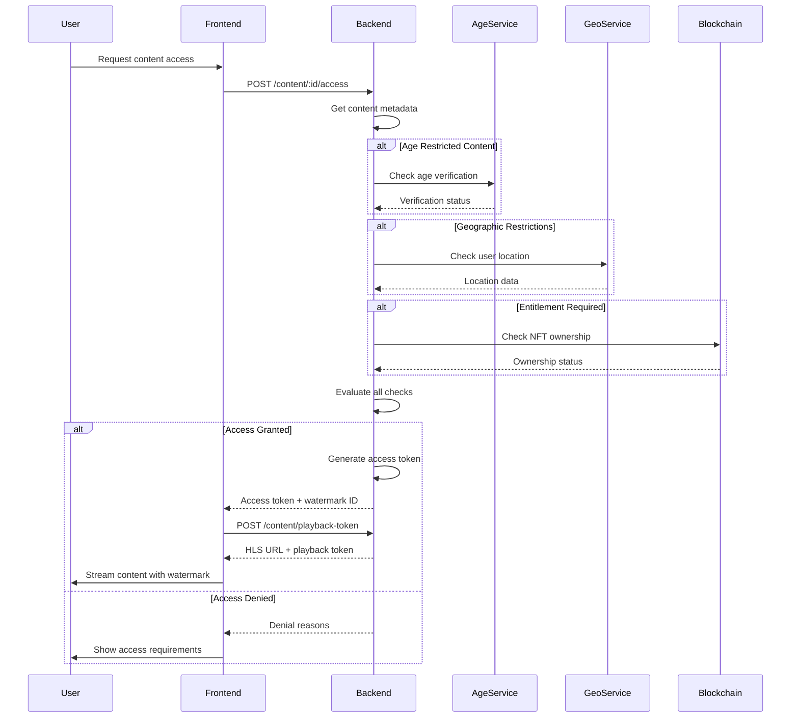

# Content Access Control System

This document describes the comprehensive content access control system that implements multi-factor access verification including age verification, geographic restrictions, and entitlement checks.

## Overview

The content access control system ensures that only authorized users can access premium content based on multiple criteria:

1. **Age Verification** - Users must be 18+ for adult content
2. **Geographic Restrictions** - Content may be restricted in certain regions
3. **Entitlement Verification** - Users must own appropriate NFTs or subscriptions
4. **Moderation Status** - Content must be approved and active

## Architecture

### Backend Components

1. **ContentAccessService** - Core service handling multi-factor access checks
2. **Content Routes** - REST API endpoints for access control
3. **Geolocation Service** - IP-based geographic restriction checking
4. **Entitlement Verification** - Blockchain-based ownership verification

### Frontend Components

1. **ContentAccessService** - Frontend service for API communication
2. **ContentAccessGate** - React component providing access control UI
3. **useContentAccess** - React hook for access state management

## Access Control Flow



## API Endpoints

### Check Content Access
```http
POST /api/v1/content/:contentId/access
Content-Type: application/json

{
  "userAddress": "0x...",
  "sessionId": "session_123"
}

Response (Access Granted):
{
  "success": true,
  "data": {
    "allowed": true,
    "reasons": [],
    "accessToken": "eyJ0eXAiOiJKV1Q...",
    "expiresAt": "2024-12-31T23:59:59Z",
    "watermarkId": "eyJhZGRyZXNzIjoi..."
  }
}

Response (Access Denied):
{
  "success": true,
  "data": {
    "allowed": false,
    "reasons": [
      {
        "type": "age_verification",
        "message": "Age verification required to access this content",
        "details": {
          "currentStatus": "none",
          "provider": "persona"
        }
      },
      {
        "type": "entitlement_required",
        "message": "Purchase required to view this content",
        "details": {
          "entitlementType": "ppv",
          "price": "10.00",
          "contentId": "content_123"
        }
      }
    ]
  }
}
```

### Get Playback Token
```http
POST /api/v1/content/playback-token
Content-Type: application/json

{
  "contentId": "content_123",
  "userAddress": "0x...",
  "accessToken": "eyJ0eXAiOiJKV1Q...",
  "sessionId": "session_123"
}

Response:
{
  "success": true,
  "data": {
    "hlsUrl": "https://stream.yourapp.com/content_123/playlist.m3u8?token=...",
    "token": "eyJ0eXAiOiJKV1Q...",
    "watermarkId": "0x1234...7890",
    "expiresAt": "2024-12-31T23:59:59Z",
    "sessionId": "session_123"
  }
}
```

### Get Content Requirements
```http
GET /api/v1/content/:contentId/requirements

Response:
{
  "success": true,
  "data": {
    "ageVerificationRequired": true,
    "geographicRestrictions": ["US", "UK"],
    "entitlementRequired": true,
    "entitlementType": "ppv",
    "price": "10.00",
    "currency": "USDC"
  }
}
```

### Validate Access Token
```http
POST /api/v1/content/validate-token
Content-Type: application/json

{
  "token": "eyJ0eXAiOiJKV1Q...",
  "contentId": "content_123"
}

Response:
{
  "success": true,
  "data": {
    "valid": true,
    "userAddress": "0x...",
    "expiresAt": "2024-12-31T23:59:59Z"
  }
}
```

## Access Control Types

### Age Verification
- **Requirement**: User must be 18+ years old
- **Implementation**: Integration with Persona KYC service
- **Verification**: Soul Bound Token (SBT) issued upon successful verification
- **Validity**: 1 year from verification date

### Geographic Restrictions
- **Implementation**: IP-based geolocation using ip-api.com or similar service
- **Caching**: Geolocation results cached for 1 hour per IP
- **Restrictions**: Content can be restricted by country code (ISO 3166-1 alpha-2)
- **Fallback**: On geolocation service failure, access is allowed (fail-open)

### Entitlement Verification
- **Types**: 
  - **PPV (Pay-Per-View)**: One-time purchase for permanent access
  - **Subscription**: Time-based access with expiration
- **Implementation**: Blockchain NFT ownership verification
- **Caching**: Entitlement status cached for 1 minute
- **Expiration**: Automatic expiration handling for time-based entitlements

### Moderation Status
- **States**: `approved`, `pending`, `blocked`
- **Access**: Only `approved` content is accessible
- **Real-time**: Status changes take effect immediately

## Frontend Integration

### Basic Usage with ContentAccessGate

```typescript
import { ContentAccessGate } from '../components/ContentAccessGate';

function VideoPlayer({ contentId }: { contentId: string }) {
  const handleAccessGranted = (playbackData: any) => {
    console.log('Access granted, playback data:', playbackData);
    // Initialize video player with HLS URL
  };

  const handleAccessDenied = (reasons: any[]) => {
    console.log('Access denied:', reasons);
    // Show appropriate UI for denial reasons
  };

  return (
    <ContentAccessGate
      contentId={contentId}
      onAccessGranted={handleAccessGranted}
      onAccessDenied={handleAccessDenied}
      showRequirements={true}
    >
      <div className="video-player">
        {/* Video player component */}
      </div>
    </ContentAccessGate>
  );
}
```

### Using the Hook Directly

```typescript
import { useContentAccess } from '../hooks/useContentAccess';

function ContentComponent({ contentId }: { contentId: string }) {
  const {
    hasAccess,
    loading,
    error,
    accessResult,
    requirements,
    needsAgeVerification,
    needsEntitlement,
    checkAccess,
    getPlaybackToken,
    getAccessMessage,
    getSuggestedActions
  } = useContentAccess(contentId);

  if (loading) return <div>Checking access...</div>;
  if (error) return <div>Error: {error}</div>;

  if (!hasAccess) {
    const actions = getSuggestedActions();
    
    return (
      <div className="access-denied">
        <h3>Access Restricted</h3>
        <p>{getAccessMessage()}</p>
        
        {actions.map(action => (
          <button key={action.action} onClick={() => handleAction(action.action)}>
            {action.label}
          </button>
        ))}
      </div>
    );
  }

  return (
    <div className="content-player">
      {/* Render content player */}
    </div>
  );
}
```

### Protected Route Component

```typescript
import { useContentAccess } from '../hooks/useContentAccess';

function ProtectedContent({ 
  contentId, 
  children 
}: { 
  contentId: string; 
  children: React.ReactNode; 
}) {
  const { hasAccess, loading, needsAgeVerification, needsEntitlement } = useContentAccess(contentId);

  if (loading) {
    return <div>Verifying access permissions...</div>;
  }

  if (needsAgeVerification) {
    return <AgeVerificationRequired />;
  }

  if (needsEntitlement) {
    return <PurchaseRequired contentId={contentId} />;
  }

  if (!hasAccess) {
    return <AccessDenied />;
  }

  return <>{children}</>;
}
```

## Configuration

### Environment Variables

#### Backend (.env)
```bash
# Geolocation Service
GEOIP_API_KEY=your_geoip_api_key  # Optional, uses free service if not provided

# JWT Configuration
JWT_SECRET=your_jwt_secret_key
JWT_EXPIRES_IN=24h

# Redis Configuration
REDIS_URL=redis://localhost:6379

# Blockchain Configuration
BLOCKCHAIN_RPC_URL=https://polygon-rpc.com
CONTENT_REGISTRY_ADDRESS=0x...
NFT_ACCESS_ADDRESS=0x...
```

#### Frontend (.env)
```bash
VITE_API_URL=https://api.yourapp.com
```

## Access Token Format

Access tokens are JWT tokens containing:

```json
{
  "contentId": "content_123",
  "userAddress": "0x...",
  "issuedAt": "2024-01-01T00:00:00Z",
  "expiresAt": "2024-01-02T00:00:00Z",
  "sessionId": "session_123",
  "contentTitle": "Sample Content",
  "iat": 1640995200,
  "exp": 1641081600
}
```

## Watermarking

### Watermark ID Format
Watermark IDs are base64-encoded JSON containing:

```json
{
  "address": "0x1234...7890",
  "session": "sess123",
  "timestamp": 1640995200000
}
```

### Video Overlay
- **Position**: Dynamic positioning to prevent easy removal
- **Content**: Truncated wallet address and session ID
- **Opacity**: Semi-transparent overlay
- **Movement**: Periodic position changes

## Security Considerations

### Access Token Security
- **Expiration**: Tokens expire after 24 hours
- **Binding**: Tokens are bound to specific content and user address
- **Validation**: Server-side validation on every playback request
- **Revocation**: Tokens can be invalidated server-side

### Geographic Bypass Prevention
- **Multiple Checks**: IP geolocation checked on both access and playback
- **VPN Detection**: Integration with VPN detection services (optional)
- **Audit Trail**: All access attempts logged with IP and location data

### Entitlement Verification
- **Real-time**: Blockchain state checked in real-time
- **Caching**: Short cache duration (1 minute) to balance performance and accuracy
- **Expiration**: Automatic handling of time-based entitlements

## Monitoring and Analytics

### Access Metrics
- **Success Rate**: Percentage of successful access attempts
- **Denial Reasons**: Breakdown of access denial reasons
- **Geographic Distribution**: Access patterns by region
- **Conversion Rate**: Percentage of denied users who complete required actions

### Performance Metrics
- **Response Time**: Average access check response time
- **Cache Hit Rate**: Effectiveness of caching strategies
- **Error Rate**: Percentage of failed access checks

### Security Metrics
- **Suspicious Activity**: Unusual access patterns or bypass attempts
- **Token Validation**: Success rate of token validation
- **Watermark Integrity**: Monitoring for watermark removal attempts

## Error Handling

### Common Error Scenarios

1. **Content Not Found**
   - **Cause**: Invalid content ID or content removed
   - **Response**: 404 with appropriate message
   - **User Action**: Redirect to content discovery

2. **Age Verification Required**
   - **Cause**: User not age verified for adult content
   - **Response**: Access denied with verification link
   - **User Action**: Complete age verification process

3. **Geographic Restriction**
   - **Cause**: User in restricted region
   - **Response**: Access denied with region information
   - **User Action**: Contact support or use different content

4. **Entitlement Required**
   - **Cause**: User doesn't own required NFT or subscription
   - **Response**: Access denied with purchase options
   - **User Action**: Purchase content or subscribe

5. **Token Expired**
   - **Cause**: Access token expired during playback
   - **Response**: 401 with refresh instruction
   - **User Action**: Automatic token refresh

### Error Recovery

```typescript
// Automatic retry with exponential backoff
const checkAccessWithRetry = async (contentId: string, maxRetries = 3) => {
  for (let attempt = 1; attempt <= maxRetries; attempt++) {
    try {
      return await contentAccessService.checkAccess({ contentId, userAddress });
    } catch (error) {
      if (attempt === maxRetries) throw error;
      
      const delay = Math.pow(2, attempt) * 1000; // Exponential backoff
      await new Promise(resolve => setTimeout(resolve, delay));
    }
  }
};
```

## Testing

### Unit Tests
```bash
# Backend tests
cd api && npm test src/services/contentAccessService.test.ts

# Frontend tests
npm test src/testing/contentAccess.test.ts
```

### Integration Tests

1. **Access Control Flow**
   - Test complete access check process
   - Verify all denial reasons work correctly
   - Test token generation and validation

2. **Geographic Restrictions**
   - Test with different IP addresses
   - Verify geolocation caching
   - Test fallback behavior

3. **Entitlement Verification**
   - Test with valid/invalid NFT ownership
   - Test subscription expiration handling
   - Verify blockchain integration

### Manual Testing Checklist

- [ ] Age-restricted content requires verification
- [ ] Geographic restrictions work correctly
- [ ] PPV content requires purchase
- [ ] Subscription content requires active subscription
- [ ] Access tokens expire correctly
- [ ] Watermarks display properly
- [ ] Error messages are user-friendly
- [ ] Suggested actions work correctly

## Troubleshooting

### Common Issues

1. **Access Always Denied**
   - Check content metadata in database
   - Verify moderation status is 'approved'
   - Check if content is active

2. **Geographic Restrictions Not Working**
   - Verify geolocation service is responding
   - Check IP address extraction from request
   - Verify country code format (ISO 3166-1 alpha-2)

3. **Entitlement Check Failing**
   - Verify blockchain RPC connection
   - Check contract addresses are correct
   - Verify user has required NFT/subscription

4. **Token Validation Errors**
   - Check JWT secret configuration
   - Verify token hasn't expired
   - Check content ID matches

### Debug Mode

Enable debug logging:
```javascript
localStorage.setItem('debug', 'content-access:*');
```

This will log:
- Access check requests and responses
- Token generation and validation
- Geolocation lookups
- Entitlement verification results

## Future Enhancements

### Planned Features
- **Advanced Watermarking**: Forensic watermarking with user identification
- **Dynamic Pricing**: Real-time price adjustments based on demand
- **Social Verification**: Community-based content verification
- **Advanced Analytics**: ML-based access pattern analysis
- **Multi-chain Support**: Support for multiple blockchain networks

### Integration Opportunities
- **CDN Integration**: Direct integration with video CDN providers
- **DRM Integration**: Hardware-level content protection
- **Compliance Automation**: Automated regulatory compliance checking
- **Fraud Detection**: Advanced fraud detection and prevention