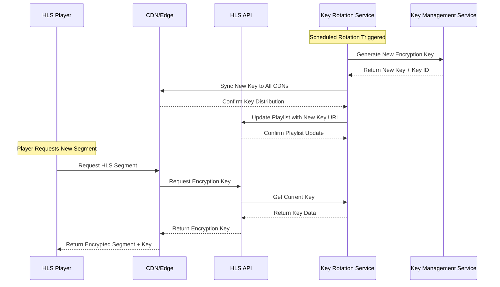

# HLS Key Rotation Implementation Guide

## Overview

This guide covers the implementation of automated HLS (HTTP Live Streaming) key rotation for secure video streaming on the decentralized adult platform. The system provides zero-downtime key rotation with CDN synchronization and emergency revocation capabilities.

## Architecture

### Key Components

1. **HLS Key Rotation Service**: Core service managing key lifecycle
2. **Key Management Service**: Secure key storage using KMS envelope encryption
3. **CDN Synchronization**: Multi-CDN key distribution
4. **Audit Logging**: Complete audit trail for compliance
5. **Emergency Procedures**: Immediate key revocation capabilities

### Key Rotation Flow



## Configuration

### Default Configuration

```typescript
const defaultConfig: HLSKeyRotationConfig = {
  rotationInterval: 30,        // 30 minutes
  keyMethod: 'AES-128',        // AES-128 or AES-256
  segmentsPerKey: 100,         // Max segments per key
  preGenerateKeys: 3,          // Pre-generated keys for fast rotation
  cdnSyncEnabled: true,        // Enable CDN synchronization
  emergencyRotationEnabled: true // Enable emergency revocation
};
```

### Environment Variables

```bash
# Key Management
KMS_PROVIDER=AWS                    # AWS, GCP, or Azure
KMS_REGION=us-east-1               # KMS region
KMS_KEY_RING=hls-encryption-keys   # Key ring/vault name

# CDN Configuration
CDN_ENDPOINTS=cdn1.example.com,cdn2.example.com
CDN_SYNC_TIMEOUT=30000             # 30 seconds
CDN_RETRY_ATTEMPTS=3

# Rotation Settings
DEFAULT_ROTATION_INTERVAL=30       # Minutes
MAX_SEGMENTS_PER_KEY=100
PRE_GENERATE_KEYS=3

# Security
EMERGENCY_ROTATION_ENABLED=true
KEY_GRACE_PERIOD=300              # 5 minutes
AUDIT_LOGGING_ENABLED=true
```

## API Usage

### Initialize Encrypted Stream

```bash
POST /api/hls/streams/{streamId}/initialize
Authorization: Bearer <token>
Content-Type: application/json

{
  "playlistUrl": "https://cdn.example.com/stream/playlist.m3u8",
  "cdnEndpoints": [
    "https://cdn1.example.com",
    "https://cdn2.example.com"
  ],
  "config": {
    "rotationInterval": 30,
    "keyMethod": "AES-128",
    "segmentsPerKey": 100,
    "cdnSyncEnabled": true
  }
}
```

### Get Encryption Key (Player Request)

```bash
GET /api/hls/keys/{keyId}
# Returns raw key bytes for HLS player decryption
```

### Manual Key Rotation

```bash
POST /api/hls/streams/{streamId}/rotate
Authorization: Bearer <token>

# Response includes rotation details and CDN sync status
```

### Emergency Key Revocation

```bash
POST /api/hls/streams/{streamId}/emergency-revoke
Authorization: Bearer <token>
Content-Type: application/json

{
  "reason": "Security incident - immediate key revocation required"
}
```

## HLS Playlist Integration

### Playlist Entry Generation

The service automatically generates HLS playlist entries with encryption information:

```m3u8
#EXT-X-KEY:METHOD=AES-128,URI="/api/hls/keys/key-id-123",IV=0x12345678901234567890123456789012
#EXTINF:10.0,
segment_001.ts
#EXTINF:10.0,
segment_002.ts
```

### Key URI Format

- **URI Pattern**: `/api/hls/keys/{keyId}`
- **Method**: `AES-128` or `AES-256`
- **IV**: 16-byte initialization vector (hex encoded)

## CDN Integration

### Supported CDN Providers

1. **AWS CloudFront**
   - Signed URL key rotation
   - Edge location synchronization
   - Cache invalidation support

2. **Cloudflare**
   - Workers KV key storage
   - Global edge distribution
   - Instant purge capabilities

3. **Fastly**
   - Edge dictionary updates
   - VCL configuration sync
   - Real-time purging

4. **Custom CDN**
   - HTTP API integration
   - Key distribution endpoints
   - Health check monitoring

### CDN Synchronization Process

1. **Key Generation**: New key created in KMS
2. **Distribution**: Key pushed to all configured CDNs
3. **Verification**: Confirm key availability on all edges
4. **Playlist Update**: Update HLS playlist with new key URI
5. **Grace Period**: Keep old key active for smooth transition
6. **Cleanup**: Remove expired keys from CDNs

## Security Features

### Key Protection

- **KMS Integration**: All keys encrypted using envelope encryption
- **Zero-Knowledge**: Keys never stored in plaintext
- **Access Control**: Role-based key access permissions
- **Audit Trail**: Complete key lifecycle logging

### Emergency Procedures

- **Immediate Revocation**: Keys can be revoked instantly
- **CDN Purge**: Automatic removal from all CDN edges
- **Incident Response**: Integration with incident management
- **Forensic Logging**: Detailed audit trail for investigations

### Compliance Features

- **GDPR Compliance**: Key deletion and data protection
- **SOX Compliance**: Financial audit trail requirements
- **ISO 27001**: Information security management
- **Custom Policies**: Configurable retention and access policies

## Monitoring and Alerting

### Key Metrics

- **Rotation Success Rate**: Percentage of successful rotations
- **CDN Sync Status**: Per-CDN synchronization health
- **Key Usage**: Active keys and access patterns
- **Performance**: Rotation timing and latency
- **Error Rates**: Failed rotations and causes

### Alerting Thresholds

```yaml
alerts:
  rotation_failure:
    threshold: 1
    severity: critical
    action: immediate_escalation
  
  cdn_sync_failure:
    threshold: 2
    severity: high
    action: retry_and_alert
  
  overdue_rotation:
    threshold: 60_minutes
    severity: medium
    action: automated_rotation
  
  key_access_anomaly:
    threshold: 100_requests_per_minute
    severity: high
    action: rate_limiting
```

### Health Checks

```bash
GET /api/hls/health

{
  "status": "healthy",
  "services": {
    "hlsEncryption": "operational",
    "keyRotation": "operational", 
    "cdnSync": "operational"
  },
  "metrics": {
    "activeStreams": 25,
    "overdueRotations": 0,
    "healthStatus": "good"
  }
}
```

## Operational Procedures

### Daily Operations

1. **Health Check**: Verify all services operational
2. **Rotation Status**: Check for overdue rotations
3. **CDN Sync**: Verify key distribution health
4. **Audit Review**: Review access logs and anomalies

### Weekly Maintenance

1. **Key Cleanup**: Remove expired keys from storage
2. **Metrics Review**: Analyze rotation performance
3. **Capacity Planning**: Monitor key storage usage
4. **Security Review**: Audit access patterns

### Monthly Reviews

1. **Compliance Audit**: Generate compliance reports
2. **Performance Analysis**: Review rotation metrics
3. **Security Assessment**: Evaluate threat landscape
4. **Procedure Updates**: Update operational procedures

## Troubleshooting

### Common Issues

#### Rotation Failures

**Symptoms**: Keys not rotating on schedule
**Causes**: 
- KMS connectivity issues
- CDN synchronization failures
- Insufficient permissions

**Resolution**:
1. Check KMS service health
2. Verify CDN endpoint connectivity
3. Validate service permissions
4. Review error logs for specific failures

#### CDN Sync Issues

**Symptoms**: Keys not available on CDN edges
**Causes**:
- Network connectivity problems
- CDN API rate limiting
- Authentication failures

**Resolution**:
1. Test CDN API connectivity
2. Check rate limiting status
3. Verify API credentials
4. Retry failed synchronizations

#### Player Decryption Errors

**Symptoms**: Video playback failures
**Causes**:
- Expired keys
- CDN cache issues
- Key URI accessibility

**Resolution**:
1. Verify key availability
2. Check CDN cache status
3. Test key URI accessibility
4. Force key rotation if needed

### Emergency Procedures

#### Security Incident Response

1. **Immediate Actions**:
   - Revoke all active keys
   - Stop affected streams
   - Document incident details

2. **Investigation**:
   - Review audit logs
   - Identify compromise scope
   - Assess data exposure

3. **Recovery**:
   - Generate new keys
   - Restart streams with new encryption
   - Monitor for continued threats

#### Service Outage Recovery

1. **Assessment**:
   - Identify failed components
   - Estimate recovery time
   - Communicate status

2. **Recovery**:
   - Restore failed services
   - Verify key availability
   - Resume normal operations

3. **Post-Incident**:
   - Conduct root cause analysis
   - Update procedures
   - Implement preventive measures

## Performance Optimization

### Key Rotation Optimization

- **Pre-generation**: Generate keys in advance
- **Batch Operations**: Group CDN updates
- **Parallel Sync**: Synchronize CDNs concurrently
- **Caching**: Cache frequently accessed keys

### CDN Performance

- **Edge Optimization**: Optimize key distribution
- **Cache Strategy**: Configure appropriate TTLs
- **Geographic Distribution**: Use regional CDNs
- **Load Balancing**: Distribute key requests

### Monitoring Optimization

- **Metric Aggregation**: Batch metric collection
- **Alert Deduplication**: Prevent alert storms
- **Dashboard Optimization**: Real-time monitoring
- **Log Management**: Efficient log storage

## Compliance and Auditing

### Audit Requirements

- **Key Lifecycle**: Complete key creation to deletion
- **Access Logging**: All key access attempts
- **Rotation Events**: Scheduled and emergency rotations
- **Security Incidents**: Breach response and recovery

### Compliance Reports

```bash
GET /api/hls/reports/compliance?framework=SOX&startDate=2024-01-01&endDate=2024-01-31

{
  "framework": "SOX",
  "period": {
    "startDate": "2024-01-01",
    "endDate": "2024-01-31"
  },
  "summary": {
    "totalRotations": 1440,
    "successfulRotations": 1438,
    "failedRotations": 2,
    "emergencyRevocations": 1,
    "complianceScore": 99.86
  },
  "details": {
    "rotationMetrics": {...},
    "securityEvents": {...},
    "auditTrail": {...}
  }
}
```

### Data Retention

- **Key Data**: Encrypted storage for 7 years
- **Audit Logs**: Immutable logging for 10 years
- **Rotation Events**: Detailed history for 5 years
- **Security Incidents**: Permanent retention

---

**Document Version**: 1.0  
**Last Updated**: [CURRENT_DATE]  
**Next Review**: [REVIEW_DATE]  
**Owner**: Streaming Infrastructure Team