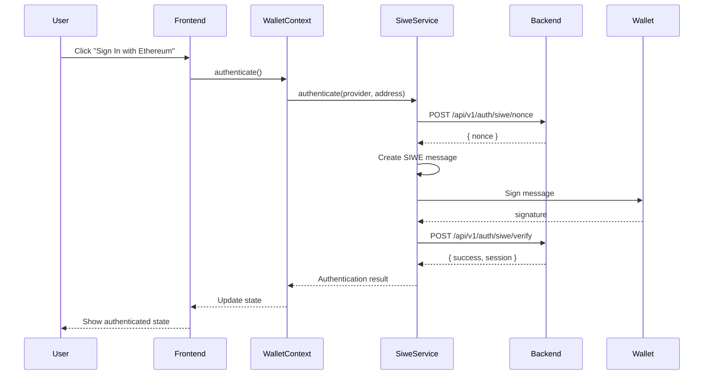

# SIWE (Sign-In with Ethereum) Integration

This document describes the SIWE authentication integration with the existing WalletContext.

## Overview

The SIWE integration enhances the existing wallet connection functionality with blockchain-based authentication. Users can now not only connect their wallets but also authenticate their identity using cryptographic signatures.

## Architecture

### Enhanced WalletContext

The `WalletContext` has been enhanced with SIWE authentication state and methods:

**New State Properties:**
- `isAuthenticated: boolean` - Whether the user is authenticated via SIWE
- `isAuthenticating: boolean` - Whether authentication is in progress
- `session: string | null` - JWT session token from successful authentication
- `authError: string | null` - Authentication-specific error messages

**New Methods:**
- `authenticate()` - Initiates SIWE authentication flow
- `logout()` - Clears SIWE session and logs out
- `clearAuthError()` - Clears authentication error messages

### SiweService

The `SiweService` handles all SIWE-related operations:

1. **Nonce Generation** - Requests a unique nonce from the backend
2. **Message Creation** - Creates a properly formatted SIWE message
3. **Signature Generation** - Uses the wallet to sign the SIWE message
4. **Verification** - Sends the signed message to backend for verification
5. **Session Management** - Handles JWT tokens and session state

## Authentication Flow



## Usage Examples

### Basic Authentication

```typescript
import { useWallet } from '../contexts/WalletContext';

function MyComponent() {
  const { 
    isConnected, 
    isAuthenticated, 
    isAuthenticating,
    authenticate, 
    logout,
    authError 
  } = useWallet();

  const handleAuth = async () => {
    if (!isConnected) {
      alert('Please connect your wallet first');
      return;
    }

    try {
      await authenticate();
      console.log('Successfully authenticated!');
    } catch (error) {
      console.error('Authentication failed:', error);
    }
  };

  return (
    <div>
      {!isAuthenticated ? (
        <button onClick={handleAuth} disabled={isAuthenticating}>
          {isAuthenticating ? 'Authenticating...' : 'Sign In with Ethereum'}
        </button>
      ) : (
        <button onClick={logout}>Logout</button>
      )}
      
      {authError && <p style={{color: 'red'}}>{authError}</p>}
    </div>
  );
}
```

### Protected Content

```typescript
import { useWallet } from '../contexts/WalletContext';

function ProtectedContent() {
  const { isAuthenticated, isConnected } = useWallet();

  if (!isConnected) {
    return <p>Please connect your wallet</p>;
  }

  if (!isAuthenticated) {
    return <p>Please authenticate with SIWE to access this content</p>;
  }

  return (
    <div>
      <h2>Protected Content</h2>
      <p>This content is only visible to authenticated users!</p>
    </div>
  );
}
```

## Backend Integration

The frontend expects the following backend endpoints:

### Generate Nonce
```
POST /api/v1/auth/siwe/nonce
Content-Type: application/json

{
  "address": "0x..."
}

Response:
{
  "nonce": "unique-nonce-string"
}
```

### Verify Signature
```
POST /api/v1/auth/siwe/verify
Content-Type: application/json

{
  "message": "siwe-message-string",
  "signature": "0x..."
}

Response:
{
  "success": true,
  "address": "0x...",
  "session": "jwt-token"
}
```

### Check Session
```
GET /api/v1/auth/session
Cookie: session=jwt-token

Response:
{
  "isAuthenticated": true,
  "address": "0x...",
  "session": "jwt-token"
}
```

### Logout
```
POST /api/v1/auth/logout
Cookie: session=jwt-token

Response: 200 OK
```

## Security Considerations

1. **Nonce Uniqueness**: Each authentication attempt uses a unique nonce to prevent replay attacks
2. **Message Expiry**: SIWE messages include expiration times (24 hours by default)
3. **Domain Binding**: Messages are bound to the current domain to prevent cross-site attacks
4. **Session Management**: JWT tokens are used for session management with HTTP-only cookies
5. **Error Handling**: Sensitive error information is not exposed to the frontend

## Configuration

### Environment Variables

```bash
# Frontend (.env)
VITE_API_URL=http://localhost:3001  # Backend API URL

# Backend (.env)
JWT_SECRET=your-jwt-secret
SIWE_DOMAIN=localhost:3000  # Your frontend domain
```

### Dependencies

The following packages were added to support SIWE:

```json
{
  "dependencies": {
    "siwe": "^2.1.4",
    "ethers": "^6.8.1"
  }
}
```

## Testing

Run the SIWE integration tests:

```bash
npm test src/testing/siweIntegration.test.ts
```

The test suite covers:
- Nonce generation
- Message signing and verification
- Session management
- Error handling
- WalletContext integration

## Troubleshooting

### Common Issues

1. **"Wallet must be connected before authentication"**
   - Ensure the wallet is connected before calling `authenticate()`

2. **Network errors during authentication**
   - Check that the backend API is running and accessible
   - Verify the `VITE_API_URL` environment variable

3. **Signature verification fails**
   - Ensure the wallet is on the correct network
   - Check that the backend SIWE implementation matches the frontend

4. **Session not persisting**
   - Verify that cookies are being set correctly
   - Check CORS configuration for credentials

### Debug Mode

Enable debug logging by setting:

```javascript
localStorage.setItem('debug', 'siwe:*');
```

This will log detailed information about the SIWE authentication process.

## Migration Guide

### From Basic Wallet Connection

If you're upgrading from basic wallet connection:

1. **Update imports**: No changes needed, same `useWallet` hook
2. **Add authentication**: Call `authenticate()` after wallet connection
3. **Handle new state**: Check `isAuthenticated` for protected features
4. **Update UI**: Show authentication status and logout option

### Backward Compatibility

The SIWE integration is fully backward compatible:
- Existing wallet connection functionality is unchanged
- New SIWE features are opt-in
- No breaking changes to existing components

## Future Enhancements

Planned improvements:
- Multi-chain SIWE support
- Automatic re-authentication on session expiry
- Integration with Web3 social features
- Enhanced session management with refresh tokens