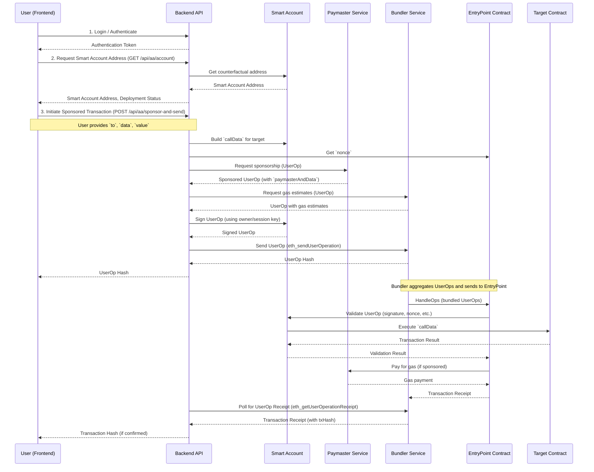

# Walletless Core for ERC-4337

This document outlines the architecture and API endpoints for the walletless core implementation using ERC-4337 Account Abstraction.

## Architecture Overview

The walletless core enables users to interact with the blockchain without directly managing private keys for their smart accounts. It leverages ERC-4337 to abstract away the complexities of transaction signing and gas payment.

Key components include:

*   **Smart Account Service (`SmartAccountService.ts`)**: Manages the creation and deployment of counterfactual smart account addresses. It provides utilities for generating deterministic smart account addresses and building `initCode` for the first UserOperation.
*   **Session Key Service (`SessionKeyService.ts`)**: Facilitates the creation, management, and revocation of ephemeral session keys. These keys can be scoped to specific contracts and functions, allowing for granular permissions and enhanced security for dApp interactions.
*   **Unified Paymaster Service (`UnifiedPaymasterService.ts`)**: Acts as an intermediary for sponsoring UserOperations. It integrates with external paymaster providers (e.g., Biconomy, Alchemy) to handle gas payments on behalf of users, providing a gasless experience.
*   **API Endpoints (`api/src/routes/aa.ts`)**: Exposes a set of RESTful APIs for interacting with the walletless core, allowing frontend applications to manage smart accounts and session keys.
*   **Centralized Configuration (`config/env.ts`, `config/chain.ts`)**: All environment-specific and chain-specific configurations are centralized for easy management and deployment.
*   **Encryption Utility (`utils/encryption.ts`)**: Provides a shared service for encrypting and decrypting sensitive data, such as private keys, using a master key.
*   **Biconomy Session Key Manager Module**: The chosen on-chain implementation for managing session keys. This module is enabled on the user's smart account to allow session keys to sign user operations based on defined policies.

The flow for a typical UserOperation involving a session key would be:

1.  User initiates an action in the dApp.
2.  The dApp requests a session key from the backend (`POST /api/v1/aa/session/create`).
3.  The backend generates a session key, stores it, and constructs a UserOperation to enable this session key as a module on the user's smart account via the Biconomy Session Key Manager Module. The policy for the session key (allowed targets, selectors, expiry) is encoded within this UserOperation.
4.  The backend sends this UserOperation to the Unified Paymaster Service for sponsorship and submission to a bundler.
5.  Once the session key module is enabled on-chain, the dApp can use this session key to sign subsequent UserOperations within its defined scope and expiry.
6.  These UserOperations are also sent to the Unified Paymaster Service for sponsorship and submission.

## API Endpoints

All API endpoints are prefixed with `/api/v1/aa`.

### 1. Get Smart Account Details

`GET /api/aa/account`

Retrieves the counterfactual smart account address for the authenticated user, its deployment status, the EntryPoint address, and the current chain ID.

**Request:**
`GET /api/v1/aa/account`

**Response (200 OK):**
```json
{
  "smartAccountAddress": "0x...",
  "deployed": true,
  "entryPoint": "0x...",
  "chainId": 11155111
}
```

### 2. Create and Register Session Key

`POST /api/aa/session/create`

Generates a new ephemeral session key, stores it in the database, and registers it on the user's smart account via a UserOperation submitted to the bundler.

**Request:**
`POST /api/v1/aa/session/create`
**Headers:**
`Content-Type: application/json`
**Body:**
```json
{
  "ttlMins": 60,
  "scope": {
    "targets": ["0xContentAccessGateAddress", "0xUploadManagerAddress"],
    "selectors": ["0xabcdef01", "0x12345678"]
  }
}
```

**Response (201 Created):**
```json
{
  "sessionKeyId": "uuid-of-session-key",
  "publicKey": "0x...",
  "expiresAt": "2025-08-20T10:00:00.000Z",
  "userOpHash": "0x..."
}
```

### 3. Revoke Session Key

`POST /api/aa/session/revoke`

Revokes an existing session key by marking it as revoked in the database and submitting a UserOperation to revoke it on the smart account.

**Request:**
`POST /api/v1/aa/session/revoke`
**Headers:**
`Content-Type: application/json`
**Body:**
```json
{
  "sessionKeyId": "uuid-of-session-key-to-revoke"
}
```

**Response (200 OK):**
```json
{
  "message": "Session key revoked successfully.",
  "userOpHash": "0x..."
}
```

### 4. Get Active Session Status

`GET /api/aa/session/status`

Lists all active (non-expired and non-revoked) session keys for the authenticated user's smart account.

**Request:**
`GET /api/v1/aa/session/status`

**Response (200 OK):**
```json
[
  {
    "id": "uuid-of-session-key-1",
    "publicKey": "0x...",
    "scope": {
      "targets": ["0xContentAccessGateAddress"],
      "selectors": ["0xabcdef01"]
    },
    "expiresAt": "2025-08-20T10:00:00.000Z",
    "createdAt": "2025-08-19T09:00:00.000Z"
  },
  {
    "id": "uuid-of-session-key-2",
    "publicKey": "0x...",
    "scope": {
      "targets": ["0xUploadManagerAddress"],
      "selectors": ["0x12345678"]
    },
    "expiresAt": "2025-08-21T12:00:00.000Z",
    "createdAt": "2025-08-20T11:00:00.000Z"
  }
]
```

## Sponsor-and-Send Sequence Diagram



## Rate Limits

To ensure fair usage and protect against abuse, the following API endpoints are rate-limited:

| Endpoint                       | Method | Limit (per caller, per route) | Environment Variable       |
| :----------------------------- | :----- | :---------------------------- | :------------------------- |
| `/api/paymaster/sponsor`       | `POST` | 20 requests/minute            | `RATE_LIMIT_SPONSOR`       |
| `/api/paymaster/submit`        | `POST` | 30 requests/minute            | `RATE_LIMIT_SUBMIT`        |
| `/api/upload/start`            | `POST` | 5 requests/minute             | `RATE_LIMIT_UPLOAD_START`  |
| `/api/upload/finalize`         | `POST` | 5 requests/minute             | `RATE_LIMIT_UPLOAD_START`  |
| `/api/aa/session/create`       | `POST` | 10 requests/hour              | `RATE_LIMIT_AA_SESSION`    |
| `/api/billing/*`               | `*`    | 20 requests/minute            | `RATE_LIMIT_BILLING`       |

The rate limit configuration can be adjusted via environment variables in `api/.env` or `api/.env.example`. The format for these variables is `N/unit` (e.g., `20/min`, `10/hour`).

The `RATE_LIMIT_PREFIX` environment variable (default `rl:`) is used to prefix Redis keys for rate limiting, allowing for easy identification and clearing of rate limit data.

### Session Key Policy Format

When creating a session key, a policy is defined to restrict its permissions. This policy is a JSON string that is encoded and passed to the Biconomy Session Key Manager Module. The structure of the policy is as follows:

```json
{
  "allowedCallTargets": ["0xContractAddress1", "0xContractAddress2"],
  "allowedFunctionSelectors": ["0xabcdef01", "0x12345678"],
  "valueLimit": "1000000000000000000", // Optional: Max value (in wei) that can be sent in a single transaction
  "gasLimit": "200000" // Optional: Max gas limit for a single transaction
}
```

*   `allowedCallTargets`: An array of contract addresses that the session key is permitted to interact with. If empty, it implies no restriction on target addresses (use with caution).
*   `allowedFunctionSelectors`: An array of 4-byte function selectors (e.g., `0xabcdef01`) that the session key is permitted to call on the `allowedCallTargets`. If empty, it implies no restriction on function selectors for the allowed targets (use with caution).
*   `valueLimit` (optional): A string representing the maximum amount of native currency (in wei) that can be sent in a single transaction by the session key.
*   `gasLimit` (optional): A string representing the maximum gas limit for a single transaction executed by the session key.

These policy parameters are configured via the `SESSION_KEY_POLICY_JSON` environment variable in `api/.env.example`. If `SESSION_KEY_POLICY_JSON` is not set, a default policy is constructed from the `targets` and `selectors` provided in the `/api/v1/aa/session/create` request.